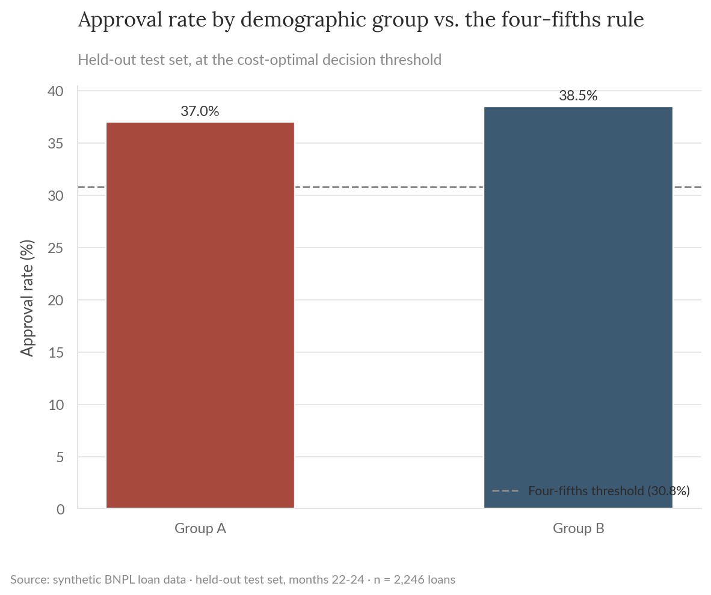
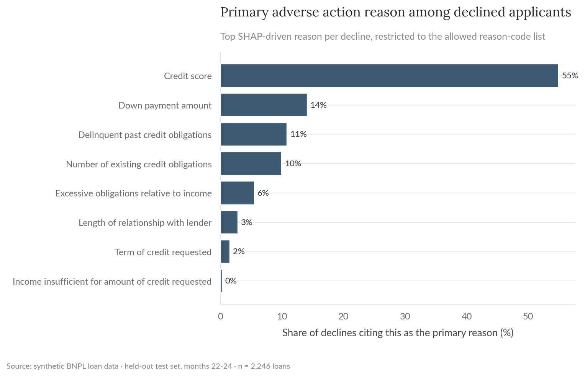
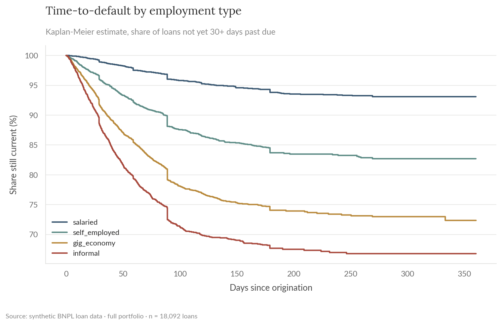
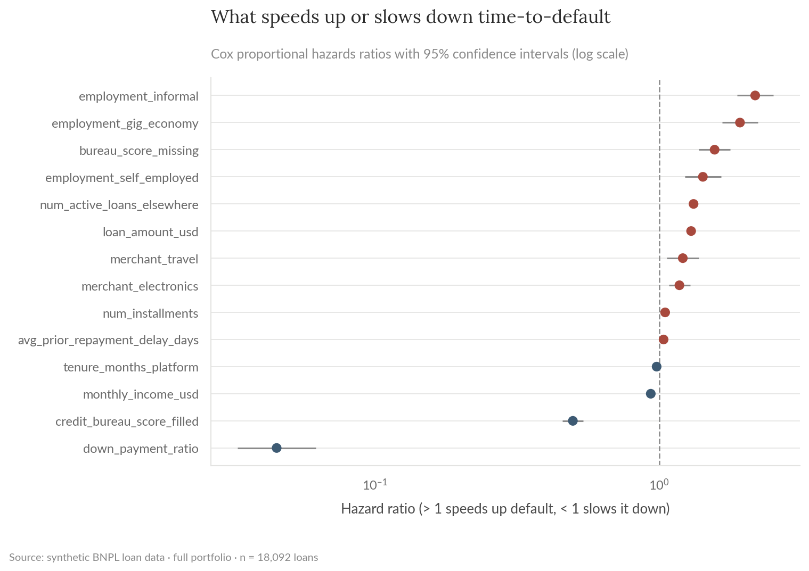

# BNPL Delinquency Risk Model

A risk model that flags which buy-now-pay-later loans are likely to go 30+ days past due, with a decision threshold picked from actual business costs instead of a default 0.5 cutoff, a fair lending review of the resulting approve/decline decisions, a survival-analysis view of how fast different segments default rather than just whether they do, and a small scoring service that proves the trained pipeline is actually deployable. Built on synthetic data modeled after a BNPL lending book, mirroring delinquency-prediction work I currently do in fintech.

**For the full technical walkthrough (modeling, calibration, SHAP, drift monitoring), see the [notebook](notebooks/01_delinquency_risk_model.ipynb).** This README is the short version. For a validation-style write-up (data lineage, conceptual soundness, outcomes analysis, ongoing monitoring plan), see the [model validation memo](docs/model_validation_memo.md).

> All data here is synthetically generated. No proprietary data, models, or results from any employer are used or implied.

**Skills and tools featured:**

- Classification modeling (logistic regression + gradient-boosted trees)
- Leakage-safe feature pipelines (feature-engine, fit on the training split only)
- Time-series cross-validated hyperparameter search
- Probability calibration
- Cost-based decision optimization
- SHAP interpretability
- Drift and calibration monitoring
- Fair lending analysis (disparate impact / four-fifths rule, SHAP-derived adverse action reason codes)
- Survival analysis (Kaplan-Meier, Cox proportional hazards)
- Model serving (FastAPI scoring endpoint over the trained pipeline)

## The problem

A BNPL lender approves a loan in seconds at checkout. Approve a customer who pays on time, and the lender earns a small merchant fee. Approve one who defaults, and the lender loses most of the loan amount. Getting the approve/decline line right is worth real money.

## What this does

Trains a model to predict delinquency risk at loan approval, then picks the approve/decline threshold that minimizes expected losses given realistic cost assumptions, rather than using a generic 0.5 cutoff.

## Results

The gradient-boosted model's hyperparameters were chosen with a randomized search over 5-fold time-series cross-validation (expanding window, each fold validating on the months right after it). Picking the decision threshold from cost instead of defaulting to 0.5 cut expected portfolio losses by **67%** on held-out data.

| | |
|---|---|
| Model accuracy (AUC), held-out test | 0.79 |
| Model accuracy (AUC), cross-validated | 0.81 ± 0.005 |
| Expected loss reduction vs. a naive 0.5 cutoff | 67% |
| Share of actual delinquent loans caught | 92% |

Delinquency climbs sharply in the shock window (Figure 1); sweeping the decision threshold against expected cost locates where that 67% reduction comes from (Figure 2).


*Figure 1. Delinquency rate by loan origination month. The last three months carry a simulated macro shock.*


*Figure 2. Expected portfolio cost by decision threshold, cost-optimal threshold vs. the naive 0.5 cutoff.*

## Missing bureau scores

About 9% of customers are thin-file: gig/informal workers and recent platform joiners with no bureau score on record at underwriting time, a routine situation for a BNPL lender rather than an edge case. The feature pipeline (feature-engine, wrapped in an sklearn `Pipeline`) adds a missing-value indicator and median-imputes the score, fit on the training split only and reused unchanged on validation, test, and the monitoring window, so no split ever influences another split's preprocessing statistics.

Bureau score is still by far the model's strongest signal (SHAP), but the missing-score indicator itself carries a small amount of separate signal beyond what employment type and tenure already capture, meaning "no bureau record" isn't fully redundant with the other applicant information the model already has.

## Calibration drift under a simulated shock

The model was stress-tested against a simulated economic shock. Standard drift monitoring (checking whether customer profiles have changed, including the rate of missing bureau scores) showed nothing unusual: every PSI stayed well under the alert threshold, and the missing-score rate barely moved (9.4% reference vs. 9.9% monitored). But the actual default rate rose anyway, and the model quietly under-predicted risk during the shock. Catching it required watching the gap between predicted and observed outcomes (Figure 3), since input drift alone stayed quiet the whole time. Full detail in section 10 of the [notebook](notebooks/01_delinquency_risk_model.ipynb).


*Figure 3. Predicted vs. actual delinquency rate by month, reference window vs. the monitored (shock) window.*

### Rate-mix shift decomposition

Clean PSI could still hide a subtler explanation: the portfolio quietly shifting toward segments (employment type, city tier, merchant category) that were already riskier before the shock. A rate-mix shift decomposition rules that out directly: 96% of the delinquency-rate increase is a rate effect (loans within the same segment getting riskier), with only 4% attributable to composition shift (Figure 4), and every employment segment moved together rather than one risky segment simply becoming more common (Figure 5).

| | |
|---|---|
| Delinquency rate, reference vs. monitored window | 13.5% vs. 19.1% |
| Share of the increase from composition shift (mix effect) | 3.6% |
| Share of the increase from within-segment rate change | 96.4% |


*Figure 4. Rate-mix shift decomposition: mix effect (composition shift) vs. rate effect (within-segment change).*


*Figure 5. Delinquency rate by employment-type segment, reference vs. monitored window.*

## Fair lending review

A credit model that never uses a protected-class attribute directly can still produce disparate outcomes through facially-neutral variables correlated with it, indirect discrimination is the scenario a fair lending review exists to catch. This project adds a synthetic protected-class-proxy attribute, `demographic_group`, held out of the model entirely and used only to test approve/decline decisions after the fact.

The four-fifths rule (a group's approval rate should be at least 80% of the highest-approval group's) is the standard screening threshold for disparate impact. Here it passes with room to spare, and the gap isn't statistically distinguishable from noise (Figure 6).

| | |
|---|---|
| Approval rate, Group A vs. Group B (reference) | 37.0% vs. 38.5% |
| Disparate impact ratio | 0.961 (passes the 0.80 four-fifths threshold) |
| Statistical significance of the gap | Not significant, p = 0.46 |



*Figure 6. Approval rate by demographic group vs. the four-fifths rule.*

For every declined applicant, the model's SHAP values also drive an adverse action reason code, the specific reasons a lender is required to give a declined applicant under ECOA. Reason codes are restricted to a fixed allowlist of genuinely credit-relevant factors; `city_tier`, `device_type`, `acquisition_channel`, and `merchant_category` never appear as a reason even when they carry real SHAP signal, matching the standard practice of not citing geography or acquisition channel on an adverse action notice.



*Figure 7. Primary adverse action reason among declined applicants.*

## Time-to-default

The classification model above answers "will this loan go 30+ days past due within the observation window." That collapses a useful distinction: a loan that defaults in week 2 is a different underwriting problem than one that defaults in month 10, even if both end up in the same "delinquent" bucket. Survival analysis keeps the time dimension instead of collapsing it.

A Kaplan-Meier estimate by employment type shows how fast that gap opens up: by the end of the observation window, 93.1% of salaried loans are still current, against 82.7% of self-employed, 72.4% of gig-economy, and 66.8% of informal loans (Figure 8), a difference too large to be sampling noise (log-rank test, p < 0.001).

A Cox proportional hazards model quantifies the same gap as a hazard ratio: holding the other factors fixed, an informal-employment loan defaults at 2.18x the rate of an otherwise-identical salaried loan, gig-economy at 1.92x, self-employed at 1.42x (Figure 9). Down payment ratio is the strongest protective factor in the model; every other credit-relevant driver in the classification model above (bureau score, existing obligations, loan amount, income) points the same direction here.

| | |
|---|---|
| Concordance index (Cox model) | 0.814 |
| Model accuracy (AUC), classification model, held-out test | 0.79 |
| Log-rank test across employment types | p < 0.001 |

The concordance index lands close to the classification model's AUC, two different framings of the same underlying risk agree on how separable it is. The classification model is still the right choice for a real-time approve/decline decision, it outputs a single probability against a cost-calibrated threshold. The survival model earns its keep downstream of that decision: once a loan is on the books, it says which segments are worth the earliest collections outreach, a question the classification model's single probability doesn't answer on its own.



*Figure 8. Kaplan-Meier estimate of time-to-default by employment type.*



*Figure 9. Cox proportional hazards ratios for time-to-default, with 95% confidence intervals.*

## Serving the model

Everything above is evaluated offline, on a held-out split. `src/serve.py` closes that gap: it wraps the trained pipeline (`reports/model.pkl`, the feature pipeline, the calibrated model, and the cost-optimal threshold, all fit in `train.py`) in a small FastAPI service, confirming the artifact this project produces is actually servable rather than something that only lives inside a notebook. One endpoint, `POST /predict`, takes the raw applicant/loan fields as JSON, runs them through the same feature engineering and pipeline transform used at training time, and returns a probability plus an approve/decline call at the stored threshold. `credit_bureau_score` is an optional field for the same reason it's handled as a missing-value case everywhere else in this project: about 9% of real applicants would show up thin-file. Pydantic rejects malformed input (out-of-range values, wrong categorical values, missing fields) before it ever reaches the model.

```bash
uvicorn serve:app --reload   # from src/
curl -X POST localhost:8000/predict -H "Content-Type: application/json" -d '{
  "age": 34, "monthly_income_usd": 2400, "tenure_months_platform": 8,
  "num_previous_loans": 3, "credit_bureau_score": 690,
  "avg_prior_repayment_delay_days": 1.5, "num_active_loans_elsewhere": 1,
  "num_installments": 6, "loan_amount_usd": 850, "down_payment_ratio": 0.15,
  "city_tier": "tier1", "employment_type": "salaried", "device_type": "ios",
  "acquisition_channel": "organic", "merchant_category": "electronics"
}'
# {"delinquency_probability": 0.0759, "decision": "decline", "threshold": 0.05}
```

This is deliberately small: no batching, auth, model versioning, or canary rollout, none of which this project is trying to demonstrate. What it does demonstrate is that the training artifacts round-trip cleanly into something that scores a single application the same way the offline evaluation did.

## Recommendation

Ship the cost-based threshold over the naive 0.5 cutoff; the 67% expected-loss reduction is the headline number. But ship it with calibration-gap monitoring running alongside standard PSI checks, not instead of it. This model would have looked healthy on every input-drift dashboard while quietly under-pricing risk through the shock. That gap is the kind of thing that shows up in a loss report a quarter later if nobody's watching for it. And since the rate-mix decomposition rules out a composition shift as the explanation, the fix belongs in the model (retrain or recalibrate on shock-period data) rather than in underwriting policy toward any particular segment. The fair lending review currently passes with a comfortable margin, but it's worth tracking on the same cadence as the drift checks above rather than treated as a one-time clearance. Downstream of underwriting, the survival model's segment-level hazard differences are a reasonable input to how collections prioritizes outreach: informal and gig-economy loans carry both a higher default rate and a faster clock. And since the model is already proven servable, none of this has to wait for a separate deployment project to act on.

## Repo layout

- `notebooks/01_delinquency_risk_model.ipynb`: full technical walkthrough, executed with all charts and results inline.
- `src/`: the reproducible pipeline (data generation, features, training, interpretability, monitoring, rate-mix shift decomposition, fair lending review, survival analysis, model serving) as standalone scripts.
- `tests/`: pytest suite covering data-generation invariants, the feature-engineering functions and pipeline (including the missing-bureau-score handling), the rate-mix shift decomposition, the fair lending disparate-impact and reason-code logic, the survival-analysis covariate construction and Cox fit, and the serving endpoint's request validation and scoring behavior.
- `reports/`: generated charts, metrics, and monitoring reports.
- `docs/model_validation_memo.md`: SR 11-7-style validation write-up (data lineage, conceptual soundness, outcomes analysis, ongoing monitoring plan).

## Reproduce

```bash
pip install -r requirements.txt
python src/generate_data.py
python src/eda.py
python src/tune.py       # hyperparameter search, writes reports/best_params.json
python src/train.py      # picks up best_params.json automatically if present
python src/interpret.py
python src/monitor_drift.py
python src/rate_mix_shift.py
python src/fair_lending.py
python src/survival_analysis.py
```

`data/` and `reports/model.pkl` are gitignored; regenerate them by running the scripts above. `reports/best_params.json` is committed so `train.py` reproduces the same tuned model without re-running the search.

## Tests

```bash
pytest tests/ -v
```

Runs in CI on every push (see the badge at the [repo root](../../README.md)).
