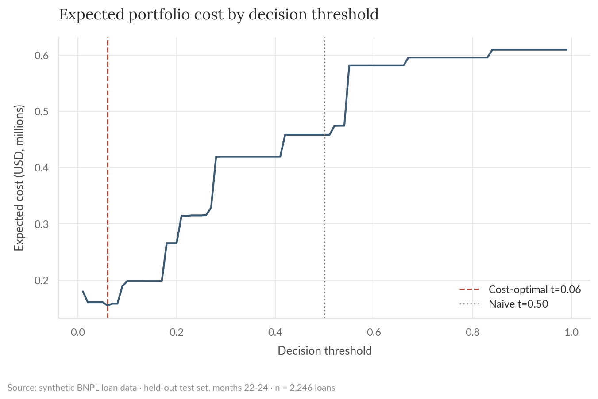
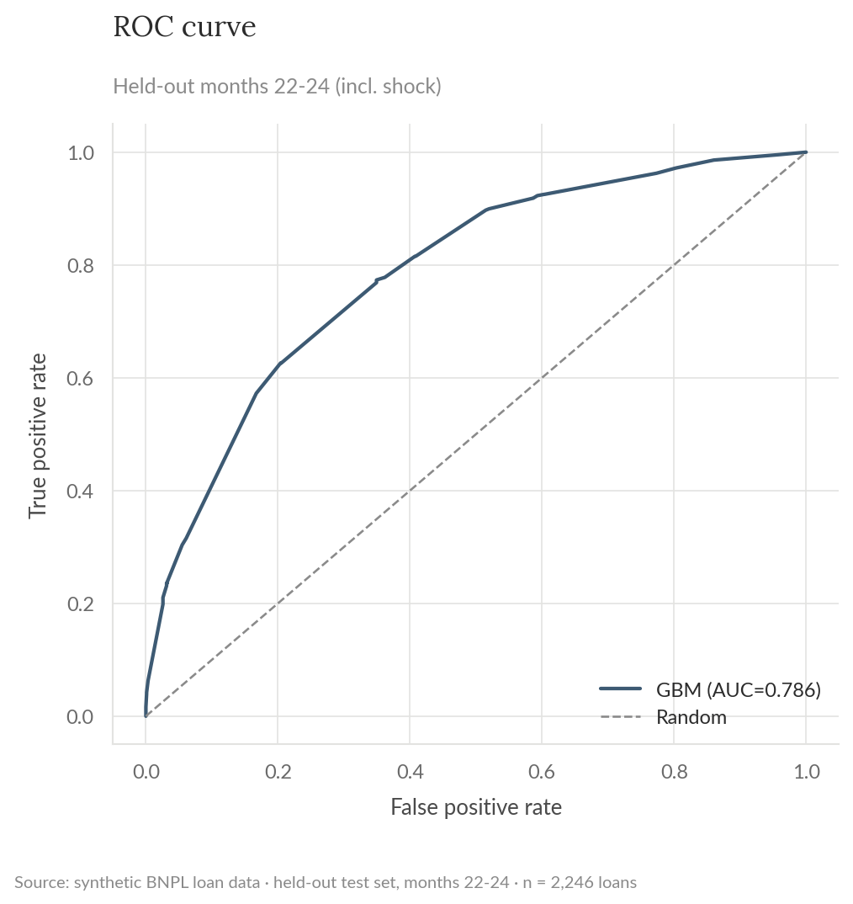
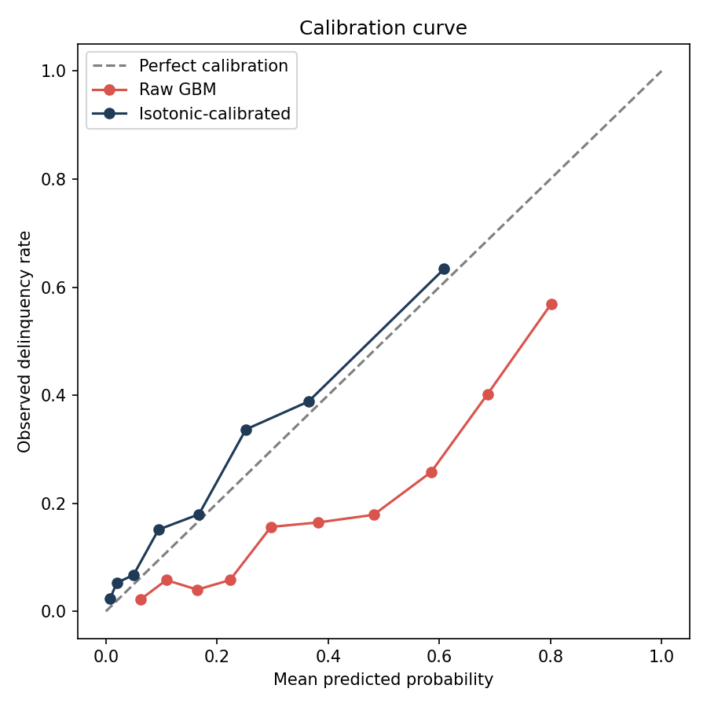
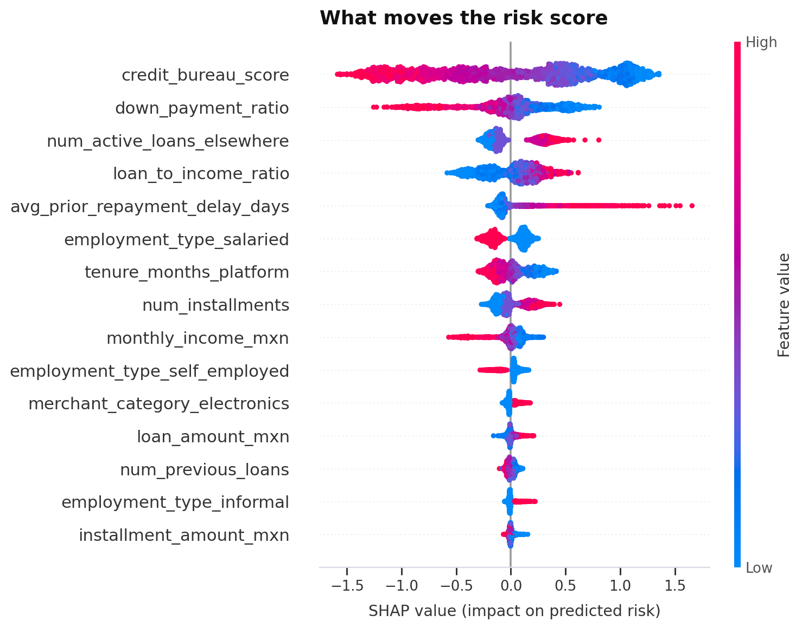
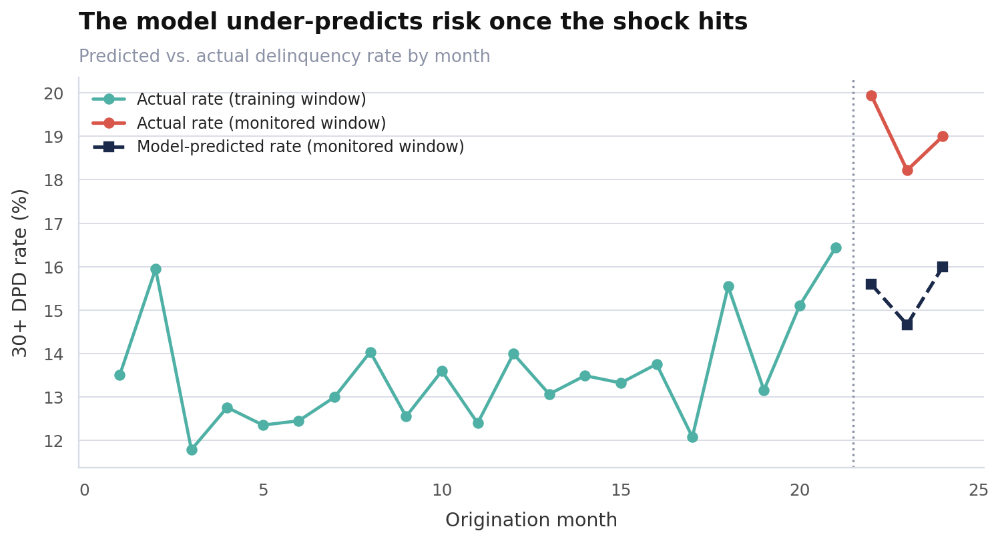
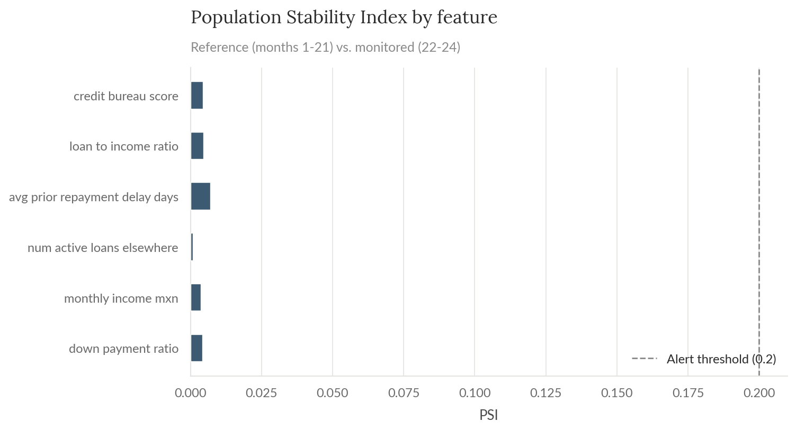

# BNPL Delinquency Risk Model

Predicts which buy-now-pay-later loans will go 30+ days past due (DPD), picks a decision threshold from business costs instead of a default 0.5, explains the model with SHAP, and checks it for drift after a simulated macro shock. This mirrors work I currently do at a Mexican BNPL fintech: delinquency prediction, contribution analysis, CLV. Built here end-to-end on synthetic data so it can be shared.

> All data in this project is synthetically generated (`src/generate_data.py`). No proprietary data, models, or results from any employer are used or implied.

## Business framing

A BNPL lender approves a loan in seconds at checkout. Every approval is a bet: if the customer pays, the lender earns a merchant/interest fee (~6% of principal here). If the customer goes 30+ days delinquent, the lender eats most of the principal (~70% here, net of recoveries). The accept/decline threshold is a direct P&L lever, so it should be picked from these costs, not from a default 0.5.

## Dataset

18k synthetic loans from 9k customers over a 24-month window: customer demographics (Mexican cities, employment type, tenure), a bureau-style credit score, prior repayment behavior, and loan terms (amount, installments, merchant category, down payment). Base delinquency rate is about 14%. The last 3 months carry a synthetic macro shock (an inflation/rate spike) that raises delinquency about 5 points without changing the input feature distributions. That gap is used later to test the monitoring setup.

Regenerate with: `python src/generate_data.py`

## Method

1. `src/eda.py`: delinquency rate by month, employment type, merchant category; bureau score and loan-to-income distributions by outcome.
2. `src/features.py`: loan-to-income ratio, installment-to-income ratio, thin-file/new-customer flags, one-hot categoricals.
3. `src/train.py`: temporal split (train on months 1-18, calibrate on 19-21, test on 22-24, which includes the shock). No random shuffling, since a real deployment never sees the future at train time. Logistic regression baseline vs. gradient-boosted trees (`HistGradientBoostingClassifier`), isotonic probability calibration fit on the validation window.
4. Decision threshold: swept thresholds against the cost assumptions above to find the cost-minimizing cutoff.
5. `src/interpret.py`: SHAP values on the held-out set.
6. `src/monitor_drift.py`: PSI on key features plus a predicted-vs-actual rate check, comparing the training population to the shocked window.

## Results

| Metric | Value |
|---|---|
| Logistic regression AUC (baseline) | 0.804 |
| GBM AUC (held-out, months 22-24) | 0.786 |
| GBM PR-AUC (average precision) | 0.461 |
| Brier score, raw to calibrated | 0.170 to 0.127 |
| Cost-optimal threshold | 0.06 |
| Portfolio cost reduction vs. naive 0.5 threshold | 66.8% |
| Precision / Recall at optimal threshold | 0.29 / 0.90 |

The logistic baseline is competitive with the GBM, 0.804 vs. 0.786 AUC. That's worth stating plainly instead of assuming a more complex model wins by default: the underlying drivers here are close to additive, so a well-regularized linear model captures most of the signal. In a real setting I'd report both and weigh interpretability and maintainability into the choice, not AUC alone.

The cost-optimal threshold (0.06) sits far below 0.5 because a missed delinquent loan costs about 12x more than declining a good customer, so the model should approve conservatively even at the expense of precision. This cut expected portfolio cost by 67% vs. a naive 0.5 cutoff on the same test set.





### What drives the score



Bureau score, down payment ratio, existing loans elsewhere, and loan-to-income ratio dominate, consistent with the EDA and with standard credit-risk intuition.

### Monitoring



Running PSI on the shocked window (months 22-24) against the training window flags nothing: every monitored feature comes back well under the 0.20 alert threshold. But the actual delinquency rate jumps from 13.6% to 19.1%, and the model, calibrated only on pre-shock data, under-predicts risk by 3.6 points during the shock (15.4% predicted vs. 19.1% observed).

This is concept drift, not covariate drift: the inputs look the same, but the relationship between inputs and outcome changed. A monitoring setup that only checks input PSI would miss it. The practical implication is to pair input drift checks with outcome-rate and calibration monitoring.



## Limitations

- Synthetic data with hand-specified, mostly-linear relationships. Real portfolios have messier, more interacting effects and label noise.
- No hyperparameter search, used sane defaults. A real project would tune the GBM and probably also try monotonic constraints on features like bureau score.
- The cost assumptions (70% loss given default, 6% margin) are illustrative, not fitted from real recovery data.
- The 3-month monitored window is short. Production monitoring would track PSI and calibration continuously, not as a one-off snapshot.

## Reproduce

```bash
pip install -r requirements.txt
python src/generate_data.py
python src/eda.py
python src/train.py
python src/interpret.py
python src/monitor_drift.py
```

Outputs land in `reports/` (figures, `metrics.json`, `drift_report.md`). `data/` and `reports/model.pkl` are gitignored, regenerate them by running the scripts above.
