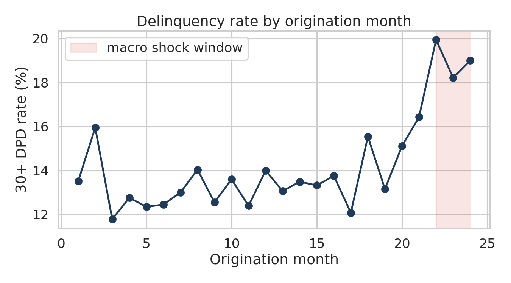
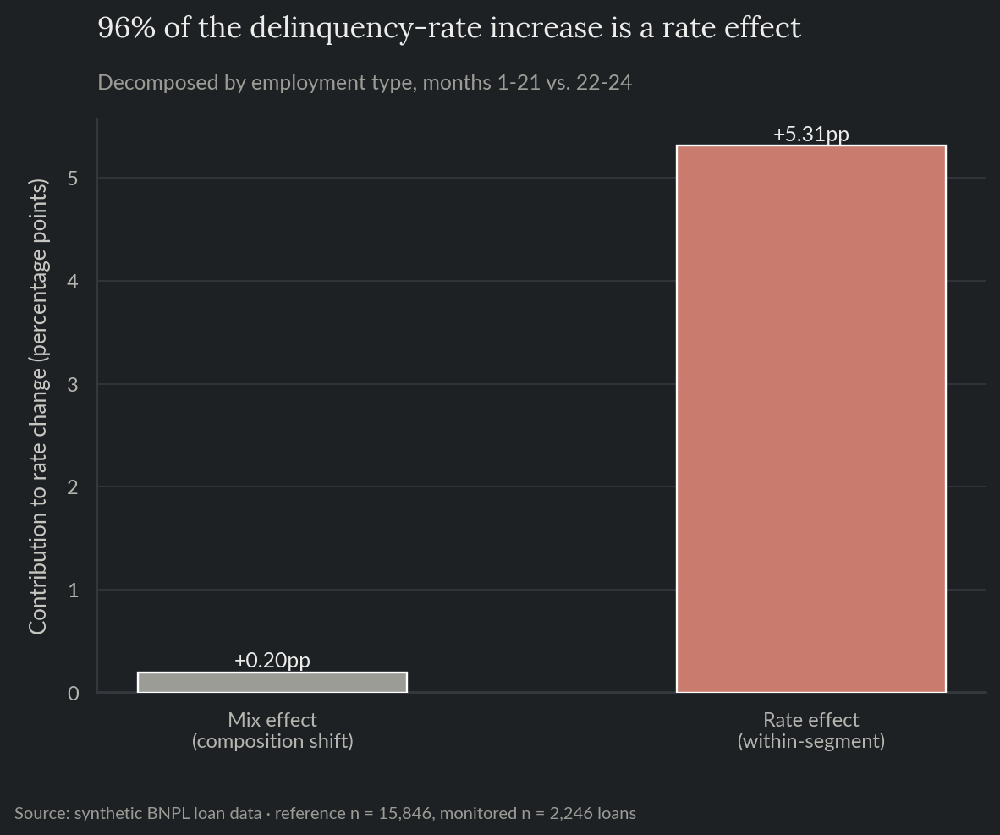
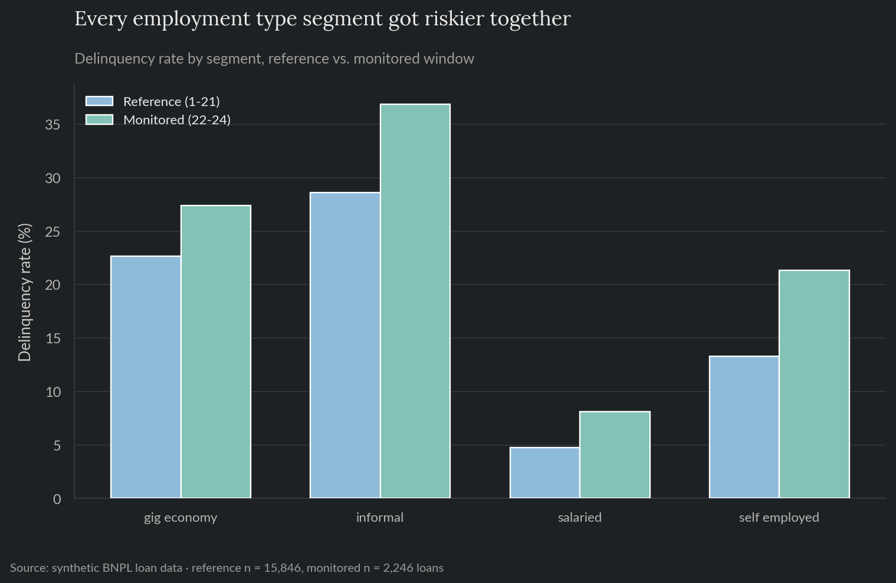

# BNPL Delinquency Risk Model

A risk model that flags which buy-now-pay-later loans are likely to go 30+ days past due, and a decision threshold picked from actual business costs instead of a default 0.5 cutoff. Built on synthetic data modeled after a BNPL lending book, mirroring delinquency-prediction work I currently do in fintech.

**For the full technical walkthrough (modeling, calibration, SHAP, drift monitoring), see the [notebook](notebooks/01_delinquency_risk_model.ipynb).** This README is the short version.

> All data here is synthetically generated. No proprietary data, models, or results from any employer are used or implied.

**Skills demonstrated:** classification modeling (logistic regression + gradient-boosted trees), leakage-safe feature pipelines (feature-engine, fit on the training split only), time-series cross-validated hyperparameter search, probability calibration, cost-based decision optimization, SHAP interpretability, drift and calibration monitoring.

## The problem

A BNPL lender approves a loan in seconds at checkout. Approve a customer who pays on time, and the lender earns a small merchant fee. Approve one who defaults, and the lender loses most of the loan amount. Getting the approve/decline line right is worth real money.

## What this does

Trains a model to predict delinquency risk at loan approval, then picks the approve/decline threshold that minimizes expected losses given realistic cost assumptions, rather than using a generic 0.5 cutoff.

## Results

The gradient-boosted model's hyperparameters were chosen with a randomized search over 5-fold time-series cross-validation (expanding window, each fold validating on the months right after it), not hand-picked. Picking the decision threshold from cost instead of defaulting to 0.5 cut expected portfolio losses by **67%** on held-out data.

| | |
|---|---|
| Model accuracy (AUC), held-out test | 0.79 |
| Model accuracy (AUC), cross-validated | 0.81 ± 0.005 |
| Expected loss reduction vs. a naive 0.5 cutoff | 67% |
| Share of actual delinquent loans caught | 92% |




## Some applicants have no bureau record

About 9% of customers are thin-file: gig/informal workers and recent platform joiners with no bureau score on record at underwriting time, a routine situation for a BNPL lender rather than an edge case. The feature pipeline (feature-engine, wrapped in an sklearn `Pipeline`) adds a missing-value indicator and median-imputes the score, fit on the training split only and reused unchanged on validation, test, and the monitoring window, so no split ever influences another split's preprocessing statistics.

Bureau score is still by far the model's strongest signal (SHAP), but the missing-score indicator itself carries a small amount of separate signal beyond what employment type and tenure already capture, meaning "no bureau record" isn't fully redundant with the other applicant information the model already has.

## Monitoring caught something standard checks would have missed

The model was stress-tested against a simulated economic shock. Standard drift monitoring (checking whether customer profiles have changed, including the rate of missing bureau scores) showed nothing unusual: every PSI stayed well under the alert threshold, and the missing-score rate barely moved (9.4% reference vs. 9.9% monitored). But the actual default rate rose anyway, and the model quietly under-predicted risk during the shock. Catching it required watching the gap between predicted and observed outcomes, since input drift alone stayed quiet the whole time. Full detail in section 10 of the [notebook](notebooks/01_delinquency_risk_model.ipynb).


### Is it a mix shift or a rate shift?

Clean PSI could still hide a subtler explanation: the portfolio quietly shifting toward segments (employment type, city tier, merchant category) that were already riskier before the shock. A rate-mix shift decomposition rules that out directly: 96% of the delinquency-rate increase is a rate effect (loans within the same segment getting riskier), with only 4% attributable to composition shift, and every employment segment moved together rather than one risky segment simply becoming more common.

| | |
|---|---|
| Delinquency rate, reference vs. monitored window | 13.5% vs. 19.1% |
| Share of the increase from composition shift (mix effect) | 3.6% |
| Share of the increase from within-segment rate change | 96.4% |





## Recommendation

Ship the cost-based threshold over the naive 0.5 cutoff; the 67% expected-loss reduction is the headline number. But ship it with calibration-gap monitoring running alongside standard PSI checks, not instead of it. This model would have looked healthy on every input-drift dashboard while quietly under-pricing risk through the shock. That gap is the kind of thing that shows up in a loss report a quarter later if nobody's watching for it. And since the rate-mix decomposition rules out a composition shift as the explanation, the fix belongs in the model (retrain or recalibrate on shock-period data) rather than in underwriting policy toward any particular segment.

## Repo layout

- `notebooks/01_delinquency_risk_model.ipynb`: full technical walkthrough, executed with all charts and results inline.
- `src/`: the reproducible pipeline (data generation, features, training, interpretability, monitoring, rate-mix shift decomposition) as standalone scripts.
- `tests/`: pytest suite covering data-generation invariants, the feature-engineering functions and pipeline (including the missing-bureau-score handling), and the rate-mix shift decomposition.
- `reports/`: generated charts, metrics, and monitoring reports.

## Reproduce

```bash
pip install -r requirements.txt
python src/generate_data.py
python src/eda.py
python src/tune.py       # hyperparameter search, writes reports/best_params.json
python src/train.py      # picks up best_params.json automatically if present
python src/interpret.py
python src/monitor_drift.py
python src/rate_mix_shift.py
```

`data/` and `reports/model.pkl` are gitignored; regenerate them by running the scripts above. `reports/best_params.json` is committed so `train.py` reproduces the same tuned model without re-running the search.

## Tests

```bash
pytest tests/ -v
```

Runs in CI on every push (see the badge at the [repo root](../../README.md)).
