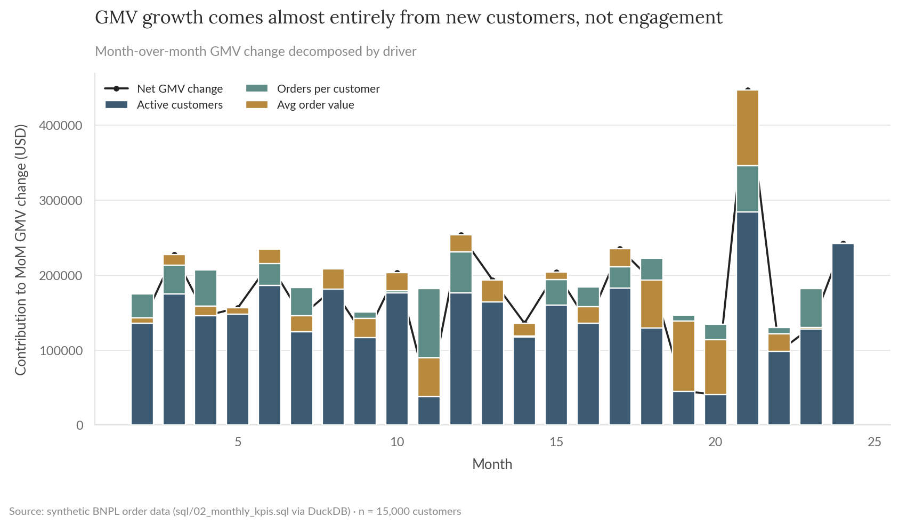
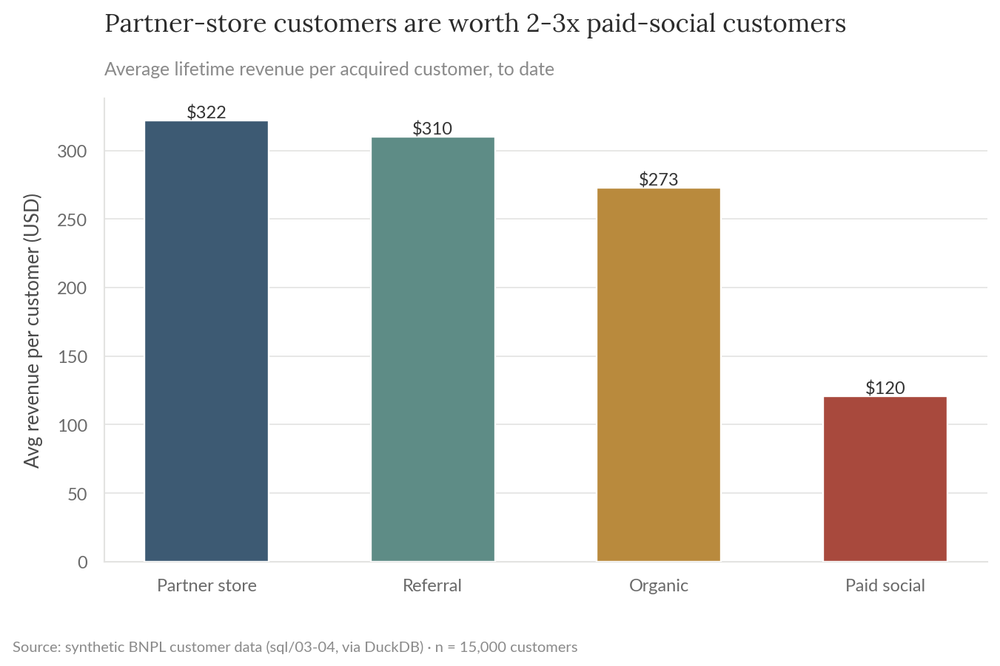
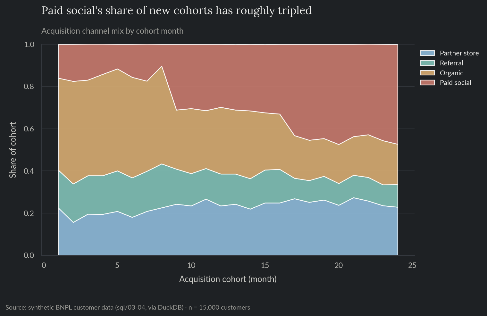
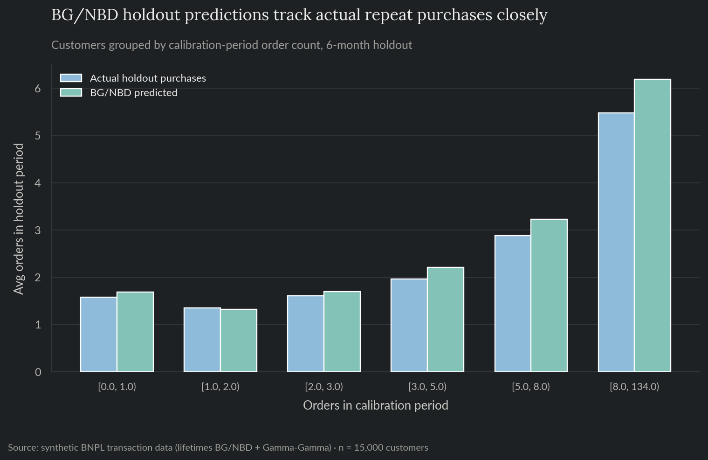
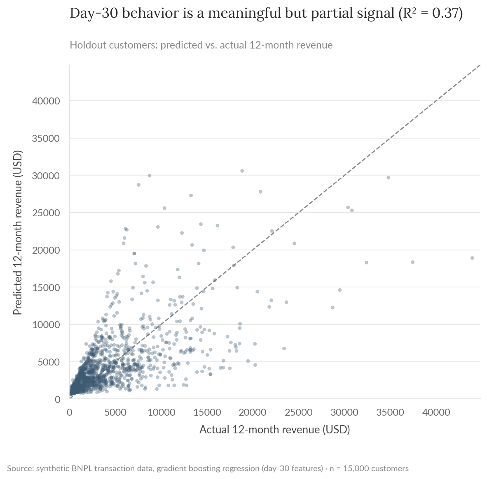

# Customer LTV & Contribution Analysis

A growth analysis for a synthetic BNPL fintech: what's driving GMV growth, which acquisition channels actually produce valuable customers, and how to predict a customer's lifetime value from their first 30 days. Built on synthetic transaction data, mirroring the growth/contribution analysis work I do alongside credit risk modeling in fintech.

**For the full technical walkthrough (SQL, BG/NBD + Gamma-Gamma CLV modeling, calibration/holdout validation, gradient boosting), see the [notebook](notebooks/02_ltv_contribution_analysis.ipynb).** This README is the short version.

> All data here is synthetically generated. No proprietary data, models, or results from any employer are used or implied. This is the same fictional company as project 01, viewed from the growth/LTV side instead of the credit-risk side.

**Skills demonstrated:** SQL (window functions, CTEs, cohort joins via DuckDB), cohort retention analysis, log-share contribution decomposition, probabilistic customer lifetime value (BG/NBD + Gamma-Gamma) with calibration/holdout validation, gradient boosting regression with feature importance.

## The problem

GMV was up sharply over two years, which looks like a growth story on the surface. The question is whether that growth is healthy, more valuable customers coming back and spending more, or whether it's being propped up by pouring more people into the top of the funnel while the customer base underneath gets less engaged.

## What this does

Decomposes GMV growth into its three multiplicative drivers (active customers, orders per customer, average order value) using SQL-aggregated monthly KPIs, then checks whether the answer traces back to a shift in acquisition channel mix. Separately, builds two complementary customer lifetime value models: a probabilistic BG/NBD + Gamma-Gamma model that scores customers from transaction history, and a gradient boosting model that scores customers from just their first 30 days.

## Results

GMV grew from $868K to $3.36M between month 4 and month 20. Decomposing that change shows active customer growth alone accounts for essentially all of it; order frequency and average order value are each net-negative contributors over the period.

| | |
|---|---|
| GMV growth, month 4 to month 20 | +$2.50M |
| Share of growth from new customers | ~107% (frequency and order value are net drags) |
| Best vs. worst channel, revenue per customer | Partner store $322 vs. paid social $120 (2.7x) |
| Paid social's share of new cohorts | Roughly tripled (16% to 47%) |
| Predicted 12-month CLV captured by top decile | 52.7% |
| Early-life model (day-30 features), holdout R² | 0.37 |



The channel data explains why: paid social is both the fastest-growing acquisition channel and the lowest-quality one by a wide margin.





## Two ways to estimate customer value

BG/NBD + Gamma-Gamma uses only transaction history and needs no features, but it takes months of purchase history to produce a stable read on a customer. Validated against a 6-month calibration/holdout split, its predicted purchase counts track actual holdout behavior closely.



For a model that can score a customer immediately after signup, a gradient boosting regressor trained on day-30 behavior explains about 37% of the variance in 12-month revenue. That's a genuine signal, order count and spend in the first 30 days dominate the prediction, but it's a partial one: some customers front-load a purchase and then churn, which day-30 features alone can't fully separate from a customer who's just getting started.



## Recommendation

The GMV trend is not the health signal it looks like. Growth is increasingly funded by paid social, a channel that produces customers worth roughly a third as much as the best channel, and both order frequency and order value are quietly declining under the growth line. Before scaling paid social spend further, the marginal CAC on that channel should be checked against its ~$120 average lifetime revenue, not against blended GMV growth.

For lifetime value scoring in production, use the day-30 gradient boosting model to triage new customers into engagement tiers immediately after signup, then let the BG/NBD + Gamma-Gamma model take over once a customer has enough transaction history for it to stabilize, rather than picking one model for the whole customer lifecycle.

## Repo layout

- `notebooks/02_ltv_contribution_analysis.ipynb`: full technical walkthrough, executed with all charts and results inline.
- `sql/`: cohort revenue, monthly KPIs, channel quality, and channel mix-shift queries, run via DuckDB.
- `src/`: the reproducible pipeline (data generation, SQL runner, contribution decomposition, channel analysis, CLV modeling) as standalone scripts.
- `reports/`: generated charts and CSV outputs.

## Reproduce

```bash
pip install -r requirements.txt
python src/generate_data.py
python src/cohort_analysis.py
python src/contribution.py
python src/channel_analysis.py
python src/clv_model.py
```

`data/` and `reports/` are gitignored except for what's needed to render this README; regenerate them by running the scripts above.
