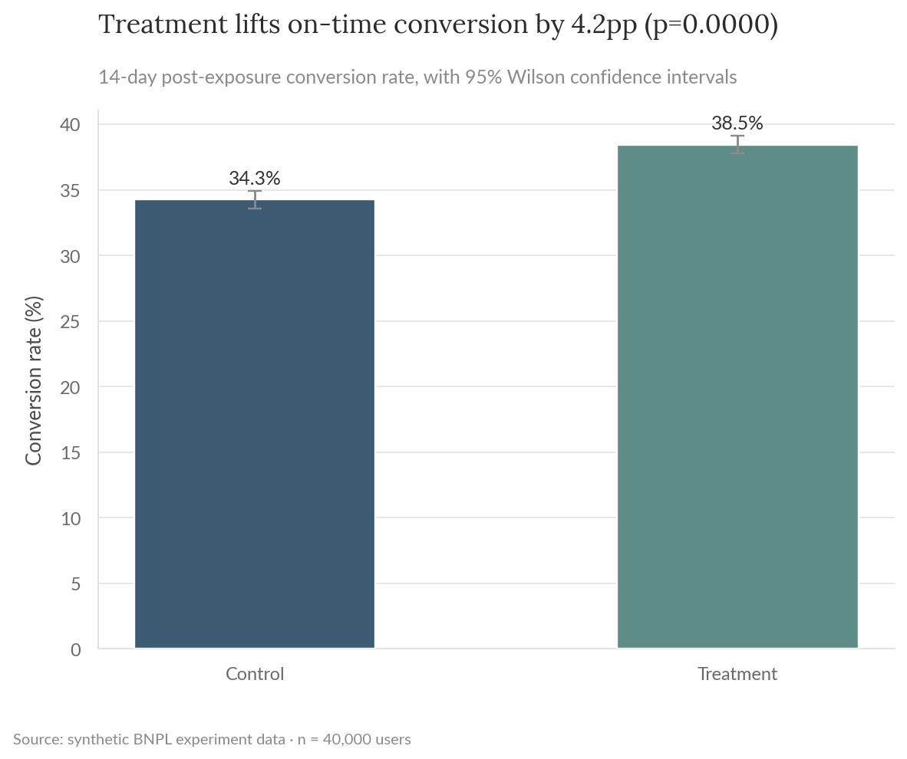
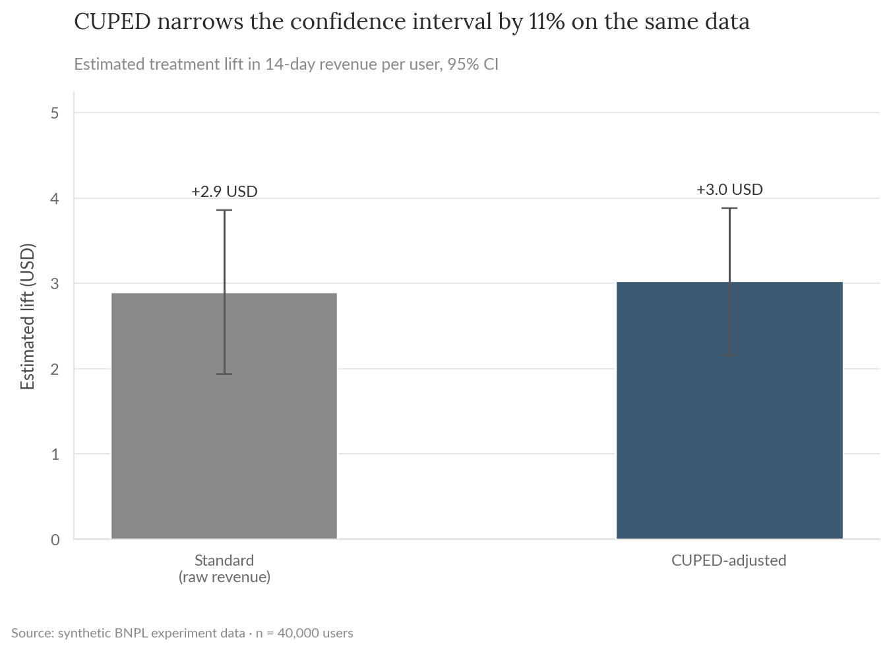
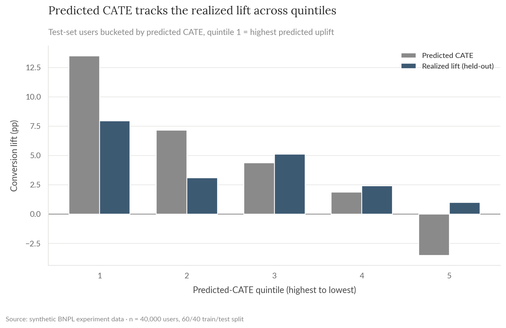
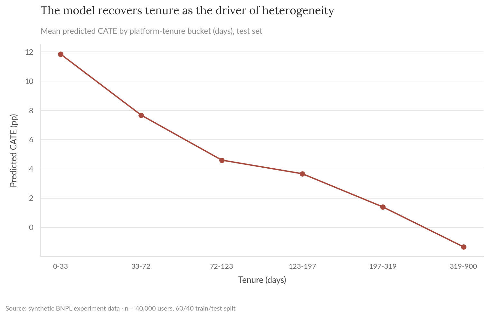
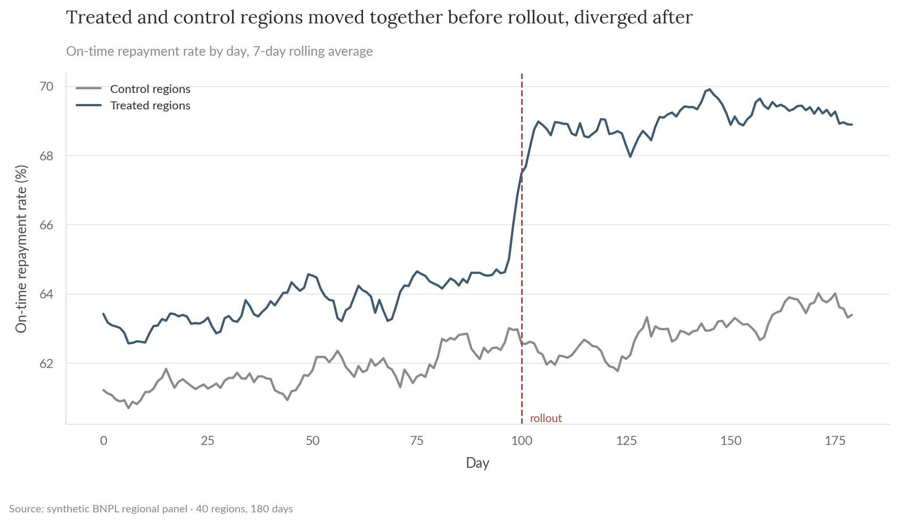
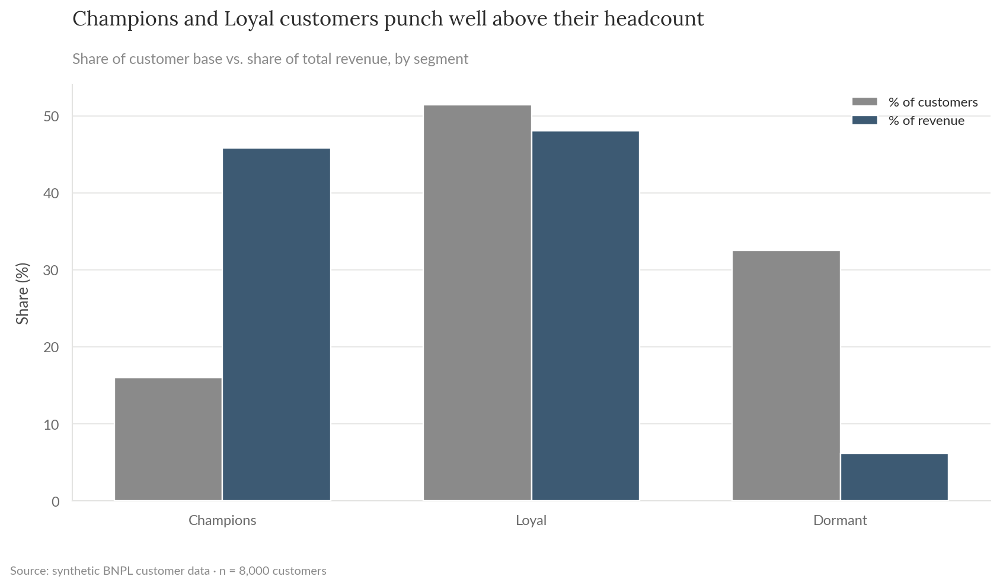
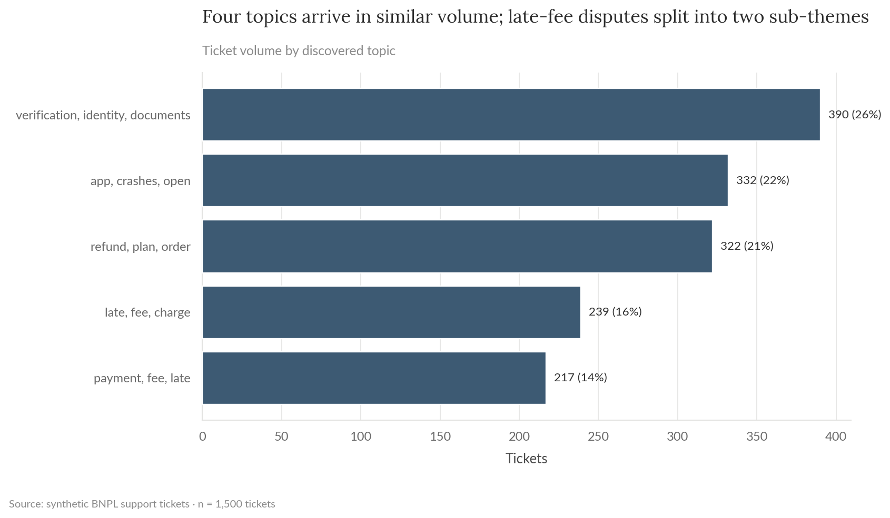

# Growth Experimentation & Segmentation

Five growth analyses for a synthetic BNPL fintech: an A/B test on a repayment-reminder redesign with a proper power analysis and CUPED variance reduction, an uplift/CATE model on that same test showing who actually benefits, a difference-in-differences read on a regional feature rollout that wasn't randomized, RFM customer segmentation, and light NLP topic modeling on support tickets. Built on synthetic data, mirroring the experimentation and lifecycle-analytics work that sits alongside credit risk and growth analysis in fintech.

**For the full technical walkthrough (power analysis, fixed-effects regression, uplift modeling, clustering, NMF), see the [notebook](notebooks/03_growth_experimentation_segmentation.ipynb).** This README is the short version.

> All data here is synthetically generated. No proprietary data, models, or results from any employer are used or implied. This is the same fictional company as projects 01 and 02, viewed from the growth/experimentation side.

**Skills demonstrated:** experiment design and power analysis, two-proportion hypothesis testing, CUPED variance reduction, uplift/CATE modeling (T-learner) with Qini-curve validation, difference-in-differences with fixed effects and a parallel-trends check, KMeans clustering for RFM segmentation, light NLP topic modeling (TF-IDF + NMF).

## The problem

Growth teams run experiments and read metrics on populations that were rarely handed to them cleanly randomized or evenly behaved. A test needs to be sized correctly before it runs, a rollout that skipped randomization still needs an honest causal read, and a customer base or a support queue needs to be broken into groups that are actually useful to act on.

## 1. A/B test: repayment-reminder redesign

A redesigned in-app reminder (clearer due date, one-tap repayment link) was tested against the existing one. The test was sized to detect a 3.5 percentage-point lift at 80% power (requiring about 2,900 users per arm) and ran on roughly 40,000 users.

| | |
|---|---|
| On-time conversion, control vs. treatment | 34.3% vs. 38.5% |
| Absolute lift | +4.2pp (95% CI: 3.3 to 5.1pp), p < 0.0001 |
| CUPED confidence interval narrowing | 11%, using pre-period revenue as the covariate |





## 2. Uplift/CATE modeling: who actually benefits

The +4.2pp average lift is real, but it's an average across everyone, and averages can hide that some users benefit far more than others. A T-learner (two gradient-boosted classifiers, one fit per arm, on tenure, recent session count, and pre-period revenue) predicts each held-out test user's individual treatment effect, validated the standard way for uplift models: by checking whether a higher predicted effect actually corresponds to a bigger realized effect on data the model never saw during fitting.

| | |
|---|---|
| Realized lift, top predicted-CATE quintile vs. bottom | +8.0pp vs. +1.0pp |
| Qini coefficient (targeting by predicted CATE vs. random) | 52.1 |
| Predicted CATE, newest users (0-33 days) vs. longest-tenured (320+ days) | +11.8pp vs. -1.3pp |





The model recovers platform tenure as the driver of the heterogeneity without being told to look for it: newer users, who haven't yet learned the old reminder flow, get most of the benefit from a clearer one; long-tenured users see essentially none.

## 3. Difference-in-differences: regional rollout

A new in-app collections feature was rolled out to 20 of 40 regions first, based on business priority rather than random assignment, which rules out a simple before/after read. A region and day fixed-effects regression, checked against a pre-period parallel-trends test first, isolates the treatment effect from any shared time trend.

| | |
|---|---|
| Pre-period trend difference (placebo check) | Not significant (p = 0.70), supports parallel trends |
| DiD estimate | +4.0pp on-time repayment (95% CI: 3.7 to 4.3pp), p < 0.0001 |



## 4. RFM customer segmentation

Recency, frequency, and monetary value, clustered with KMeans (k chosen by silhouette score, not fixed in advance) into three segments.

| Segment | % of customers | % of revenue |
|---|---|---|
| Champions | 16% | 46% |
| Loyal | 52% | 48% |
| Dormant | 32% | 6% |



## 5. Support ticket topic modeling

TF-IDF + NMF on 1,500 synthetic support tickets recovers five topics from text alone, validated at 85% purity against the known ground-truth categories (a check only possible because the data is synthetic).



One topic, general account questions, doesn't cluster cleanly on its own; it scatters across the other four because it shares vocabulary with them rather than having a distinct signature. That's a real limitation of unsupervised topic modeling on short text, not something worth glossing over.

## Recommendation

Ship the reminder redesign; the lift is well outside noise and confirmed two ways (a standard test and a CUPED-adjusted one with a tighter interval). But ship it targeted, not blanket: the uplift model shows the benefit concentrates heavily in newer users, so rolling the redesign out to long-tenured users buys almost nothing while the engineering and support cost of maintaining two reminder flows is the same either way. For the regional rollout, the fixed-effects estimate and the pre-period placebo check both support treating the +4.0pp effect as real rather than a pre-existing regional difference, which makes the case for extending the rollout to the remaining regions. For lifecycle marketing, the RFM segments show where a differentiated offer would pay off most: roughly a third of customers are Dormant and contribute barely 6% of revenue, so a win-back offer targeted at that group would cost little in forgone Champion/Loyal attention. For support operations, route the four cleanly-separated topics to a keyword/topic-based triage rule, but keep a human or supervised classifier in the loop for general account questions, since that category doesn't have a clean unsupervised signature to route on.

## Repo layout

- `notebooks/03_growth_experimentation_segmentation.ipynb`: full technical walkthrough, executed with all charts and results inline.
- `src/`: the reproducible pipeline (data generation, experiment design/CUPED, uplift/CATE modeling, causal inference, segmentation, topic modeling) as standalone scripts.
- `tests/`: pytest suite covering data-generation invariants, the DiD estimator (against a synthetic panel with a known injected effect), the uplift model's bucket-calibration and Qini-curve logic, and the RFM/topic-modeling helper functions.
- `reports/`: generated charts and CSV outputs.

## Reproduce

```bash
pip install -r requirements.txt
python src/generate_data.py
python src/experiment_design.py
python src/uplift_modeling.py
python src/causal_inference.py
python src/segmentation.py
python src/ticket_topics.py
```

`data/` and `reports/*.csv` are gitignored; regenerate them by running the scripts above.

## Tests

```bash
pytest tests/ -v
```

Runs in CI on every push (see the badge at the [repo root](../../README.md)).
