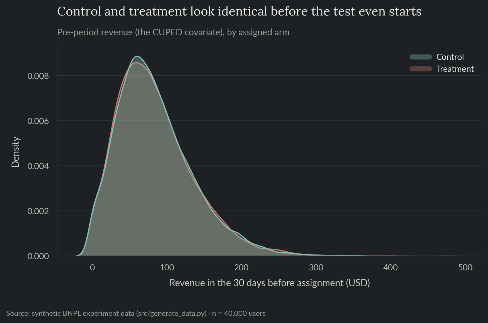
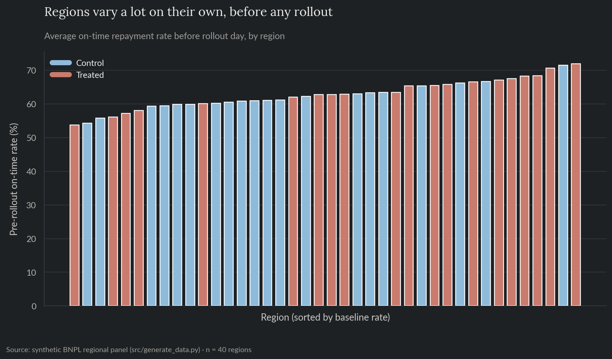
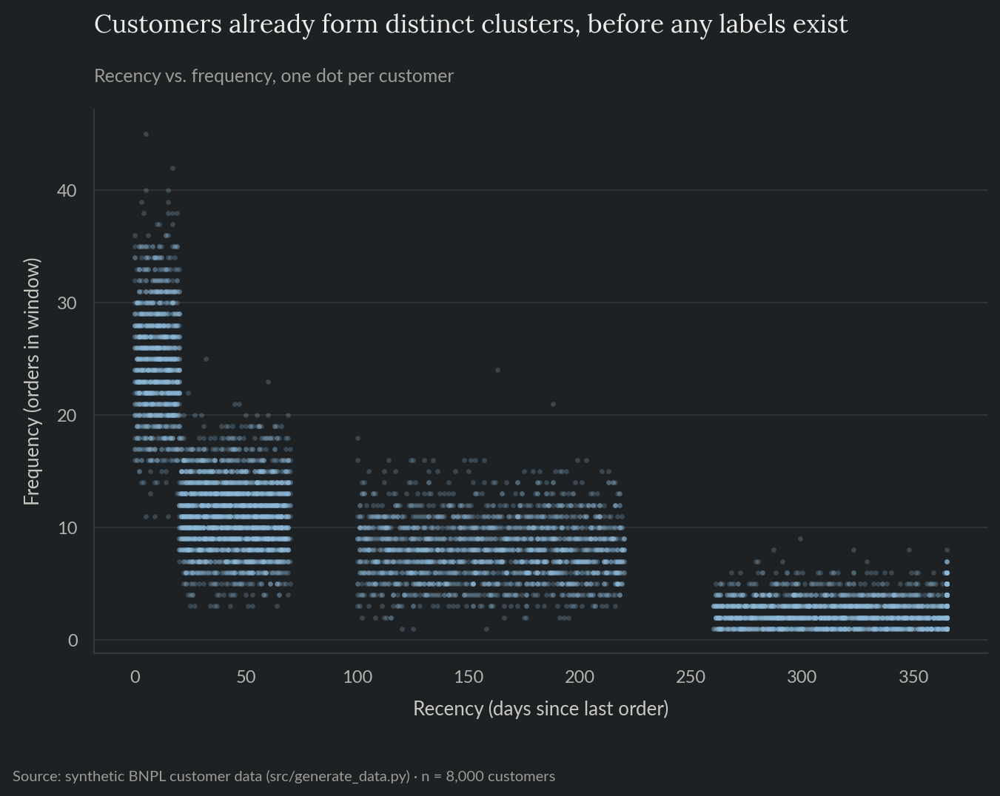
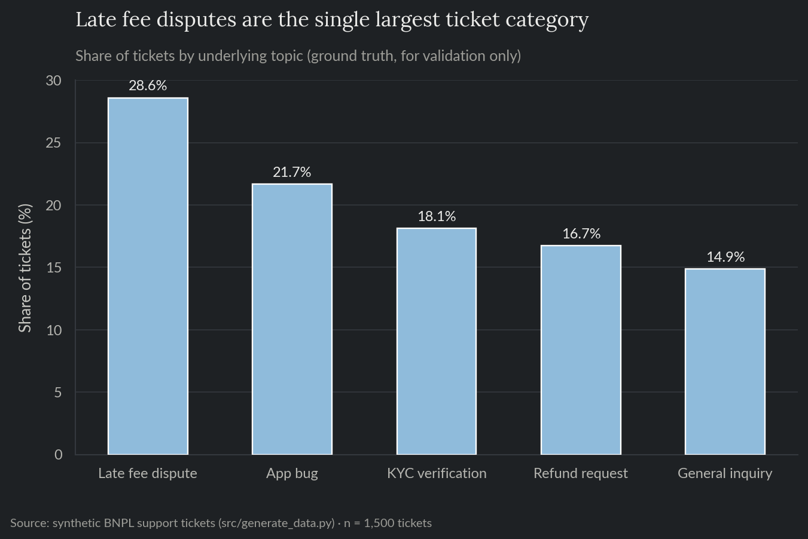
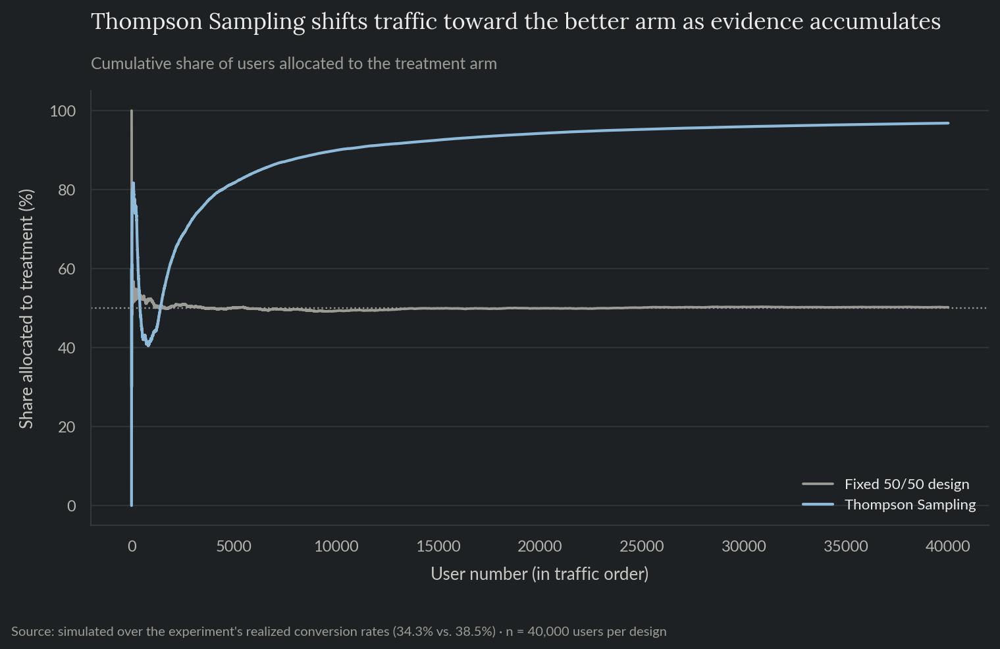
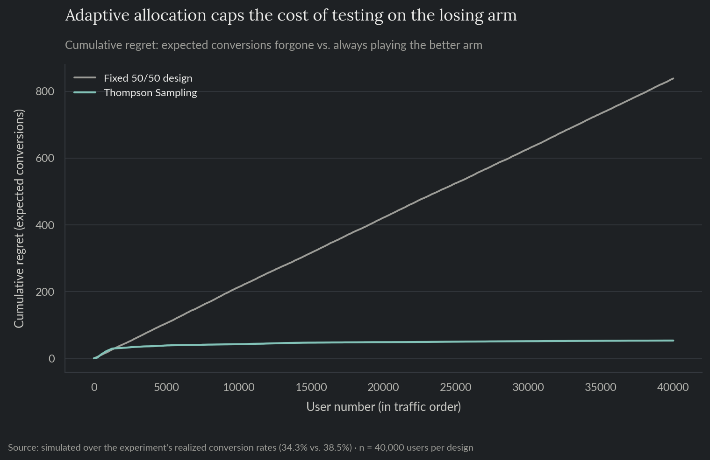
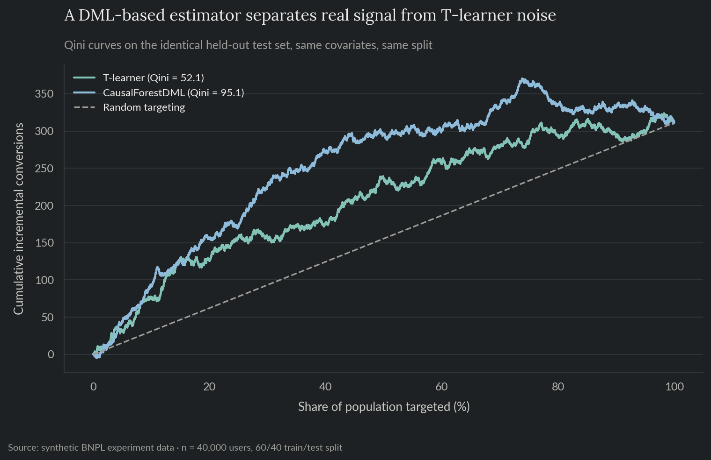
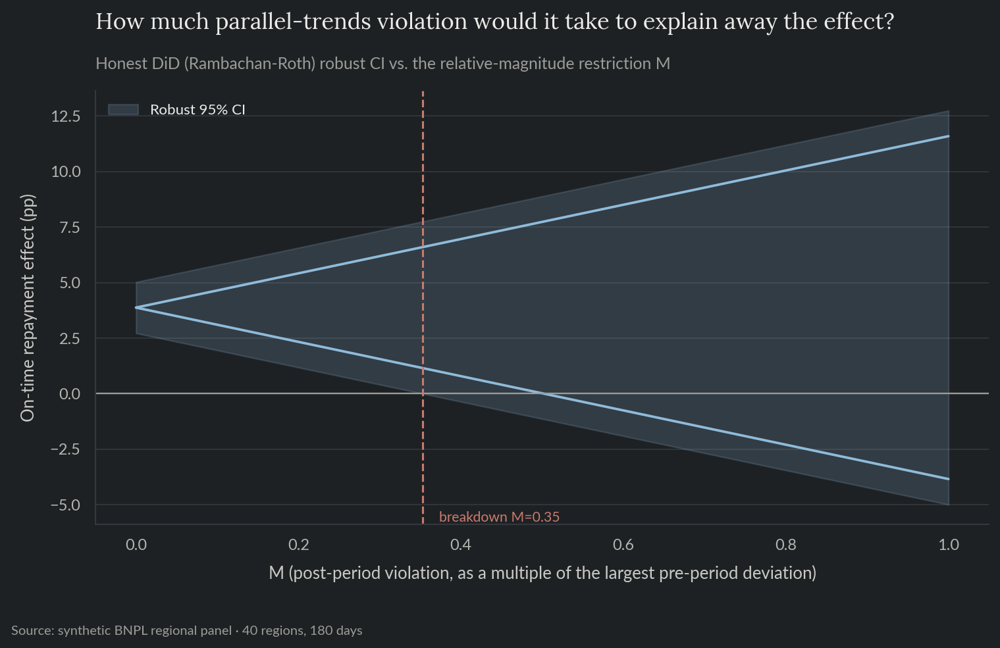
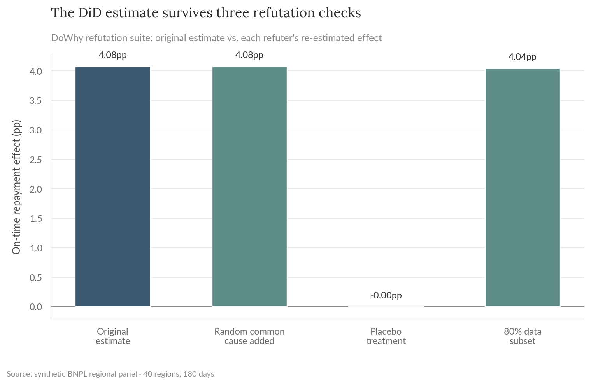

# Growth Experimentation & Segmentation

Five growth analyses for a synthetic buy now, pay later (BNPL) fintech: an A/B test on a repayment-reminder redesign with a proper power analysis, CUPED variance reduction, and a sequential-experimentation comparison against an adaptive bandit design, an uplift/CATE model on that same test showing who actually benefits, a difference-in-differences read on a regional feature rollout that wasn't randomized, RFM customer segmentation, and light NLP topic modeling on support tickets. Built on synthetic data, mirroring the experimentation and lifecycle-analytics work that sits alongside credit risk and growth analysis in fintech.

**For the full technical walkthrough (power analysis, fixed-effects regression, uplift modeling, clustering, NMF), see the [notebook](notebooks/03_growth_experimentation_segmentation.ipynb).** This README is the short version.

> All data here is synthetically generated. No proprietary data, models, or results from any employer are used or implied. This is the same fictional company as projects 01 and 02, viewed from the growth/experimentation side.

**Skills and tools featured:**

- Exploratory data analysis
- Experiment design and power analysis
- Two-proportion hypothesis testing
- CUPED variance reduction
- Multi-armed bandits (Thompson Sampling) vs. fixed-horizon testing
- Uplift/CATE modeling (T-learner and EconML's CausalForestDML) with Qini-curve validation
- Difference-in-differences with fixed effects and a parallel-trends check
- Wild cluster bootstrap and Honest DiD sensitivity analysis
- DoWhy's causal model/identify/estimate/refute framework
- KMeans clustering for RFM segmentation
- Light NLP topic modeling (TF-IDF + NMF)

## The problem

Growth teams run experiments and read metrics on populations that were rarely handed to them cleanly randomized or evenly behaved. A test needs to be sized correctly before it runs, a rollout that skipped randomization still needs an honest causal read, and a customer base or a support queue needs to be broken into groups that are actually useful to act on.

## Exploratory analysis

This project runs on four independent datasets, one per section below. Before any of them gets a test, a regression, or a clustering algorithm, it's worth checking what each one actually looks like.

The A/B test's randomization worked as intended: pre-period revenue, the same covariate CUPED uses later, is essentially indistinguishable between control and treatment (Figure 1), exactly what a clean 50/50 split should produce before the treatment can have touched anything.



*Figure 1. Pre-period revenue distribution, control vs. treatment.*

The regional rollout data tells a different story: individual regions vary quite a bit on their own before any rollout happens, from a 53.7% to a 71.9% pre-rollout on-time rate (Figure 2). Since that variation exists independent of treatment status, comparing raw before/after levels would confuse it with the rollout's actual effect, which is exactly why the difference-in-differences model further down controls for region fixed effects instead.



*Figure 2. Average on-time repayment rate before rollout day, by region.*

The RFM customer base already separates into visually distinct groups on just two of its three dimensions, recency and frequency, before any clustering algorithm runs (Figure 3). That's what gives KMeans real structure to find later, rather than an arbitrary cut through one smooth blob.



*Figure 3. Recency vs. frequency, one dot per customer.*

Support tickets skew toward late fee disputes, 29% of the total and the single largest category (Figure 4). Since this is synthetic data, that ground-truth label is known upfront, which is what makes it possible to score the unsupervised topic model against it later instead of only eyeballing the result.



*Figure 4. Share of tickets by underlying topic.*

## 1. A/B test: repayment-reminder redesign

A redesigned in-app reminder (clearer due date, one-tap repayment link) was tested against the existing one. The test was sized to detect a 3.5 percentage-point lift at 80% power, meaning an 80% chance of catching a real effect that size if one truly exists, which required about 2,900 users per arm. It ran on roughly 40,000 users.

| | |
|---|---|
| On-time conversion, control vs. treatment | 34.3% vs. 38.5% |
| Absolute lift | +4.2pp (95% CI: 3.3 to 5.1pp), p < 0.0001 |
| CUPED confidence interval narrowing | 11%, using pre-period revenue as the covariate |

The standard test shows the lift clearly (Figure 5). A second technique, CUPED (Controlled-experiment Using Pre-Experiment Data), tightens the estimate further on the exact same data and sample size, no extra traffic needed. It works by using a metric from before the test, each user's prior revenue, that's correlated with the outcome but wasn't touched by the treatment itself, to strip out noise that has nothing to do with the reminder redesign. That narrows the confidence interval by 11% (Figure 6).


*Figure 5. On-time conversion by arm, control vs. treatment.*


*Figure 6. Estimated treatment lift, standard vs. CUPED-adjusted, 95% CI.*

### Sequential experimentation: what an adaptive design would have cost or saved

A fixed 50/50 split, like the one above, is the right choice when a clean, unbiased effect estimate is the goal. But it has a real cost: every user sent to the losing arm during the test is a user who didn't get the better experience, and a fixed design keeps sending traffic there at the same rate even once the result is obvious.

An adaptive alternative, a Thompson Sampling multi-armed bandit, shows how large that cost actually is. Simulated over the same 40,000 users and the same two conversion rates, it gradually shifts traffic toward whichever arm looks better as evidence comes in (Figure 7), reaching 96.8% of traffic on the winning arm by the end of the run. Because it stops overexposing users to the losing arm, it banks 886 more conversions over the same total traffic (Figure 8), a 93.6% cut in cumulative regret, the gap between what was actually earned and what a design that always knew the right answer would have earned, compared to the fixed design.

| | |
|---|---|
| Total conversions, fixed 50/50 vs. Thompson Sampling (same 40,000 users) | 14,521 vs. 15,407 |
| Additional conversions banked by Thompson Sampling | 886 |
| Cumulative regret reduction | 93.6% |
| Traffic on treatment by the end of the run | 50% (fixed) vs. 96.8% (Thompson Sampling) |



*Figure 7. Cumulative share of traffic allocated to the treatment arm, fixed 50/50 design vs. Thompson Sampling.*



*Figure 8. Cumulative regret (expected conversions forgone vs. always playing the better arm), fixed design vs. Thompson Sampling.*

There's a real catch, though. Because the bandit's traffic split responds to outcomes as they come in, the resulting data no longer fits the assumptions a standard significance test relies on, the same test used in section 1 above. A production deployment that wanted both the bandit's lower regret and a trustworthy end-of-test result would need specialized "always-valid" testing methods, not implemented here.

This simulation also treats the treatment effect as one flat number for everyone. Section 2 below shows that's not quite true, newer users benefit far more than long-tenured ones, so a contextual bandit that adapts to that difference would be the natural next step.

## 2. Uplift/CATE modeling: who actually benefits

The +4.2pp average lift from the A/B test is real, but it's an average across everyone, and averages hide that some users benefit far more than others. Uplift modeling estimates that treatment effect per user instead of as one population-wide number; this individualized version is called the CATE (Conditional Average Treatment Effect).

The first approach, a T-learner, fits two separate models, one per arm, on each user's tenure, recent activity, and pre-period revenue, then predicts each user's individual effect as the gap between the two. It's validated the standard way for this kind of model: checking whether users the model predicts will benefit more actually do benefit more, on data it never saw during fitting.

| | |
|---|---|
| Realized lift, top predicted-CATE quintile vs. bottom | +8.0pp vs. +1.0pp |
| Qini coefficient (targeting by predicted CATE vs. random) | 52.1 (higher is better; a model with no real targeting signal scores 0) |
| Predicted CATE, newest users (0-33 days) vs. longest-tenured (320+ days) | +11.8pp vs. -1.3pp |

Predicted effect tracks realized effect on held-out data (Figure 9), and the model recovers platform tenure as the driver of the heterogeneity without being told to look for it (Figure 10): newer users, who haven't yet learned the old reminder flow, get most of the benefit from a clearer one; long-tenured users see essentially none.


*Figure 9. Predicted CATE vs. realized lift, by quintile of predicted effect.*


*Figure 10. Predicted CATE by platform-tenure bucket.*

### A second, more rigorous CATE estimator

The T-learner has a structural weakness: subtracting two separately-fit models amplifies whatever noise each one picked up on its own. A different approach, [EconML](https://github.com/py-why/econml)'s `CausalForestDML`, avoids that. It first statistically strips out the parts of the outcome and treatment that a user's tenure, activity, and revenue already explain on their own (a step called double machine learning), then groups the remaining users into a tree structure, a "causal forest," so each estimated effect comes from a group of genuinely similar users rather than one model's difference from another.

Trained on the exact same data split as the T-learner above, it nearly doubles the Qini coefficient:

| | |
|---|---|
| Qini coefficient, T-learner vs. CausalForestDML | 52.1 vs. 95.1 |
| CausalForestDML average treatment effect | +4.7pp (95% CI: 1.1 to 8.3pp) |



*Figure 11. Qini curves, T-learner vs. CausalForestDML, on the identical held-out test set.*

The T-learner's Qini curve still clears random targeting by a wide margin, so it was never a bad model (Figure 11). The gap is what a hand-rolled two-model difference costs against an estimator built specifically to avoid the noise-amplification problem that causes.

## 3. Difference-in-differences: regional rollout

A new in-app collections feature was rolled out to 20 of 40 regions first, chosen by business priority rather than at random. That rules out a simple before/after comparison, since the regions that got it first might have looked different from the rest to begin with.

Difference-in-differences works around that by comparing the *change* over time in treated regions against the *change* over the same period in untreated ones, rather than comparing raw levels directly. That comparison is only valid if, absent the rollout, both groups of regions would have kept moving together, the parallel trends assumption. A regression that controls for region and day, checked against a test of that assumption on the pre-rollout period, isolates the treatment effect from any trend the two groups already shared.

| | |
|---|---|
| Pre-period trend difference (placebo check) | Not significant (p = 0.70), supports parallel trends |
| DiD estimate | +4.0pp on-time repayment (95% CI: 3.7 to 4.3pp), p < 0.0001 |

Treated and control regions move together before rollout and diverge after (Figure 12).


*Figure 12. On-time repayment rate by day, treated vs. control regions.*

### Three robustness checks on the DiD estimate

The first check addresses a technical wrinkle: standard errors here are clustered by region, but with only 40 regions (20 treated), that's on the low end of what the usual clustering math assumes, and results can get unreliable with too few clusters. A wild cluster bootstrap is a resampling-based method built specifically to double-check inference in that situation, without leaning on that same assumption. It comes back with a 95% confidence interval of 3.7 to 4.3pp, almost identical to the original result, which is itself good evidence the low cluster count isn't causing a problem here.

The second check addresses a subtler risk: the pre-trends test above failed to detect a difference between the two groups, but "failed to detect" isn't the same as "proved there isn't one." Honest DiD asks how large an undetected violation of parallel trends, happening after the rollout, would have to be before it could actually explain away the effect. Here, that breakdown point works out to about a third of the largest wobble already seen in the pre-rollout data (M = 0.35). In other words, the result holds up unless something several times noisier than anything observed before the rollout was happening quietly afterward (Figure 13).



*Figure 13. Honest DiD sensitivity analysis: breakdown point M.*

A third check comes from a different angle entirely, using the [DoWhy](https://github.com/py-why/dowhy) library to run three stress tests that don't depend on the DiD-specific assumptions above: adding a made-up confounder that shouldn't matter, swapping in a fake randomly-assigned treatment, and refitting on random subsets of the data. A real effect should barely move under the first and third tests, and collapse toward zero under the second. That's exactly what happens here (Figure 14), the pattern that says the effect is real rather than an artifact of how it was estimated.



*Figure 14. DoWhy refutation suite: original estimate vs. each refuter's re-estimated effect.*

## 4. RFM customer segmentation

Customers are grouped by recency, frequency, and monetary value, how recently, how often, and how much they buy, into segments using KMeans clustering. The number of segments wasn't fixed in advance; it was chosen using the silhouette score, a measure of how cleanly separated the resulting groups are from each other. That landed on three segments.

| Segment | % of customers | % of revenue |
|---|---|---|
| Champions | 16% | 46% |
| Loyal | 52% | 48% |
| Dormant | 32% | 6% |

Champions are 16% of customers and 46% of revenue; Dormant customers are nearly a third of the base and 6% of revenue (Figure 15).


*Figure 15. Share of customers and share of revenue, by RFM segment.*

## 5. Support ticket topic modeling

The raw ticket text is converted into numeric vectors using TF-IDF, a standard technique that weights each word by how distinctive it is to a specific ticket rather than how often it appears everywhere. From there, NMF, an unsupervised method for breaking a set of documents into a handful of interpretable topics, recovers five topics from the text alone, with no labels involved.

Since this data is synthetic, the true ticket category is actually known, which makes it possible to check the recovered topics against it directly: 85% purity (Figure 16).


*Figure 16. Ticket volume by recovered topic.*

One topic, general account questions, doesn't cluster cleanly on its own; it scatters across the other four because it shares vocabulary with them rather than having a distinct signature. That's a real limitation of unsupervised topic modeling on short text.

## Recommendation

Ship the reminder redesign. The lift is well outside noise and confirmed two ways, a standard test and a CUPED-adjusted one with a tighter interval. But ship it targeted, not blanket: the uplift model shows the benefit concentrates heavily in newer users, so rolling it out to long-tenured users buys almost nothing, while the cost of maintaining two reminder flows is the same either way.

For future tests in this same low-stakes, high-traffic category, weigh a fixed design's clean inference against an adaptive design's lower regret. The simulation above suggests roughly 900 conversions over 40,000 users, real revenue, were the price paid here for a fixed design's straightforward, trustworthy result.

For the regional rollout, the fixed-effects estimate holds up under every check run against it, the pre-period placebo test and both robustness checks, so the +4.0pp effect looks real rather than a pre-existing difference between regions. That supports extending the rollout to the rest.

For lifecycle marketing, the RFM segments point to where a differentiated offer would pay off most: roughly a third of customers are Dormant and contribute barely 6% of revenue, so a win-back offer aimed at that group costs little in attention diverted from Champions and Loyal customers.

For support operations, route the four cleanly-separated topics to a keyword or topic-based triage rule, but keep a human or a supervised classifier in the loop for general account questions, since that category doesn't have a clean enough signature for unsupervised routing.

## Repo layout

- `notebooks/03_growth_experimentation_segmentation.ipynb`: full technical walkthrough, executed with all charts and results inline.
- `src/`: the reproducible pipeline (data generation, exploratory analysis, experiment design/CUPED, sequential experimentation/bandits, uplift/CATE modeling and its EconML comparison, causal inference and its robustness checks including the DoWhy refutation suite, segmentation, topic modeling) as standalone scripts.
- `tests/`: pytest suite covering data-generation invariants, the fixed-horizon vs. Thompson Sampling simulation, the DiD estimator and its robustness checks (against synthetic panels with a known injected effect or a known injected pre-trend violation), the DoWhy refutation suite, the uplift model's bucket-calibration and Qini-curve logic, the CausalForestDML comparison, and the RFM/topic-modeling helper functions.
- `reports/`: generated charts and CSV outputs.

## Reproduce

```bash
pip install -r requirements.txt
python src/generate_data.py
python src/eda.py
python src/experiment_design.py
python src/sequential_experimentation.py
python src/uplift_modeling.py
python src/cate_econml.py
python src/causal_inference.py
python src/robustness_checks.py
python src/dowhy_refutation.py
python src/segmentation.py
python src/ticket_topics.py
```

`data/` and `reports/*.csv` are gitignored; regenerate them by running the scripts above.

## Tests

```bash
pytest tests/ -v
```

Runs in CI on every push (see the badge at the [repo root](../../README.md)).
