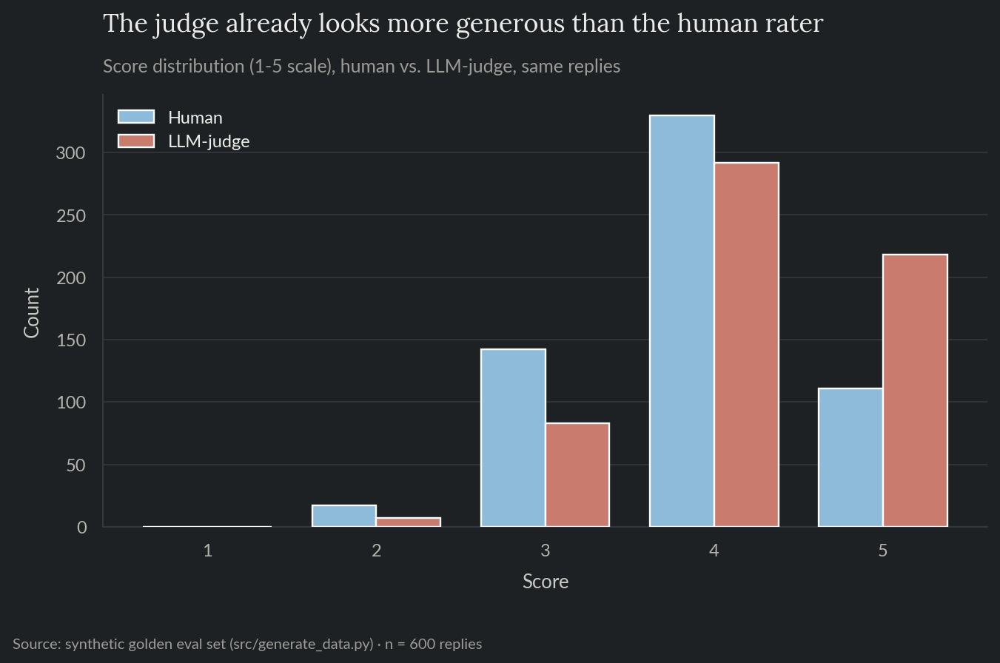
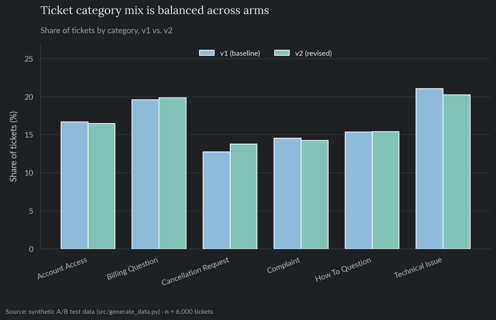
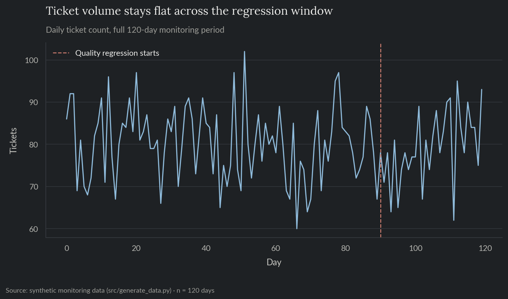
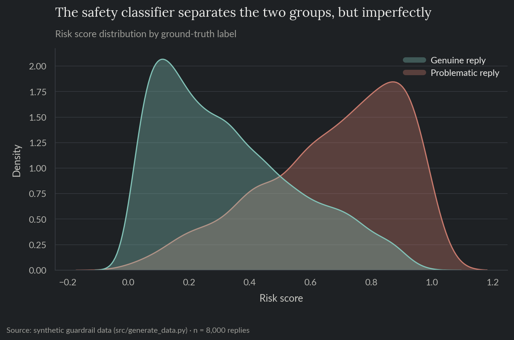
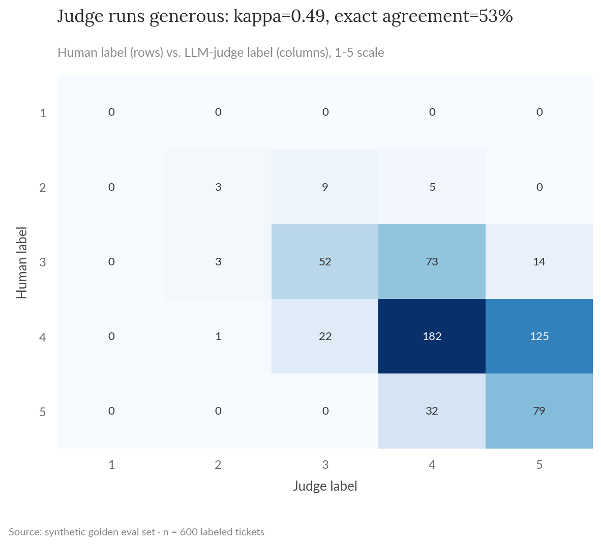
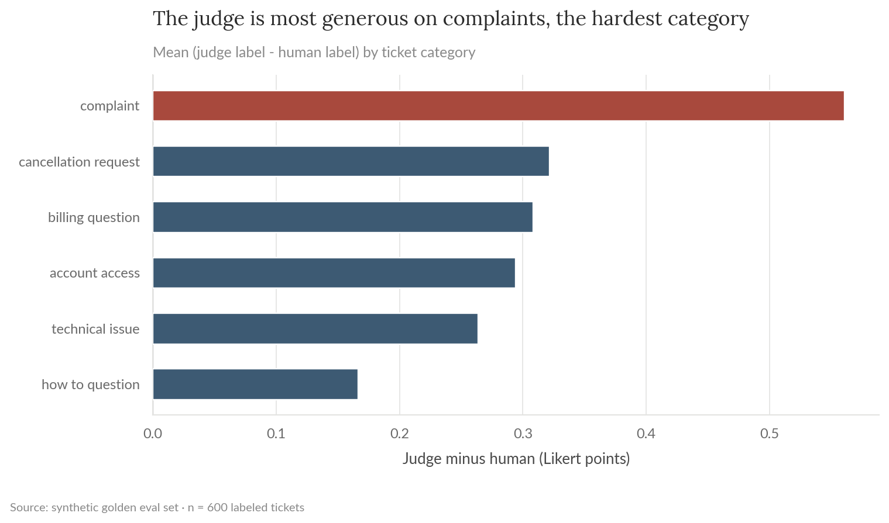
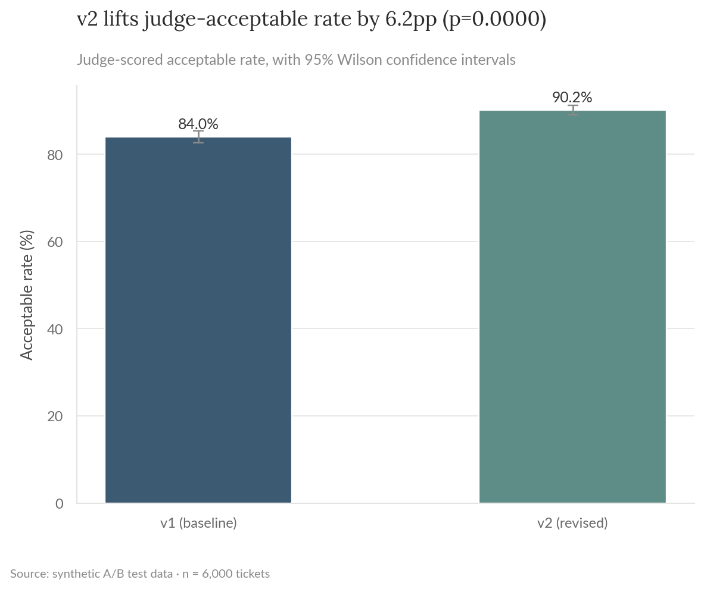
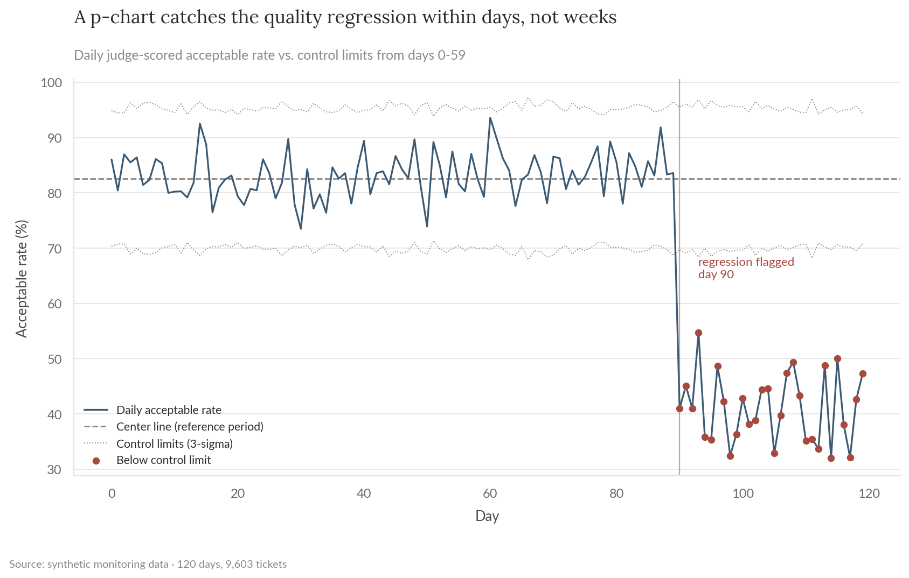
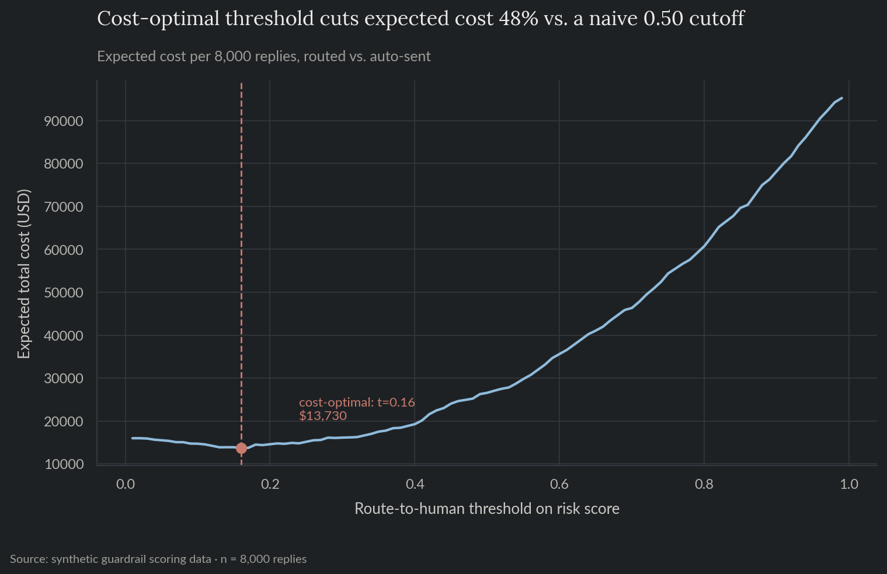

# Evaluating & Monitoring an LLM-Powered Feature

A generic company ships an LLM-drafted reply feature for its support inbox: the model drafts a response, and it's either auto-sent or routed to a human reviewer depending on risk. This project covers the data-science layer around that feature, not the feature itself: validating the automated judge used to score reply quality, A/B testing a prompt change, monitoring quality in production, and picking a cost-based auto-send threshold. Built on synthetic data, mirroring the AI-ops/eval work that sits alongside classical modeling as more teams ship LLM-powered features.

**For the full technical walkthrough (kappa validation, power analysis, control charts, cost curves), see the [notebook](notebooks/04_llm_eval_monitoring.ipynb).** This README is the short version.

> All data here is synthetically generated. No proprietary data, models, or results from any employer are used or implied. Deliberately not tied to the fictional company in projects 01-03; this methodology is meant to generalize across any LLM-powered feature, not read as a one-company demo.

**Skills and tools featured:**

- Exploratory data analysis
- LLM-judge validation against human labels (Cohen's kappa, bias decomposition)
- Experiment design and two-proportion A/B testing
- Statistical process control (p-charts) for output-quality monitoring
- Cost-based decision threshold optimization

## The problem

Teams shipping LLM-powered features tend to reach for an LLM-judge to score output quality because human review of everything doesn't scale, then trust the judge's numbers without checking whether it's actually a reliable stand-in for a human. Meanwhile the usual production-monitoring playbook (checking whether input features have drifted) doesn't catch a regression in what the model outputs, and the auto-send/review-queue split is usually set by gut feel rather than by what each type of mistake actually costs.

## Exploratory analysis

This project runs on four independent datasets, one per section below. Before any of them gets a kappa calculation, a significance test, a control chart, or a cost curve, it's worth looking at what each one shows on its own.

Even before computing kappa formally, the judge's scores already skew higher than the human rater's: more 4s and 5s, fewer 3s, an average of 4.20 against the human's 3.89 on the same 600 replies (Figure 1).



*Figure 1. Score distribution (1-5 scale), human vs. LLM-judge, same replies.*

The A/B test's two arms are balanced on ticket category, within a couple of points of each other on every category (Figure 2). That matters because category difficulty varies a lot (complaints are hardest to draft well, how-to questions the easiest), so an imbalanced split would confuse a category-mix difference with a real prompt-version effect.



*Figure 2. Share of tickets by category, v1 vs. v2.*

Daily ticket volume in the monitoring data stays flat across the entire window, including right through the quality regression injected on day 90 (Figure 3). That rules out volume as a confound before the control chart even runs: whatever drops on day 90, it isn't traffic.



*Figure 3. Daily ticket count, full 120-day monitoring period.*

The guardrail's raw risk scores already separate genuine replies from problematic ones, but with real overlap in the middle (Figure 4), consistent with the classifier's 0.85 AUC: better than a coin flip, far from perfect, which is exactly why the auto-send threshold below has to be chosen deliberately rather than assumed.



*Figure 4. Risk score distribution by ground-truth label.*

## 1. Validating the LLM-judge against human labels

Before trusting the judge for anything downstream, a 600-ticket golden set was scored by both a human rater and the judge, on a 1-5 scale.

Raw agreement overstates how reliable that really is, two independent raters will land on the same score some of the time purely by chance. Cohen's kappa corrects for that: it measures agreement beyond what chance alone would produce. The specific version used here, quadratic-weighted kappa, also treats a 1-vs-5 mismatch as a much bigger disagreement than a 3-vs-4 one, matching how much those two kinds of miss actually matter in practice.

| | |
|---|---|
| Exact agreement | 52.7% |
| Within-1-point agreement | 96.7% |
| Quadratic-weighted kappa | 0.49 (below the 0.60 "substantial agreement" floor) |
| Judge bias vs. human | +0.31 points, systematically generous (p < 0.0001) |

Human and judge scores agree closely but not perfectly (Figure 5).



*Figure 5. Judge score vs. human score, confusion matrix over the golden set.*

The bias concentrates on complaints, the category where a bad reply does the most damage and where catching it matters most (Figure 6).



*Figure 6. Judge bias vs. human rating, by ticket category.*

## 2. A/B test: a revised drafting prompt

Prompt v2 adds an explicit instruction to acknowledge the issue and give one concrete next step. It was tested against the baseline prompt on roughly 6,000 tickets, well above the ~1,200 per arm a power analysis called for beforehand. That's the standard calculation for how much data is needed to reliably detect a real effect of a given size, here a 4-point lift, rather than mistaking noise for a win or missing a real one.

| | |
|---|---|
| Judge-acceptable rate, v1 vs. v2 | 84.0% vs. 90.2% |
| Absolute lift | +6.2pp (95% CI: 4.5 to 7.9pp), p < 0.0001 |



*Figure 7. Judge-acceptable rate by arm, v1 vs. v2.*

Since the judge's generosity bias applies to both arms about equally, this relative lift is a fair read even though neither arm's raw acceptable-rate should be quoted as a trustworthy standalone number.

## 3. Production monitoring: catching a silent quality regression

A daily p-chart (control chart for a proportion) tracks the judge-scored acceptable rate against control limits set from a stable reference period. A regression was injected on day 90 with no change in ticket volume or category mix, exactly the kind of shift that standard input-drift monitoring would miss entirely (Figure 8).

| | |
|---|---|
| Reference-period center line | 82.6% acceptable |
| Regression detected | Day 90, the same day it started (3-day run rule) |

A single point outside the control limits can be noise, so the chart also flags a run rule: three consecutive points on the same side of the center line, a pattern random day-to-day variation rarely produces, which is what actually caught this regression on the day it started.



*Figure 8. Daily p-chart: judge-scored acceptable rate against control limits.*

## 4. Guardrail threshold: auto-send vs. route-to-human

A lightweight safety classifier scores every drafted reply before it's sent, ranking a random bad reply above a random fine one 85% of the time (AUC 0.85). The auto-send threshold comes from actual costs, not a default 0.5 cutoff: a bad reply that slips through and gets auto-sent costs far more (remediation, trust damage) than a fine reply that gets needlessly routed to a human (reviewer time). But that reviewer-time cost applies to every routed reply, good or bad, so the threshold has to balance the two rather than just avoid the worse mistake at any cost.

| | |
|---|---|
| Cost-optimal threshold | 0.16, vs. a naive 0.50 |
| Expected cost reduction | 48.3% ($13,730 vs. $26,556 per 8,000 replies) |
| Share routed to human review | 72.7% at the optimal threshold vs. 27.2% at 0.50 |

Sweeping the threshold against expected cost locates that optimum well below the naive 0.50 cutoff (Figure 9).



*Figure 9. Expected cost by auto-send threshold, cost-optimal threshold vs. the naive 0.50 cutoff.*

## Recommendation

Don't retire human review of the judge itself. A kappa of 0.49 is below the standard bar for substantial agreement, and the bias concentrates on complaints, the category where it's most costly to get wrong, so that category should get more frequent human audits than the aggregate agreement number alone would suggest.

The prompt change is a clear ship: a 6.2pp lift with a tight interval, and the relative comparison holds up even given the judge's known bias.

For monitoring, the control chart is already doing its job, it caught this regression the same day it started. The main follow-up is tuning the run-rule length against how expensive a slower detection would actually be.

For the guardrail, the threshold itself is already cost-optimal. The real constraint is the classifier's precision at AUC 0.85, and improving that would shrink the review queue more than adjusting the threshold further ever could.

## Repo layout

- `notebooks/04_llm_eval_monitoring.ipynb`: full technical walkthrough, executed with all charts and results inline.
- `src/`: the reproducible pipeline (data generation, exploratory analysis, judge validation, A/B test, drift monitoring, guardrail threshold) as standalone scripts.
- `tests/`: pytest suite covering data-generation invariants and the pure computation behind the kappa/bias calculation, the A/B result, the control-chart detection logic, and the cost-optimal threshold search.
- `reports/`: generated charts.

## Reproduce

```bash
pip install -r requirements.txt
python src/generate_data.py
python src/eda.py
python src/eval_framework.py
python src/ab_test.py
python src/drift_monitoring.py
python src/guardrail_threshold.py
```

`data/` is gitignored; regenerate it by running the scripts above.

## Tests

```bash
pytest tests/ -v
```

Runs in CI on every push (see the badge at the [repo root](../../README.md)).
