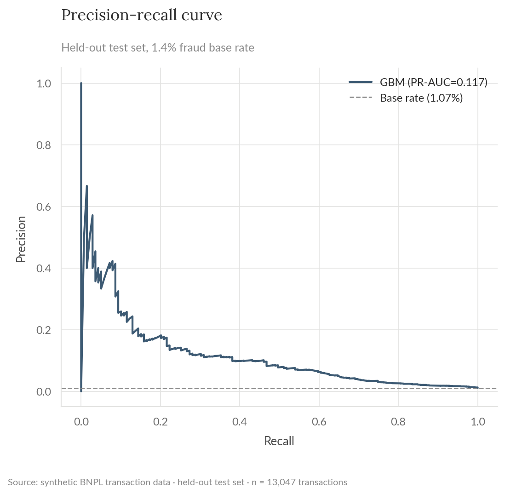
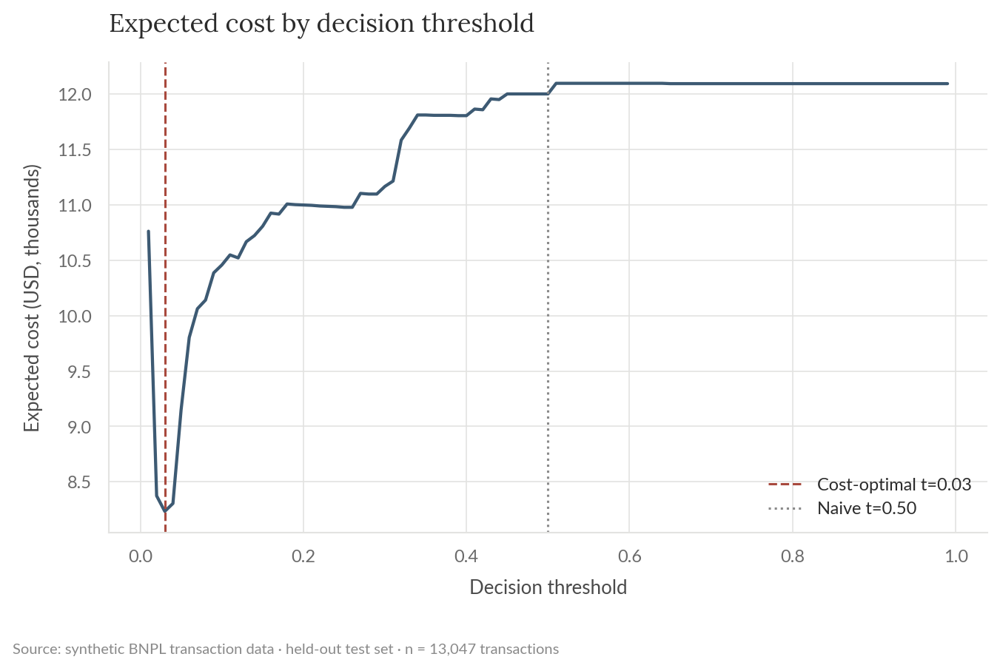
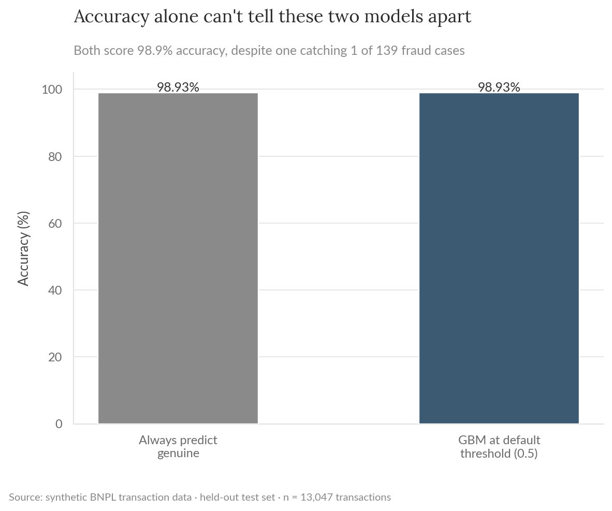
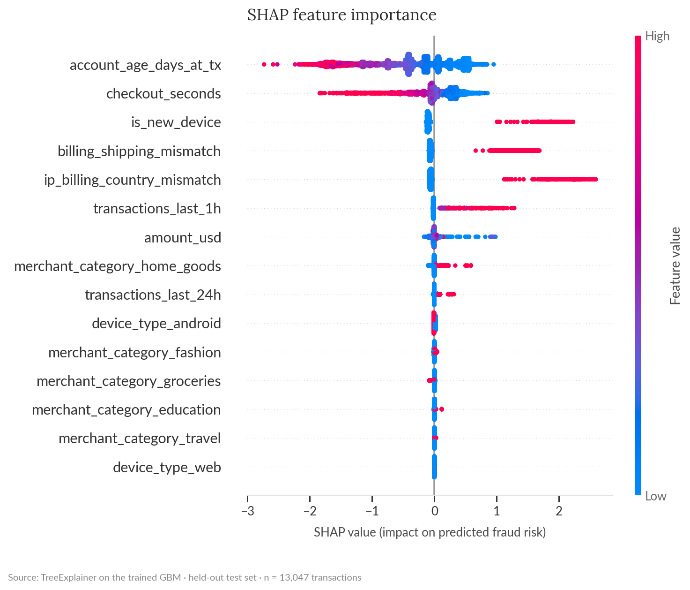
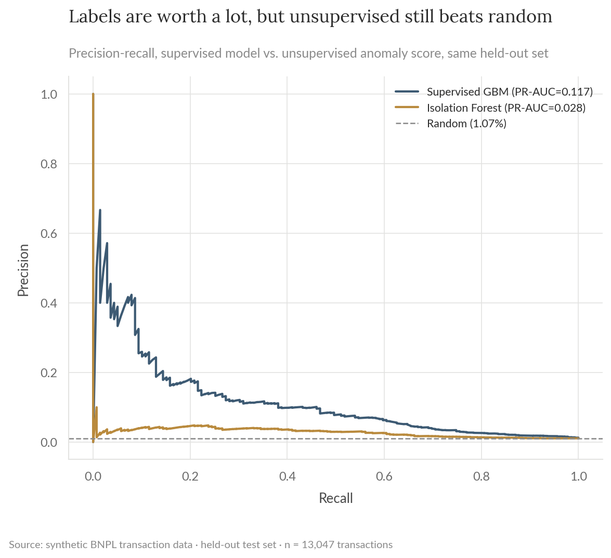

# BNPL Transaction Fraud Detection

A transaction-fraud model for a buy-now-pay-later checkout flow, at a realistic 1.4% fraud rate, where accuracy is close to meaningless as a metric and the decision threshold has to come from actual fraud-loss and review-cost numbers rather than a default 0.5 cutoff. Built on synthetic data, the same fictional BNPL fintech as projects 01-04, viewed from the fraud/risk operations side.

**For the full technical walkthrough (feature pipeline, PR-AUC vs. ROC-AUC, cost-based thresholding, SHAP, unsupervised comparison), see the [notebook](notebooks/05_fraud_anomaly_detection.ipynb).** This README is the short version.

> All data here is synthetically generated. No proprietary data, models, or results from any employer are used or implied.

**Skills and tools featured:**

- Classification under extreme class imbalance (gradient-boosted trees vs. a logistic baseline)
- Precision-recall (PR-AUC) as the primary metric, not ROC-AUC or accuracy
- Cost-based decision threshold optimization
- SHAP interpretability
- Unsupervised anomaly detection (Isolation Forest) as a labels-scarce alternative

## The problem

A fraud team has to decide, at checkout, whether to let a transaction through. Miss a fraudulent one and the loss is the transaction amount plus a chargeback fee; flag a genuine one and the cost is a much smaller review or friction cost, but there are vastly more genuine transactions than fraudulent ones. At a 1-2% fraud rate, a model can score 98%+ accuracy while never catching a single fraud case, so the metric and the threshold both have to be chosen with that skew in mind, not despite it.

## What this does

Trains a classifier to score each transaction's fraud probability at checkout time, using device, velocity, and mismatch signals available in that moment, then picks the approve/flag threshold that minimizes expected cost given fraud-loss and review-cost assumptions, the same cost-based approach project 01 uses for delinquency.

## Results

| | |
|---|---|
| Fraud rate, held-out test set | 1.07% |
| GBM PR-AUC (average precision) | 0.117 (~11x the base rate) |
| GBM ROC-AUC | 0.839 |
| Logistic regression baseline PR-AUC | 0.109 |
| Expected cost reduction, cost-optimal threshold vs. naive 0.5 cutoff | 31.4% |
| Precision / recall at the cost-optimal threshold (t = 0.03) | 8.3% / 49.6% |

The GBM ranks transactions well above random despite the skew (Figure 1); sweeping the decision threshold against expected cost shows why the optimal cutoff (0.03) sits so far below the usual 0.5 default (Figure 2).



*Figure 1. Precision-recall curve on the held-out test set, GBM vs. the 1.07% base rate.*



*Figure 2. Expected cost by decision threshold, cost-optimal threshold vs. the naive 0.5 cutoff.*

The threshold sits at 0.03, not 0.5, because the cost asymmetry is large: missing a fraud case costs the transaction amount plus a $25 chargeback fee, while flagging a genuine one costs a flat $3 review cost, so the cost-minimizing policy flags aggressively (catching about half of all fraud cases) even though the resulting precision is only 8.3%, meaning roughly 11 flagged transactions for every real fraud case caught. That's a normal trade for a fraud system to make; it isn't a normal trade for accuracy to make.

## The accuracy paradox

At the default 0.5 threshold, the trained GBM and a trivial model that always predicts "genuine" score identically on accuracy (98.93%), because the GBM catches exactly 1 of 139 fraud cases in the test set at that cutoff (Figure 3). Accuracy is the wrong metric here by construction, not because the model is bad: with fraud this rare, almost any prediction pattern scores well on accuracy, which is exactly why PR-AUC and a cost-based threshold, not accuracy and a 0.5 cutoff, are the right tools for this kind of skew.



*Figure 3. Accuracy of a trivial "always genuine" classifier vs. the trained GBM at the default 0.5 threshold.*

## What drives the risk score

SHAP on the held-out test set recovers the risk drivers the data was generated from (Figure 4): account age dominates (newer accounts are riskier), followed by a fast checkout, an unrecognized device, and billing/shipping or IP/billing-country mismatches, the same signals real fraud systems watch for at checkout.



*Figure 4. SHAP feature importance on the held-out test set.*

## Unsupervised anomaly detection vs. a supervised model

Before enough confirmed-fraud labels exist to train a model like the one above, or for a fraud pattern the existing labels don't cover, a fraud team has only unsupervised methods to fall back on. An Isolation Forest, trained on the same features with no access to `is_fraud` at all, scores each transaction's general "unusualness" instead of its fraud probability specifically. On the same held-out set, it clears random ranking by a real margin (2.7x the base rate) but falls well short of the supervised model (11.0x), a 4.2x gap (Figure 5). Having labels is worth a lot; not having them yet is not worth nothing.

| | |
|---|---|
| Supervised GBM PR-AUC | 0.117 (11.0x base rate) |
| Isolation Forest PR-AUC | 0.028 (2.7x base rate) |
| Supervised advantage | 4.2x the unsupervised PR-AUC |



*Figure 5. Precision-recall curve, supervised GBM vs. unsupervised Isolation Forest, same held-out set.*

## Recommendation

Ship the cost-based threshold (0.03) over a default 0.5 cutoff; a 0.5 threshold on this model is functionally identical to not having a model at all, given how rarely predicted probabilities cross it at this fraud rate. Track PR-AUC, not accuracy, as the headline offline metric, and re-derive the threshold whenever the fraud-loss or review-cost assumptions change, since the entire cutoff is a direct function of those two numbers. Where labels are thin, delayed, or don't yet cover a new fraud pattern, the Isolation Forest above is a reasonable interim signal, not a replacement for the supervised model once enough confirmed labels exist to train one.

## Repo layout

- `notebooks/05_fraud_anomaly_detection.ipynb`: full technical walkthrough, executed with all charts and results inline.
- `src/`: the reproducible pipeline (data generation, features, training, interpretability, unsupervised anomaly detection) as standalone scripts.
- `tests/`: pytest suite covering data-generation invariants (including that every fraud-risk signal actually raises the fraud rate in the generated data), the feature pipeline and temporal split, the cost-optimal threshold search, and the anomaly-score sign convention.
- `reports/`: generated charts and metrics.

## Reproduce

```bash
pip install -r requirements.txt
python src/generate_data.py
python src/train.py
python src/interpret.py
python src/anomaly_detection.py
```

`data/` and `reports/model.pkl` are gitignored; regenerate them by running the scripts above.

## Tests

```bash
pytest tests/ -v
```

Runs in CI on every push (see the badge at the [repo root](../../README.md)).
