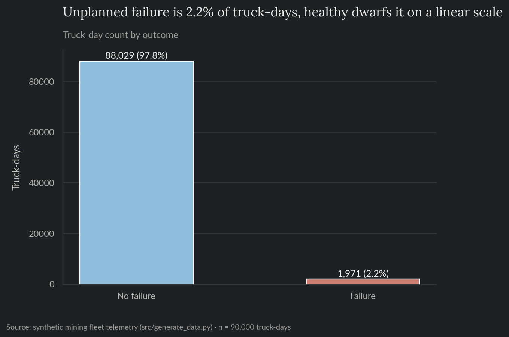
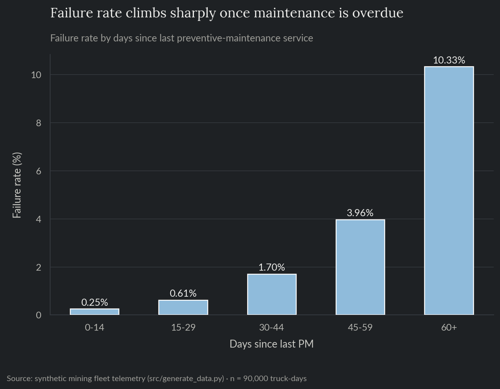
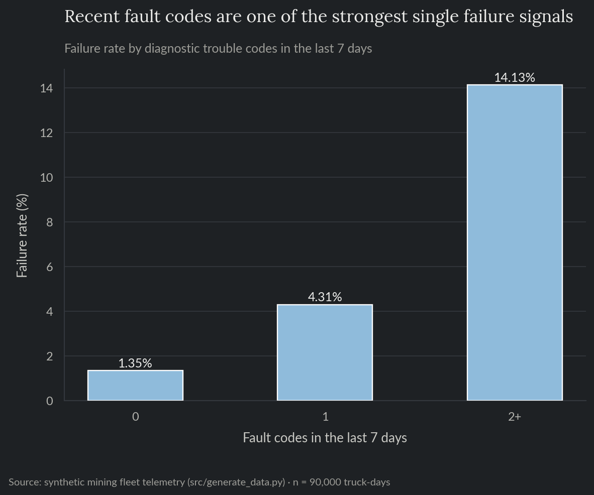
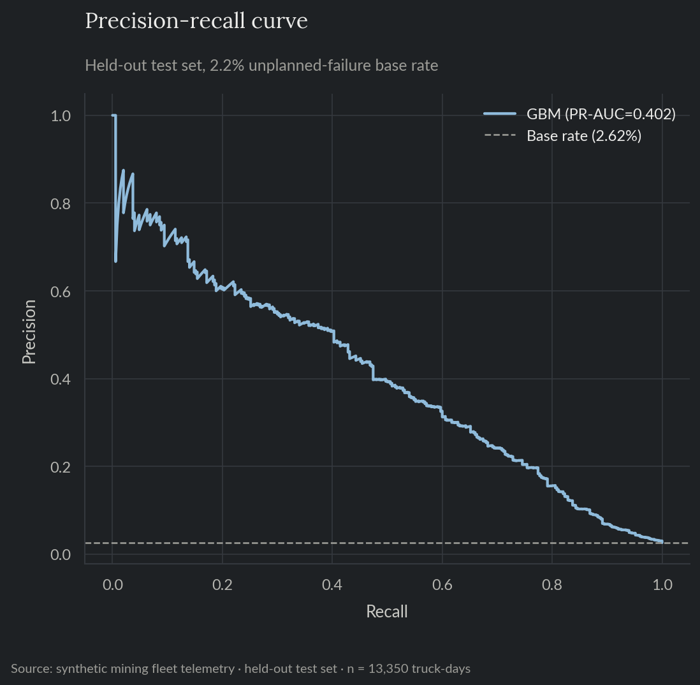
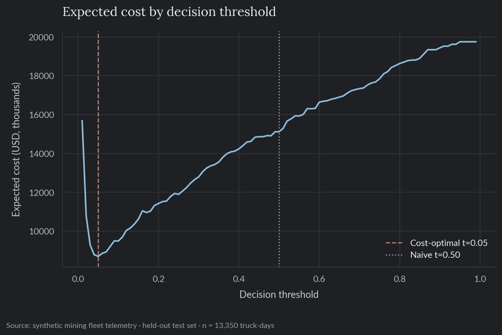
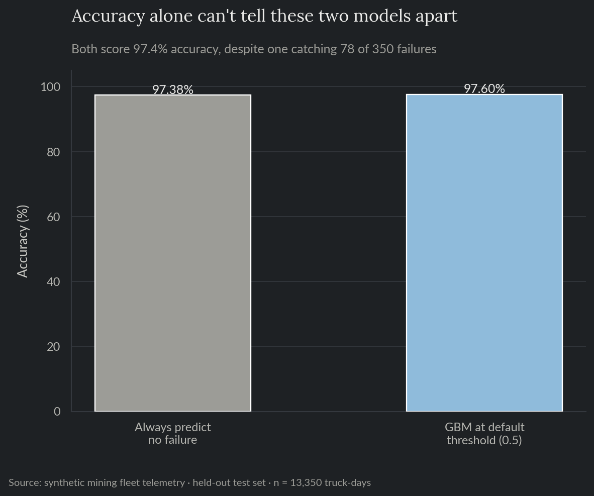
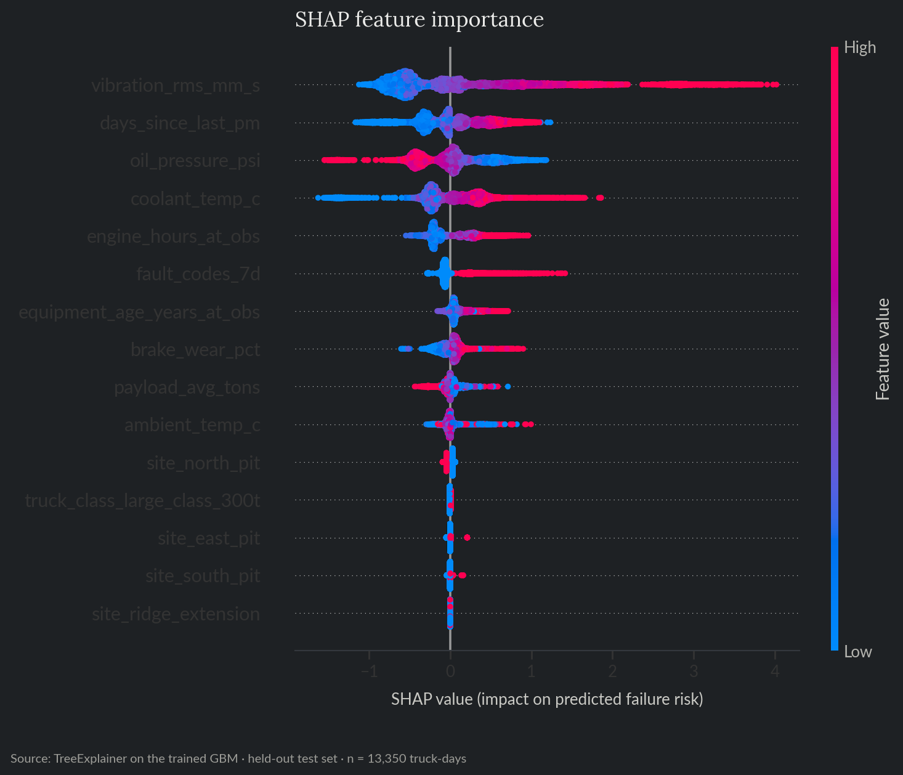
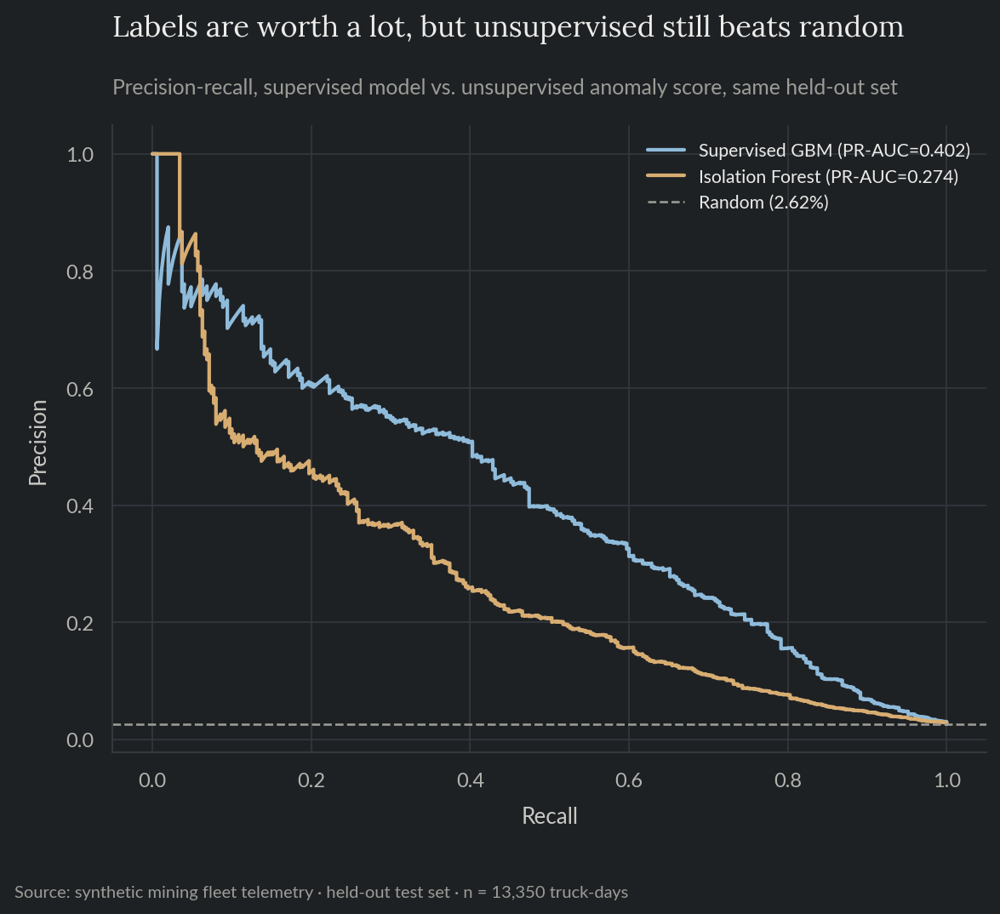

# Equipment Failure Risk Model

A predictive-maintenance model for a mining haul-truck fleet, at a realistic 2.2% unplanned-failure rate, where accuracy is close to meaningless as a metric and the decision threshold has to come from actual downtime-cost and inspection-cost numbers rather than a default 0.5 cutoff. Built on synthetic data modeling a fictional open-pit mining operation.

**For the full technical walkthrough (feature pipeline, PR-AUC vs. ROC-AUC, cost-based thresholding, SHAP, unsupervised comparison), see the [notebook](notebooks/06_equipment_failure_risk.ipynb).** This README is the short version.

> All data here is synthetically generated. No proprietary data, models, or results from any employer are used or implied.

**Skills and tools featured:**

- Exploratory data analysis
- Classification under extreme class imbalance (gradient-boosted trees vs. a logistic baseline)
- Precision-recall (PR-AUC) as the primary metric, not ROC-AUC or accuracy
- Cost-based decision threshold optimization
- SHAP interpretability
- Unsupervised anomaly detection (Isolation Forest) as a labels-scarce alternative

## The problem

A maintenance team has to decide, from daily telemetry, whether to pull a haul truck in for inspection. Missing an impending failure costs the truck's downtime plus the extra expense of an emergency repair. Flagging a truck that wasn't actually about to fail costs much less: just a scheduled inspection. But healthy truck-days vastly outnumber the ones heading toward failure. At a ~2% failure rate, a model can score 97%+ accuracy while catching almost none of the actual failures, so the metric and the threshold both have to be chosen with that skew in mind, not despite it.

## What this does

Trains a classifier to score each truck-day's failure probability from telemetry available that day (engine hours, vibration, oil pressure, coolant temperature, brake wear, recent fault codes, days overdue for preventive maintenance), then picks the inspect/leave-in-service threshold that minimizes expected cost given downtime-cost and inspection-cost assumptions.

## Exploratory analysis

The single biggest fact about this dataset is the imbalance itself: 1,971 failure truck-days against 88,029 healthy ones, a 45:1 ratio (2.190% failure rate). Plotted on a linear scale rather than log, the failure bar is nearly invisible next to healthy, which is the actual shape of the problem every metric choice and threshold decision below has to work around (Figure 1).



*Figure 1. Truck-day count by outcome, no failure vs. failure.*

Days overdue for preventive maintenance is already one of the strongest single signals before any model gets trained: a truck 60+ days past its last PM service fails at 10.33%, against 0.25% for one serviced in the last two weeks, roughly a 41x difference (Figure 2).



*Figure 2. Failure rate by days since last preventive-maintenance service.*

Failure rate also climbs sharply with recent fault codes: 1.35% with none in the last 7 days, versus 14.13% with two or more, roughly a 10x difference (Figure 3).



*Figure 3. Failure rate by diagnostic trouble codes in the last 7 days.*

## Results

| | |
|---|---|
| Failure rate, held-out test set | 2.62% |
| GBM PR-AUC (average precision) | 0.402 (~15.3x the base rate) |
| GBM ROC-AUC | 0.906 (ranks a random impending-failure truck-day above a random healthy one 91% of the time) |
| Logistic regression baseline PR-AUC | 0.434 (edges out the GBM) |
| Expected cost reduction, cost-optimal threshold vs. naive 0.5 cutoff | 42.5% |
| Precision / recall at the cost-optimal threshold (t = 0.05) | 23.4% / 71.4% |

The GBM ranks truck-days well above random despite the skew (Figure 4); sweeping the decision threshold against expected cost shows why the optimal cutoff (0.05) sits so far below the usual 0.5 default (Figure 5).



*Figure 4. Precision-recall curve on the held-out test set, GBM vs. the 2.62% base rate.*



*Figure 5. Expected cost by decision threshold, cost-optimal threshold vs. the naive 0.5 cutoff.*

The threshold sits at 0.05 instead of 0.5 because the two mistakes cost very different amounts. Missing an impending failure costs the truck's estimated downtime plus an extra $8,000 for an emergency repair. Flagging a healthy truck for inspection only costs a flat $4,000 crew dispatch. Given that gap, the cost-minimizing policy flags well ahead of the default cutoff, catching about 71% of impending failures, even though only 23.4% of what it flags turns out to actually fail within the week (roughly 3 inspections for every real impending failure caught). That's a normal trade for a maintenance system to make, since an unplanned haul-truck failure costs far more than a routine inspection. It would be a terrible trade if the goal were accuracy instead.

Worth flagging on its own: the logistic baseline slightly outperforms the GBM here (0.434 vs. 0.402 PR-AUC). That's a genuine finding rather than an inconsistency: this dataset's failure label was generated from a close-to-linear combination of the raw telemetry signals, so a linear model captures most of the available signal on its own, and the GBM's extra flexibility for interactions and nonlinearities buys little on top of it. The GBM is still used below for its SHAP tooling and because a production system would keep both models in the comparison rather than lock in the linear one from a single test split.

## The accuracy paradox

At the default 0.5 threshold, the trained GBM scores 97.60% accuracy, barely above a trivial model that always predicts "no failure" and never flags anything at all (97.38%). That's because the GBM only catches 78 of 350 failures in the test set at that cutoff (Figure 6). This isn't a sign the model is bad, it's a sign accuracy is the wrong tool here. With failure this rare, almost any prediction pattern scores well on accuracy, which is exactly why this project tracks PR-AUC and a cost-based threshold instead.



*Figure 6. Accuracy of a trivial "always no failure" classifier vs. the trained GBM at the default 0.5 threshold.*

## What drives the risk score

SHAP, a method that attributes each individual prediction back to how much each feature pushed it up or down, shows what the model is actually keying on. On the held-out test set, it recovers the exact risk drivers the data was generated from (Figure 7): vibration dominates, followed by days since last PM, oil pressure, coolant temperature, and engine hours. Those are the same signals a real fleet-maintenance system watches for.



*Figure 7. SHAP feature importance on the held-out test set.*

## Unsupervised anomaly detection vs. a supervised model

Before enough confirmed-failure labels exist to train a model like the one above, or for a new truck class or fleet without failure history, a maintenance team only has unsupervised methods to fall back on.

An Isolation Forest is one option. Trained on the same features but with no access to the failure label at all, it works by repeatedly splitting the feature space at random. A genuine outlier tends to get isolated into its own tiny partition in far fewer splits than a typical point does, so a short average path length becomes its anomaly score. It's scoring general "unusualness," not failure probability specifically.

On the same held-out set, it clears random ranking by a wide margin (10.5x the base rate), coming within 1.5x of the supervised model (15.3x) (Figure 8). That's a narrow gap for an unsupervised method, and it makes sense given what the label looks like: a truck heading toward failure genuinely looks statistically unusual, elevated vibration, dropping oil pressure, rising coolant temperature, all at once. Gradual physical degradation like this is close to what anomaly detection is naturally good at, unlike a case such as fraud, where the bad actor is actively trying to look normal.

| | |
|---|---|
| Supervised GBM PR-AUC | 0.402 (15.3x base rate) |
| Isolation Forest PR-AUC | 0.274 (10.5x base rate) |
| Supervised advantage | 1.5x the unsupervised PR-AUC |



*Figure 8. Precision-recall curve, supervised GBM vs. unsupervised Isolation Forest, same held-out set.*

## Recommendation

Ship the cost-based threshold (0.05), not the default 0.5 cutoff. A 0.5 threshold catches only 78 of 350 failures, barely different from having no model at all. Track PR-AUC, not accuracy, as the headline offline metric, and re-derive the threshold whenever the downtime-cost or inspection-cost assumptions change, since the whole cutoff is a direct function of those two numbers.

Where labels are thin or a fleet is new, the Isolation Forest above is a strong interim signal, closer to the supervised model's performance than in the fraud case. It's not a replacement for the supervised model, once enough confirmed failure labels exist to train one, that's still the better choice, but the gap here is small enough that an unsupervised deployment is a genuinely reasonable starting point rather than just a stopgap.

## Repo layout

- `notebooks/06_equipment_failure_risk.ipynb`: full technical walkthrough, executed with all charts and results inline.
- `src/`: the reproducible pipeline (data generation, exploratory analysis, features, training, interpretability, unsupervised anomaly detection) as standalone scripts.
- `tests/`: pytest suite covering data-generation invariants (including that every failure-risk signal actually raises the failure rate in the generated data), the feature pipeline and temporal split, the cost-optimal threshold search, and the anomaly-score sign convention.
- `reports/`: generated charts and metrics.

## Reproduce

```bash
pip install -r requirements.txt
python src/generate_data.py
python src/eda.py
python src/train.py
python src/interpret.py
python src/anomaly_detection.py
```

`data/` and `reports/model.pkl` are gitignored; regenerate them by running the scripts above.

## Tests

```bash
pytest tests/ -v
```

Runs in CI on every push (see the badge at the [repo root](../../README.md)).
