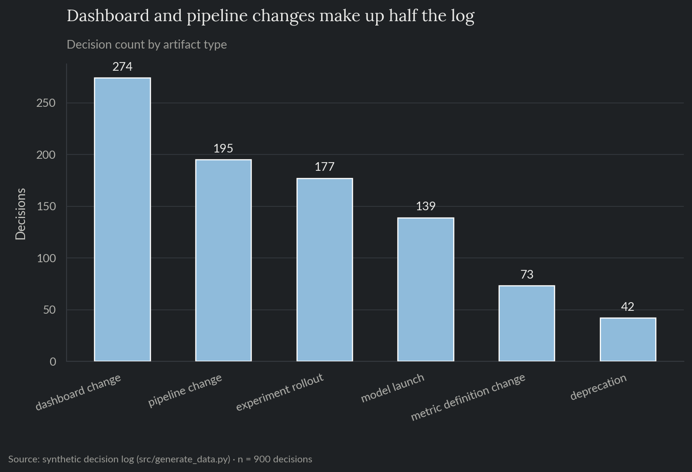
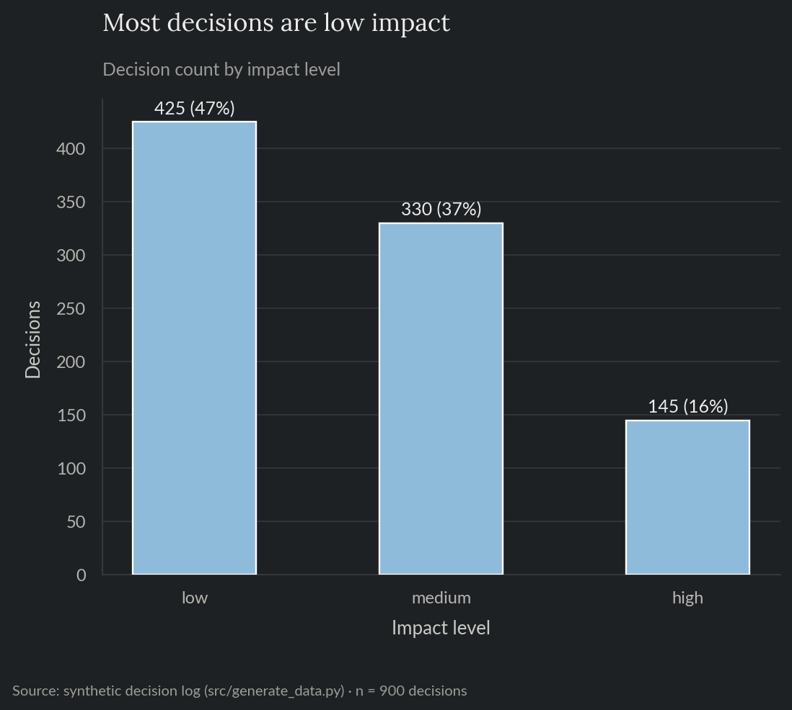
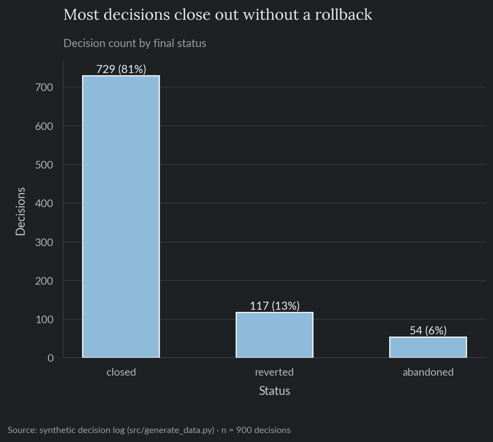
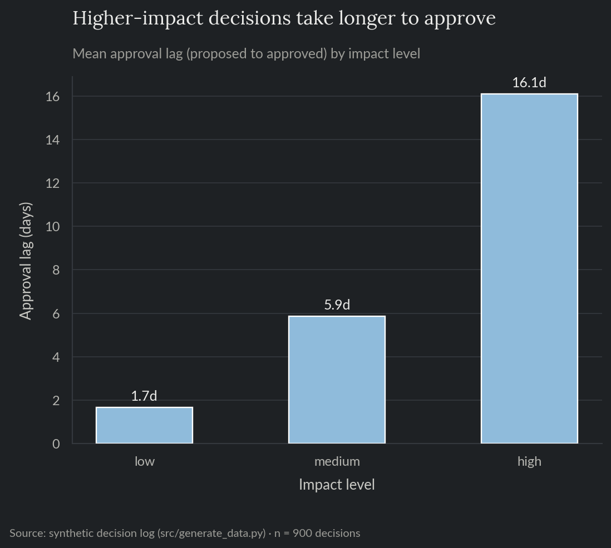
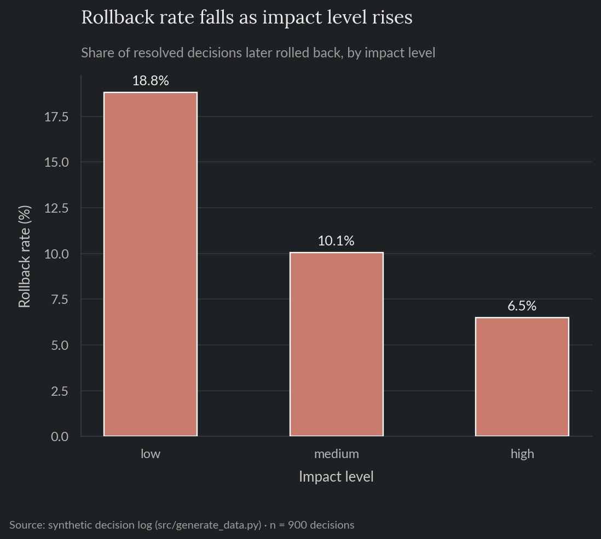
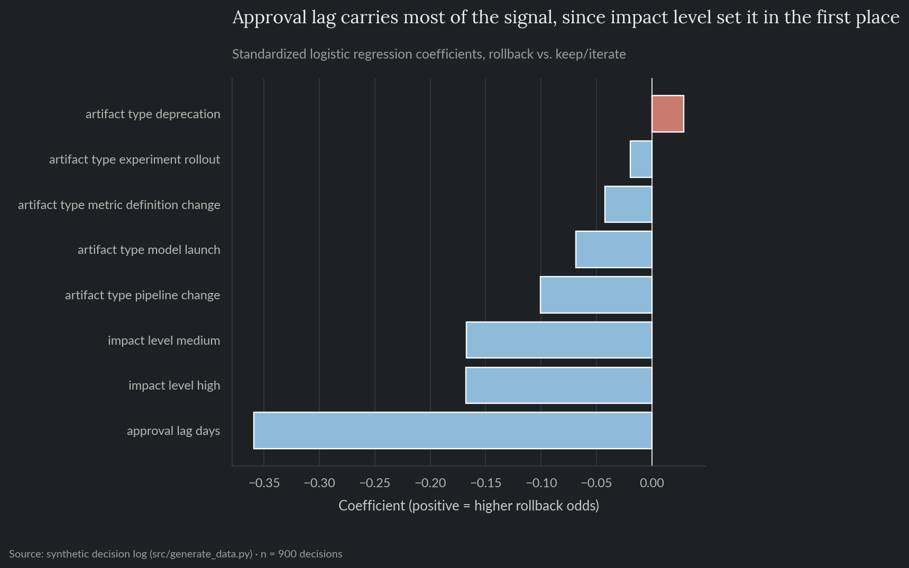
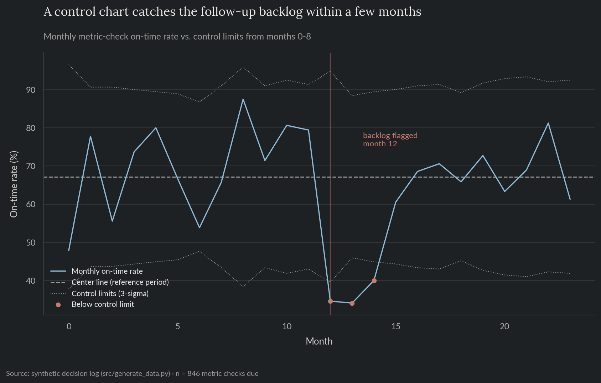

# Data Science Decision Governance

A synthetic decision log for a data science team: every model launch, experiment rollout, dashboard change, pipeline change, metric-definition change, and deprecation, recorded with an impact level and two follow-up commitments due after it ships. Built so a real pattern is recoverable from it: more scrutiny before shipping predicts fewer rollbacks, but it also predicts that follow-up on smaller changes gets skipped.

**For the full technical walkthrough (schema validation, the multi-factor check, the control chart), see the [notebook](notebooks/07_ds_decision_governance.ipynb).** This README is the short version.

> All data here is synthetically generated. No proprietary data, models, or results from any employer are used or implied.

**Skills and tools featured:**

- Exploratory data analysis
- Schema-based record validation (Pydantic)
- Group comparisons across categorical levels
- Logistic regression for interpretability rather than prediction
- Statistical process control (p-chart) for backlog monitoring

## The problem

A data science team makes a lot of decisions that never get written down anywhere: launching a model, rolling out an experiment, changing a dashboard, changing a pipeline, redefining a metric, deprecating something old. Without a record, two things tend to break. Nobody can later reconstruct what shipped, when, or why. And the follow-up, checking that a change actually did what it was supposed to, quietly gets skipped, especially for changes that felt too small to worry about at the time.

## What this does

Builds a decision log where every record carries an impact level (low/medium/high) and two dated follow-up commitments: a short check that it shipped as intended, and a longer check on whether it actually worked. A schema contract rejects records missing what their impact level requires. From there: how approval speed and rollback rate vary by impact level, whether that pattern holds up once other factors are considered together, and a control chart that catches a stretch of missed follow-ups while it's happening rather than after the fact.

## Exploratory analysis

900 decisions over a 2-year window. Dashboard and pipeline changes make up half the log by volume; deprecations are rarest (Figure 1). Most decisions are low impact (Figure 2, 47%), and most close out without ever being rolled back (Figure 3: 81% closed, 13% reverted, 6% abandoned before approval).



*Figure 1. Decision count by artifact type.*



*Figure 2. Decision count by impact level.*



*Figure 3. Decision count by final status.*

## Approval speed and rollback rate

Higher-impact decisions take longer to get approved: 1.7 days on average at low impact, 5.9 at medium, 16.1 at high (Figure 4). That extra scrutiny lines up with a real difference in outcomes: rollback rate falls from 18.8% at low impact to 10.1% at medium and 6.5% at high (Figure 5), close to a 3x spread between the two ends.



*Figure 4. Mean approval lag by impact level.*



*Figure 5. Rollback rate by impact level, resolved decisions only.*

## Does this hold with everything else considered together?

A logistic regression predicting rollback from impact level, artifact type, and approval lag together checks whether impact level still matters once the other factors sit in the same model, rather than only being a stand-in for one of them. Every impact-level and artifact-type coefficient points the same direction as the charts above (Figure 6), so the pattern holds up even when several variables compete for credit at once. But the model's overall lift is modest: PR-AUC of 0.19 against a 13.7% base rate, and impact level on its own very nearly matches that. Approval lag carries the largest single coefficient, but mostly because it's set almost directly by impact level in this simulation, so the two features are splitting credit for the same effect rather than adding independent information. That's a real limitation of the exercise, not a hidden flaw: this simulation makes rollback probability a function of impact level and nothing else, so no model built from these fields will ever predict a single decision's fate reliably, even while the aggregate pattern in Figures 4 and 5 is genuine.



*Figure 6. Standardized logistic regression coefficients, rollback vs. keep/iterate.*

## Catching a follow-up backlog

The metric check (due 30 days after shipping: did it actually work) is the more consequential of the two follow-up commitments, and also the one most likely to slip. It closes on time only 51.6% of the time for low-impact decisions, versus 88.6% for high-impact ones. Nobody skips the review for a big launch; a small dashboard change is exactly the kind of thing that quietly falls off everyone's list.

A monthly control chart on the on-time rate, the same p-chart approach project 04 uses for a quality regression, catches a three-month stretch where on-time completion drops well below its normal range and stays there, instead of waiting for someone to notice a pile of overdue checks (Figure 7).



*Figure 7. Monthly metric-check on-time rate vs. control limits from the reference period.*

## Recommendation

The review process is doing its job on the outcome side: higher scrutiny for higher-impact decisions tracks with meaningfully fewer rollbacks, and that holds up once artifact type and approval speed are considered alongside it. It's failing on the follow-up side: the decisions that skip extra review are also the ones most likely to never get checked on afterward, which defeats the point of tracking an outcome if half of them are never actually checked. A light default reminder for low-impact monitoring checks, plus a monthly control chart like the one here running in the background, would catch both the routine drift and an occasional capacity crunch before either turns into a backlog nobody's watching.

## Repo layout

- `notebooks/07_ds_decision_governance.ipynb`: full technical walkthrough, executed with all charts and results inline.
- `src/`: the reproducible pipeline (data generation, schema validation, exploratory analysis, governance analysis, monitoring control chart) as standalone scripts.
- `tests/`: pytest suite covering data-generation invariants (including that every impact-level relationship the log is supposed to encode actually holds), the schema contract, and the control-chart detection logic.
- `reports/`: generated charts and metrics.

## Reproduce

```bash
pip install -r requirements.txt
python src/generate_data.py
python src/eda.py
python src/governance_analysis.py
python src/open_loops.py
```

`data/` is gitignored; regenerate it by running the scripts above.

## Tests

```bash
pytest tests/ -v
```

Runs in CI on every push (see the badge at the [repo root](../../README.md)).
