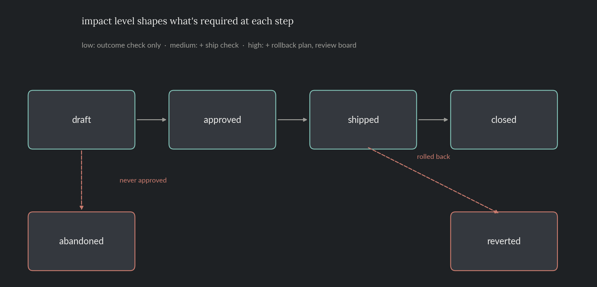

# Data Science Decision Governance

A working record format for a data science team's own decisions: model launches, experiment rollouts, dashboard changes, pipeline changes, metric-definition changes, deprecations. One decision is one file. Impact level (low/medium/high) sets how much rigor that file needs, enforced by a schema instead of by memory. This README documents the standard; `decisions/` holds real example records written against it.

> Everything here, the example records included, is fictional. No proprietary data, decisions, or results from any employer are used or implied.

**Skills and tools featured:**

- Schema-based record validation (Pydantic)
- CLI tooling to scaffold and validate records
- A live scan for monitoring commitments that are currently overdue

## The problem

A data science team makes a lot of decisions that never get written down anywhere: launching a model, rolling out an experiment, changing a dashboard, changing a pipeline, redefining a metric, deprecating something old. Without a record, two things tend to break. Nobody can later reconstruct what shipped, when, or why. And the follow-up, checking that a change actually did what it was supposed to, quietly gets skipped, especially for changes that felt too small to worry about at the time.

## How it works

Every decision is **low, medium, or high** impact. That's the only thing that determines how much process it needs.

| | low | medium | high |
|---|---|---|---|
| Ship check (did it ship as intended) | - | required | required |
| Outcome check (did it work) | required | required | required |
| Rollback plan (body section) | - | if not easily reversible | required |
| Reviewers | 1 | 2 | 3, incl. a review-board reviewer |

A decision moves through a fixed lifecycle. `abandoned` and `reverted` are the two ways out that aren't "it worked":



- **draft**: being written, not yet approved.
- **approved**: reviewers signed off, hasn't shipped yet.
- **shipped**: live. Both monitoring checks are now running.
- **closed**: the outcome check happened and the decision is being kept or iterated on.
- **reverted**: the outcome check happened and the decision was rolled back.
- **abandoned**: proposed, never approved. A dead end from draft, not a failure once shipped.

## The record

A decision is a markdown file: YAML frontmatter (the fields the schema checks) plus a free-text body (what changed, why, the rollback plan, monitoring notes). Templates for each impact level live in `templates/`. `routing.yaml` holds the reviewer-count minimums the table above is drawn from.

Here's a real one, high impact, currently shipped and partway through its monitoring window (`decisions/product_analytics/DSG-0002-attribution-model-v2-launch.md`):

```yaml
---
id: DSG-0002
title: "Launch attribution model v2 to production scoring"
artifact_type: model_launch
domain: product_analytics
impact_level: high
status: shipped
author: "M. Alvarez"
dates:
  proposed: 2026-06-20
  approved: 2026-06-25
  shipped: 2026-07-01
  resolved: null
monitoring:
  ship_check:
    due: 2026-07-08
    done: true
  outcome_check:
    due: 2026-07-31
    done: false
    outcome: null
reviewers: ["J. Okafor", "R. Singh", "Review Board"]
---

## What changed

Attribution model v2 replaces the rule-based last-touch model for marketing spend attribution.

## Why

The rule-based model was known to overweight the last channel in the path. v2 uses a data-driven multi-touch approach. Expected to shift attributed spend away from paid search toward earlier-funnel channels, without changing the total spend figure.

## Rollback plan

Scoring pipeline can flip back to the v1 rule-based model with a single config change; no data migration involved. If v2's attributed totals diverge from v1's by more than 15% in either direction during the first two weeks, roll back and re-evaluate.

## Monitoring notes

Shipped and scoring live traffic as of 2026-07-01. Ship check confirmed the new model is scoring in production as intended. Outcome check (does the attribution shift match expectations) isn't due until 2026-07-31.
```

Three reviewers because it's high impact (one of them the review board), a filled-in rollback plan because that's required at this level too, and `outcome.done: false` because the outcome check genuinely hasn't happened yet, its due date is two weeks out.

## Field reference

| Field | Type | Notes |
|---|---|---|
| `id` | string | `DSG-####`, assigned sequentially by `new_decision.py`. |
| `title` | string | |
| `artifact_type` | enum | `dashboard_change` \| `pipeline_change` \| `experiment_rollout` \| `model_launch` \| `metric_definition_change` \| `deprecation` |
| `domain` | enum | `product_analytics` \| `search_ranking` \| `marketing` \| `customer_support` \| `operations` \| `infrastructure` |
| `impact_level` | enum | `low` \| `medium` \| `high` |
| `status` | enum | `draft` \| `approved` \| `shipped` \| `closed` \| `reverted` \| `abandoned` |
| `author` | string | |
| `dates.proposed` | date | Always required. |
| `dates.approved` | date \| null | Required once `status` is past `draft`, except `abandoned`. |
| `dates.shipped` | date \| null | Required once `status` is `shipped` or later. |
| `dates.resolved` | date \| null | Required once `status` is `closed` or `reverted`. |
| `monitoring` | object \| null | `null` while `draft` or `abandoned`. |
| `monitoring.ship_check.due` / `.done` | date / bool | Required once shipped, medium and high impact only. |
| `monitoring.outcome_check.due` / `.done` | date / bool | Required once shipped, every impact level. |
| `monitoring.outcome_check.outcome` | enum \| null | `keep` \| `iterate` \| `rollback`. Required once `status` is `closed` or `reverted`. |
| `reviewers` | list of strings | Minimum count by impact level, enforced once past `draft`/`abandoned` (see `routing.yaml`). |

## The record contract

`schema.py` is a Pydantic model plus one cross-field check per rule above. The parts that aren't obvious from the field table alone:

```python
@model_validator(mode="after")
def _check_consistency(self):
    if self.status == "draft":
        ...
        return self          # no dates, no monitoring, no reviewer check yet

    if self.status == "abandoned":
        ...
        return self          # proposed, never approved -- same idea

    # everything past this point went through approval
    if self.dates.approved is None:
        raise ValueError(f"status={self.status} requires an approved date")
    ...
```

Reviewers get assigned as part of approval, so a `draft` (still being written) or an `abandoned` record (never got that far) isn't held to the reviewer-count minimum. Once a record is approved or later, `validate_file()` layers on two checks that aren't pure field validation: the reviewer count against `routing.yaml`, and, for high impact, a non-empty `## Rollback plan` section in the body (checked with the placeholder HTML comment stripped out first, so an untouched template doesn't pass by accident).

`validate.py` runs this over every file in `decisions/`:

```
$ python src/validate.py
8 / 8 records valid.
```

A few concrete ways a record fails it. A medium-impact decision that shipped without a ship check:

```
1 validation error for DecisionRecord
  Value error, impact_level=medium requires a ship_check once shipped [type=value_error, ...]
```

A high-impact decision approved with only 2 reviewers and no rollback plan written yet:

```
impact_level=high requires >= 3 reviewers, got 2
impact_level=high requires a non-empty '## Rollback plan' section
```

Both of those are real output from `validate_file()` against a deliberately broken record, not paraphrased.

## Creating a new decision

```
$ python src/new_decision.py --domain marketing --impact-level medium \
    --title "Switch the campaign dashboard to weekly cohorts" --author "J. Okafor"
Wrote decisions/marketing/DSG-0009-switch-the-campaign-dashboard-to-weekly-cohorts.md
```

Copies the right template, assigns the next id, and fills in what it can. The rest (dates once approved and shipped, reviewers, the body) gets filled in by hand as the decision moves through its lifecycle.

## Catching what's overdue right now

`open_loops.py` walks every record and reports which monitoring checks are past their due date and not marked done, a live status check against whatever's in `decisions/` right now, not a report over history. As of July 14, 2026:

```
$ python src/open_loops.py
4 overdue check(s):

DSG-0008 (decisions/product_analytics/DSG-0008-churn-model-decommission.md): ship_check was due 2026-04-17, 88 day(s) ago - "Decommission the 2023 churn-risk model"
DSG-0008 (decisions/product_analytics/DSG-0008-churn-model-decommission.md): outcome_check was due 2026-05-10, 65 day(s) ago - "Decommission the 2023 churn-risk model"
DSG-0004 (decisions/marketing/DSG-0004-campaign-attribution-pipeline-change.md): ship_check was due 2026-05-17, 58 day(s) ago - "Rebuild the campaign-attribution ETL on the new event schema"
DSG-0004 (decisions/marketing/DSG-0004-campaign-attribution-pipeline-change.md): outcome_check was due 2026-06-09, 35 day(s) ago - "Rebuild the campaign-attribution ETL on the new event schema"
```

Both flagged decisions are seeded that way on purpose, so the script has something real to catch. Re-running it later will report different numbers as `date.today()` moves and the example records don't.

## Repo layout

- `README.md`: this file, the standard.
- `templates/`: `decision-low.md`, `decision-medium.md`, `decision-high.md`.
- `routing.yaml`: reviewer-count minimums by impact level.
- `decisions/<domain>/`: 8 example records spanning all six domains, all three impact levels, and most lifecycle states (draft, shipped, closed, reverted, abandoned).
- `src/`: `schema.py` (the contract), `validate.py`, `open_loops.py`, `new_decision.py`, plus `render_lifecycle_diagram.py` for the diagram above.
- `tests/`: pytest suite covering the schema contract, the overdue-detection logic, and the scaffolding CLI.

## Reproduce

```bash
pip install -r requirements.txt
python src/validate.py
python src/open_loops.py
python src/render_lifecycle_diagram.py
```

## Tests

```bash
pytest tests/ -v
```

Runs in CI on every push (see the badge at the [repo root](../../README.md)).
