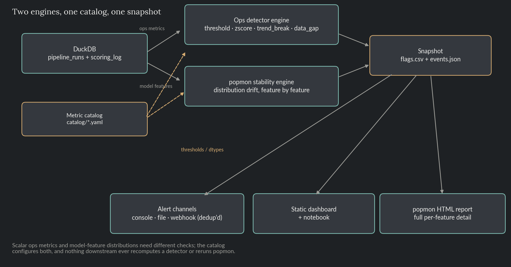
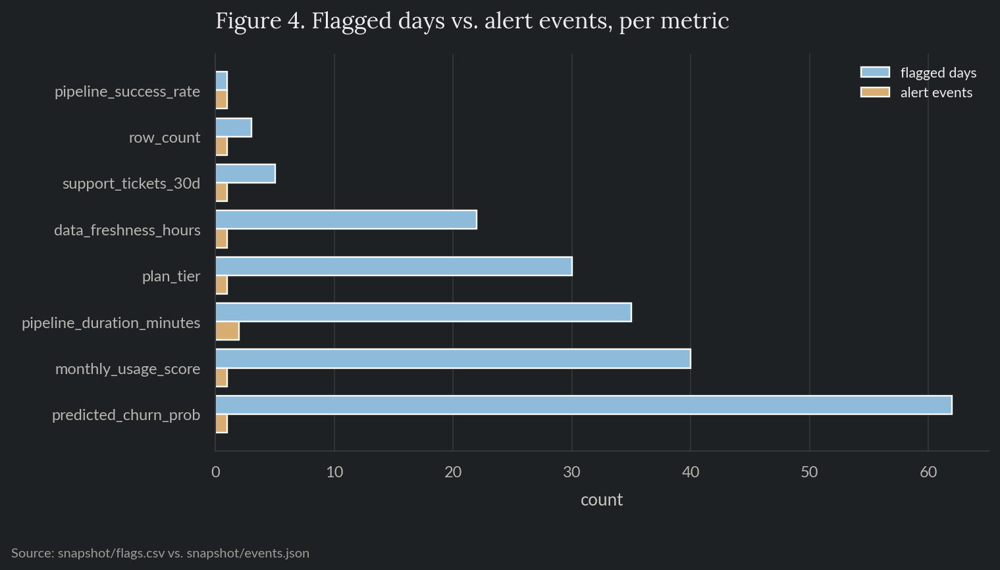

# Observatory

A monitoring toolkit for a DS team's own operations: a nightly model-training pipeline's
health metrics, and the churn model it trains, scored against a batch of customers every
day. Two detection engines, one for each kind of signal, both configured from a single
metric catalog and unified into one snapshot: `flags.csv`, `events.json`, deduplicated
alert events, a static dashboard, and popmon's own full stability report.

> Everything here, the metrics and the churn model included, is synthetic data generated
> in-repo. No proprietary data, metrics, or results from any employer are used or implied.

**Skills and tools featured:**

- A pluggable multi-method ops-metric detector engine (threshold, z-score, trend-break, data-gap)
- [popmon](https://github.com/ing-bank/popmon) for model feature/prediction distribution drift, reference-period-relative alerting
- A YAML metric catalog, Pydantic-validated, driving both engines' configuration
- DuckDB + SQL (CTEs, window functions) as the data source
- Alert deduplication and pluggable alert channels, shared by both engines
- Snapshot-based pipeline architecture, decoupling detection from reporting
- A static HTML dashboard built from the snapshot

## The problem

A DS team's operational health has two different shapes, and a monitoring system built
for only one of them misses the other. A pipeline's runtime, success rate, and data
freshness are scalar numbers with thresholds; a hard breach, a statistical outlier, a
gradual drift are each best caught by a different, purpose-built check. But a model's
input features and its own predictions aren't single numbers to threshold, a plan-tier
mix shifting from mostly-basic to mostly-enterprise doesn't move any one row out of
range, it changes the shape of the distribution, which needs a population-comparison
tool, not a scalar detector. Building one engine to do both badly serves neither; this
project runs two, configured from one place, so adding a new signal to watch is a
one-file change regardless of which kind it is.

## Architecture



`generate_data.py` writes two tables to `data/observatory.duckdb`: `pipeline_runs` (one
row per day, four ops metrics) and `scoring_log` (one row per customer scored per day,
five model features). `snapshot.py` is the only thing that ever runs either engine: it
loads the metric catalog, pulls both panels via the `sql/` queries, runs the ops
detectors against the ops metrics and popmon against the model features, and writes
`snapshot/flags.csv` and `snapshot/events.json`. Everything downstream, alert channels,
the dashboard, the notebook, reads only the snapshot; none of them recompute a detector,
rerun popmon, or touch the database directly.

## The metric catalog

Every monitored signal is one YAML file under `catalog/`, not a hardcoded constant:

```yaml
# catalog/pipeline_success_rate.yaml
name: pipeline_success_rate
kind: ops_metric
description: "Fraction of scheduled pipeline runs that completed without error that day."
monitor: true
threshold_limit: 0.80
threshold_direction: below
```

```yaml
# catalog/plan_tier.yaml
name: plan_tier
kind: model_feature
description: "Subscription plan tier at scoring time: basic, pro, or enterprise."
monitor: true
dtype: categorical
```

`src/catalog.py` validates every entry with Pydantic: an `ops_metric` must set a
threshold and direction and must not set a `dtype`; a `model_feature` must set a `dtype`
and must not set threshold fields. `snapshot.py` builds both engines' configuration
straight from this, an `ops_metric`'s threshold feeds `ThresholdDetector`, a
`model_feature`'s name feeds popmon's feature list. Adding a tenth monitored signal, or
turning one off (`monitor: false`), is a one-file change; nothing in `src/` changes.

## The ops detector engine

Four detectors, one interface (`src/detectors.py`): a `.detect(series)` that returns a
boolean flag per day. Every ops metric runs against all four, since which one fires is
itself informative.

| Detector | Catches | Misses |
|---|---|---|
| `threshold` | A hard limit breach, immediately, regardless of history | A metric whose normal range legitimately drifts over time |
| `zscore` | A sudden spike relative to a trailing rolling window | A slow drift, the rolling window eventually absorbs it as the new normal |
| `trend_break` | A sustained move between a short window and a longer baseline, catches a gradual decline while it's still developing | A short-lived spike can echo in this detector for a while after it resolves, see below |
| `data_gap` | A day the metric didn't report at all | Anything about the value itself |

## The popmon stability engine

`src/stability.py` wraps popmon's `pm_stability_report()`, comparing each day's feature
distribution against a clean 15-day reference period rather than the whole series' own
self-referencing bounds, which matters most for a slow drift: a drift that's still
developing widens the series' own variability as it happens, so comparing against a
fixed clean baseline is what keeps a gradual shift from just looking like normal
variation.

popmon runs 15-30 individual statistical checks per feature per day, and a handful
landing on red is normal background noise, not every check agrees with every other one
even when nothing is wrong. `extract_alerts()` only flags a day if its red-check count
is meaningfully above that feature's own reference-period baseline:

```python
reference = counts[counts["day"].isin(reference_days)]
baseline = reference["n_red"].median() if len(reference) else 0
cutoff = baseline + red_margin

for _, row in counts.iterrows():
    flagged = row["day"] >= reference_days.stop and row["n_red"] >= cutoff
```

## Real pipeline output

```
$ python src/generate_data.py
Wrote 90 pipeline_runs rows and 16,200 scoring_log rows -> data/observatory.duckdb
Ops injections: duration spike (days 30-32), success-rate step change (day 55+), freshness ramp (days 65-79), row-count gap (days 40-42)
Model injections: usage-score shift (day 50+), plan-tier mix shift (day 60+), ticket-count reporting gap (days 70-73), churn-prob drift (days 20-80)

$ python src/snapshot.py
Wrote 1890 flag rows -> snapshot/flags.csv
Wrote 9 alert event(s) -> snapshot/events.json
Wrote snapshot/popmon_stability_report.html
[ALERT] day 28: predicted_churn_prob flagged by popmon
[ALERT] day 30: pipeline_duration_minutes flagged by threshold, zscore
[ALERT] day 36: pipeline_duration_minutes flagged by trend_break
[ALERT] day 40: row_count flagged by data_gap
[ALERT] day 50: monthly_usage_score flagged by popmon
[ALERT] day 55: pipeline_success_rate flagged by zscore
[ALERT] day 60: plan_tier flagged by popmon
[ALERT] day 68: data_freshness_hours flagged by trend_break
[ALERT] day 70: support_tickets_30d flagged by popmon
```

Eight of the nine monitored metrics were flagged, each by the check suited to its
anomaly shape: `threshold`/`zscore` catch the duration spike immediately, `trend_break`
catches the freshness ramp only once enough bad days accumulate inside its comparison
window, `data_gap` catches the missing rows, and popmon catches both the numerical
level shift (`monthly_usage_score`) and the categorical mix shift (`plan_tier`) that no
scalar check could see. `tenure_months`, left untouched as a control feature, was never
flagged. The extra `pipeline_duration_minutes` event on day 36 is an echo, not a new
incident: the day-30 spike is still sitting inside `trend_break`'s comparison window for
a while after it resolves, a real characteristic of window-based baselines and exactly
why the engine also runs `threshold` and `zscore`, both of which compare a day only to
its own recent history.

## Alert dedup and channels

Both engines produce the same long-form output (day, metric, detector, flagged), so one
dedup function serves both: `find_alert_events()` (`src/alerts.py`) collapses a
contiguous run of flagged days into a single event, dated to the day the run starts.
`pipeline_success_rate` is flagged on every day from day 55 onward, over 30 flagged
days, but produces exactly one alert event.



`AlertChannel` is a one-method interface;
`ConsoleChannel`, `FileChannel`, and a `WebhookChannel` stub (records the payload
instead of a live network call) sit behind it, `dispatch()` fans every event out to
every configured channel.

## SQL / DuckDB

The two tables live in `data/observatory.duckdb`, queried through `sql/*.sql`. The
pipeline's own queries stay deliberately unaggregated, both detector engines do their
own windowing:

```sql
-- sql/ops_daily_panel.sql
select day, date, pipeline_duration_minutes, pipeline_success_rate,
       data_freshness_hours, row_count
from pipeline_runs
order by day;
```

Two more, `ops_kpi_comparison.sql` and `scoring_volume_trend.sql`, are ad hoc queries
an analyst would run directly, not part of the automated pipeline, showing a CTE-based
week-over-week comparison and a window-function rolling average:

```sql
-- sql/scoring_volume_trend.sql (excerpt)
avg(customers_scored) over (
    order by day
    rows between 6 preceding and current row
) as rolling_7d_avg
```

```
$ python3 -c "import duckdb; print(duckdb.connect('data/observatory.duckdb', read_only=True).execute(open('sql/ops_kpi_comparison.sql').read()).fetchdf())"
 latest_day  duration_now  duration_7d_ago  success_rate_now  success_rate_7d_ago  freshness_now  freshness_7d_ago
         89          43.6             38.6            0.8579                0.851           9.29              8.71
```

## Dashboard

**[Live view →](https://gus-morales.github.io/work-showcase/08-observatory/dashboard.html)**

`dashboard/index.html` is a static, self-contained build from a single snapshot run,
KPI cards, an alerts-per-day chart split by engine, a detector-mix chart, a per-metric
status table, and the alert timeline, styled to match the rest of this portfolio. It's
a point-in-time snapshot, not a live app; rerun `src/build_dashboard.py` after
`snapshot.py` to refresh it. The full per-feature popmon detail lives separately at
`snapshot/popmon_stability_report.html`, linked from the dashboard's footer.

## Notebook

`notebooks/08_observatory.ipynb` reads the raw panels (for plotting context) and the
snapshot files, never a detector or popmon directly: the raw ops panel, detector flags
overlaid on it, the two clearest popmon cases (a level shift and a mix shift) charted
from the scoring log, the flagged-days-vs-alert-events dedup comparison, and the alert
log.

## Repo layout

- `README.md`: this file.
- `catalog/`: one YAML file per monitored signal.
- `src/`: `catalog.py` (schema + loader), `generate_data.py`, `detectors.py` (ops
  engine), `stability.py` (popmon wrapper), `alerts.py` (dedup + channels),
  `snapshot.py` (the pipeline), `build_dashboard.py`, `render_architecture.py`,
  `style.py`.
- `sql/`: the pipeline's own queries plus two ad hoc analyst-style examples.
- `data/`: `observatory.duckdb`, the two synthetic tables.
- `snapshot/`: `flags.csv`, `events.json`, `alert_log.jsonl`, `popmon_stability_report.html`.
- `dashboard/`: the static HTML build.
- `notebooks/`: the reporting notebook, reads the snapshot (and raw panels) only.
- `reports/figures/`: charts generated by the notebook.
- `tests/`: pytest suite covering each detector, popmon alert extraction, the catalog
  schema, the dedup logic, and an end-to-end check that all eight injected anomalies
  are caught on the real seeded data.

## Reproduce

```bash
pip install -r requirements.txt
python src/generate_data.py
python src/snapshot.py
python src/build_dashboard.py
python src/render_architecture.py
jupyter nbconvert --to notebook --execute --inplace notebooks/08_observatory.ipynb
```

`data/`, `snapshot/`, and `dashboard/` are gitignored; regenerate them with the commands
above.

## Tests

```bash
pytest tests/ -v
```

Runs in CI on every push (see the badge at the [repo root](../../README.md)).
