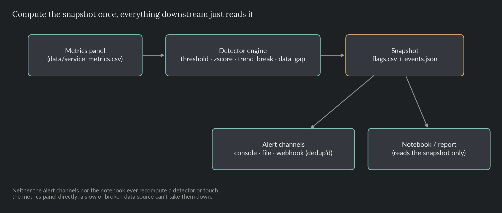
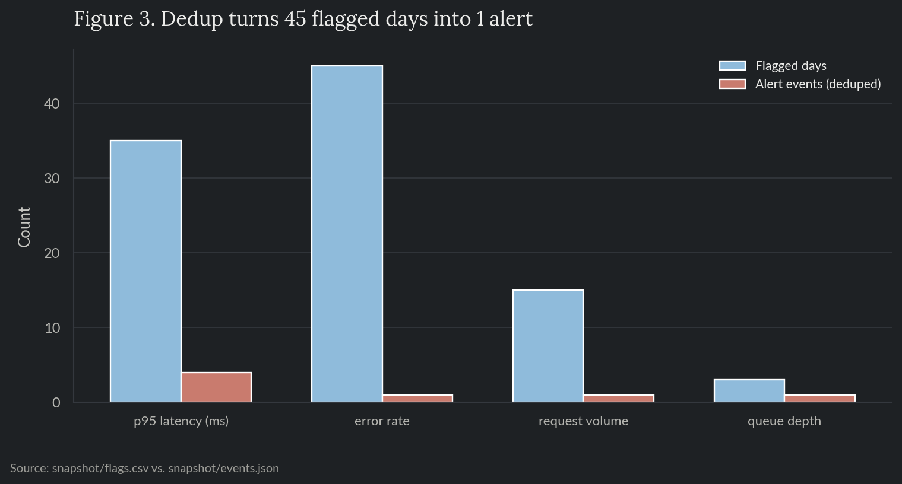

# Service Health Monitor

An operational anomaly-monitoring toolkit for a fictional web service's health metrics: p95 latency, error rate, request volume, queue depth. A pluggable detector engine runs four different anomaly-detection methods against every metric, writes the result to a snapshot once, and dispatches deduplicated alerts through pluggable channels. Nothing downstream, alerting or reporting, ever recomputes a detector or touches the raw metrics directly; it reads the snapshot.

> Everything here, the metrics included, is synthetic data generated in-repo. No proprietary data, metrics, or results from any employer are used or implied.

**Skills and tools featured:**

- A pluggable multi-method anomaly engine (threshold, z-score, trend-break, data-gap detectors behind one interface)
- Alert deduplication: one event per incident, not one per flagged day
- A pluggable alert-channel abstraction (console, file, webhook stub)
- Snapshot-based pipeline architecture, decoupling detection from reporting

## The problem

A service accumulates operational metrics every day, and sooner or later something in them goes wrong: a latency spike, an error-rate step change, a slow decline in traffic, a monitoring gap where a metric just stops reporting. Two things tend to go wrong with how teams catch this. One detection method isn't enough, a fixed threshold catches a hard breach but misses a slow drift, a statistical outlier check catches a spike but adapts to (and then hides) a sustained shift, so real anomaly detection needs several methods running together, not one. And a monitoring system that recomputes everything live, on every dashboard load, couples its own reliability to the data source it's watching, so the detection run needs to happen once, get persisted, and be readable independently of whatever is or isn't working upstream at the time.

## Architecture



`generate_data.py` produces the metrics panel (in a real deployment, this would be wherever the service's metrics actually live). `snapshot.py` is the only thing that ever runs the detector engine: it reads the panel, runs every detector against every metric, and writes `snapshot/flags.csv` (every detector's flag for every metric, every day) and `snapshot/events.json` (deduplicated alert events). Alert channels and the reporting notebook both read only the snapshot; neither one runs a detector or touches the metrics panel.

## The detector engine

Four detectors, one interface (`src/detectors.py`): a `.detect(series)` that returns a boolean flag per day. Adding a fifth is a one-class addition, nothing else in the pipeline changes.

| Detector | Catches | Misses |
|---|---|---|
| `threshold` | A hard limit breach, immediately, regardless of history | A metric whose normal range legitimately drifts over time |
| `zscore` | A sudden spike relative to a trailing rolling window | A slow drift, the rolling window eventually absorbs it as the new normal |
| `trend_break` | A sustained move between a short window and a longer baseline, catches a gradual decline while it's still developing | A short-lived spike can echo in this detector for a while after it resolves, see below |
| `data_gap` | A day the metric didn't report at all | Anything about the value itself |

Every metric runs against all four, on purpose, since which detector(s) fire is itself informative:

```python
def run_detectors(df, detector_map):
    rows = []
    for metric, detectors in detector_map.items():
        series = df.set_index("day")[metric]
        for detector in detectors:
            flags = detector.detect(series)
            for day, flagged in flags.items():
                rows.append({"day": int(day), "metric": metric, "detector": detector.name, "flagged": bool(flagged)})
    return pd.DataFrame(rows, columns=["day", "metric", "detector", "flagged"])
```

Real output, one pipeline run over the seeded panel:

```
$ python src/generate_data.py
Wrote 120 daily rows -> data/service_metrics.csv
Injected: latency spike (days 45-47), error-rate step change (day 75+), request-volume decline (days 95-109), queue-depth reporting gap (days 55-57)

$ python src/snapshot.py
Wrote 1920 flag rows -> snapshot/flags.csv
Wrote 7 alert event(s) -> snapshot/events.json
[ALERT] day 45: p95_latency_ms flagged by threshold, trend_break, zscore
[ALERT] day 55: p95_latency_ms flagged by trend_break
[ALERT] day 55: queue_depth flagged by data_gap
[ALERT] day 57: p95_latency_ms flagged by trend_break
[ALERT] day 75: error_rate flagged by threshold, trend_break, zscore
[ALERT] day 76: p95_latency_ms flagged by trend_break
[ALERT] day 105: request_volume flagged by trend_break
```

All four injected anomalies are caught: the latency spike at day 45 (by all three value-based detectors at once), the error-rate step change at day 75, the queue-depth reporting gap at day 55, and the request-volume decline, which `trend_break` only surfaces at day 105, about two weeks after it actually started, because it needs enough low days inside its 7-day window before the comparison to the 30-day baseline crosses the 15% threshold. That lag is real and worth knowing about: `trend_break` trades speed for not reacting to single-day noise.

The three extra `p95_latency_ms` events (days 55, 57, 76) aren't new incidents. The original day-45 spike is still sitting inside `trend_break`'s 30-day baseline window for a while after it resolves, which temporarily makes ordinary post-spike readings look artificially low by comparison, an echo, not a fresh problem. It's a real characteristic of window-based baselines, and it's exactly why the engine runs `threshold` and `zscore` alongside `trend_break`: both compare a day only to its own recent history, so neither one shares this blind spot.

## Alert dedup

`error_rate` is flagged on 45 of the 120 days, every day from day 75 onward, since the step change never recovers. A naive alert-per-flagged-day design sends 45 alerts for one incident. `find_alert_events()` (`src/alerts.py`) collapses a run of flagged days into a single event, dated to the day the run starts:

```python
def find_alert_events(flags_df):
    events = []
    for metric, group in flags_df.groupby("metric"):
        pivot = group.pivot(index="day", columns="detector", values="flagged").fillna(False).sort_index()
        any_flagged = pivot.any(axis=1)
        was_flagged = False
        for day, flagged in any_flagged.items():
            if flagged and not was_flagged:
                triggered = sorted(pivot.columns[pivot.loc[day]].tolist())
                events.append({"day": int(day), "metric": metric, "detectors": triggered})
            was_flagged = flagged
    return sorted(events, key=lambda e: (e["day"], e["metric"]))
```



## Alert channels

`AlertChannel` is a one-method interface (`send(event)`); `dispatch()` fans every event out to every configured channel. Three implementations: `ConsoleChannel` prints, `FileChannel` appends one JSON line per event to a log, `WebhookChannel` is a stand-in for a real outbound webhook (Slack, PagerDuty, etc.), it records the payload it would have sent instead of making a live network call, since this repo has no external dependencies by design.

```python
def dispatch(events, channels):
    for event in events:
        for channel in channels:
            channel.send(event)
```

Adding a real destination means writing one class with a `send()` method; nothing in `snapshot.py` or the detector engine needs to change.

## Notebook

`notebooks/08_service_health_monitor.ipynb` reads `data/service_metrics.csv` and the two snapshot files, never the detector engine directly, and charts the raw metrics, which detector(s) flagged which days, and the dedup comparison above.

## Repo layout

- `README.md`: this file.
- `src/`: `generate_data.py`, `detectors.py` (the engine), `alerts.py` (dedup + channels), `snapshot.py` (the pipeline), `style.py`, `render_architecture.py` for the diagram above.
- `data/`: the synthetic metrics panel.
- `snapshot/`: `flags.csv`, `events.json`, `alert_log.jsonl`, the pipeline's output, regenerated by `snapshot.py`.
- `notebooks/`: the reporting notebook, reads the snapshot only.
- `reports/figures/`: charts generated by the notebook.
- `tests/`: pytest suite covering each detector, the dedup logic, channel dispatch, and an end-to-end check that all four injected anomalies are caught on the real seeded panel.

## Reproduce

```bash
pip install -r requirements.txt
python src/generate_data.py
python src/snapshot.py
python src/render_architecture.py
jupyter nbconvert --to notebook --execute --inplace notebooks/08_service_health_monitor.ipynb
```

## Tests

```bash
pytest tests/ -v
```

Runs in CI on every push (see the badge at the [repo root](../../README.md)).
