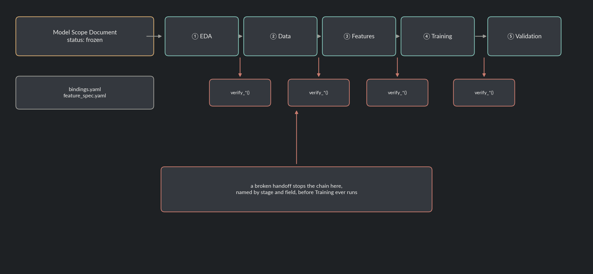

# ML Pipeline Contracts

A model build touches five specialized stages, EDA, data preparation, feature engineering,
training, validation, each one plausibly owned by a different person. This project asks
one question: when a stage's output becomes the next stage's input, how do you know it
actually means what the next stage assumes it means, without a human re-reading every
handoff? The answer here is a schema-validated Model Scope Document plus a
contract-checked stage chain: every stage's declared output is verified against the next
stage's requirements before the pipeline advances, and a broken handoff stops the run
with a specific, stage-addressed error instead of a bad model three steps downstream.

> All data here is synthetically generated. This project is a genericized, from-scratch
> reimplementation of the shape of a multi-agent ML pipeline framework, not a copy of
> any specific one: no employer name, person name, vendor name, or internal codename
> appears anywhere in this code. Every stage here is a deterministic Python function,
> not a live model call, so the whole pipeline reproduces identically on every run and
> needs no API key or network access, the same as every other project in this portfolio.

**Skills and tools featured:**

- Schema-based contracts between pipeline stages (Pydantic), checked at every handoff, not just at the edges
- A frozen design-document gate (the Model Scope Document) that blocks every downstream stage until it's signed off
- Point-in-time / leakage guards on event-level source data, unit-tested against a case that would leak
- The same pipeline code run against two unrelated synthetic domains, one single-target classification, one two-target (`task_type: both`) run, to prove the contracts are actually domain-agnostic
- IV and PSI as training-time feature diagnostics (a different job than this portfolio's other PSI use, see below)
- A deliberately broken run that shows the contract layer actually catching something, not just claiming to

## The problem

A pipeline built as one script per stage, chained by convention, tends to break in a
specific way: stage three assumes stage two's output has a column named a certain
thing, or that a certain column is a feature and not the label, and nothing checks that
assumption until training either crashes on a `KeyError` or, worse, doesn't crash at
all and just trains on the label. The fix isn't more code in each stage, it's a
contract at the seam: what a stage promises to produce, and a check that actually opens
the artifact and confirms the promise holds before the next stage ever runs.

## How it works

Every run starts as a `MODEL_SCOPE.md`: a machine-readable YAML header (objective,
target definitions, one metric and threshold per target, a feature-count cap, declared
data sources) plus a free-text body, the same frontmatter-plus-prose format project 07
uses for its decision records. `status` moves `draft -> signed_off -> frozen`, and
`require_frozen()` is the one gate every stage checks: nothing downstream runs against
a Scope that isn't frozen.



A Model Scope names intent, not execution. Two more files, committed alongside it,
supply that: `bindings.yaml` (which files back each data source, the join keys, the
decision-time cutoff) and `feature_spec.yaml` (the feature ideas: an aggregation over
an event source, or a passthrough column from the base population). `src/orchestrator.py`
chains the five stages in order, and between every one, calls a `verify_*` function
from `src/stage_io.py` that opens the actual artifact and checks it, not just that a
Pydantic object with the right field names came back:

| Stage | Consumes | Produces | What gets checked before advancing |
|---|---|---|---|
| ① EDA | the 4 inputs a Model Scope needs | a sample profile + target rate over time | the declared files actually exist |
| ② Data | frozen Model Scope + bindings | `training_data.parquet` (identifier + targets only) + a manifest | the identifier column is real and unique, every target is present and non-null, the row count matches |
| ③ Features | Data stage output + `feature_spec.yaml` | `features.parquet`, point-in-time filtered | the identifier lines up with the Data stage's, no target column snuck into the feature list, the feature count is under the Scope's cap |
| ④ Training | Feature stage output | one model per target, a 5-step reduction funnel, IV/PSI | every selected feature actually came from the Feature stage's output, the metric is a real number |
| ⑤ Validation | Training stage output | pass/fail per target against the Scope's threshold | the pass flag is arithmetically consistent with the metric and threshold it's based on |

Stage ② only stages the target spine and the join graph, on purpose, mirroring the
real discipline this project is modeled on: a stage that engineers features and also
decides what the target is has no seam for a leakage check to sit at. Feature
engineering, and only feature engineering, touches the event-level source data.

## Point-in-time correctness

Both synthetic domains below have event-level source data (usage events, agent
activity) with rows dated on both sides of each identifier's decision-time cutoff, on
purpose. `guards.filter_point_in_time()` drops every row after the cutoff before
aggregating; skipping that step would leak information the decision-maker couldn't
have had yet. `tests/test_guards.py` proves the difference directly: on a small
fixture, the naive (unfiltered) average is 50.0, one future event with an extreme
value drags it there, the correctly filtered average is 1.0.

## Two domains, one contract

**Domain A, churn** (`runs/churn/run-001`): a subscription business deciding, at each
customer's 90-day mark, whether they're at risk of churning in the next 30 days.
3,000 customers, 29.1% `churned_next_30d`. A gradient-boosted classifier, reduced from
10 candidate features to 6, holds 0.392 PR-AUC on the holdout split against a Model
Scope threshold of 0.30.

**Domain B, ticket triage** (`runs/ticket-triage/run-001`): a support team deciding,
within 2 hours of a ticket opening, whether it will escalate and how long it will take
to resolve. 2,500 tickets, 34.6% `will_escalate`, median resolution 10.5 hours. This
run's Model Scope declares `task_type: both`, one classification target
(`will_escalate`, PR-AUC 0.435 vs. a 0.40 threshold) and one regression target
(`resolution_hours`, MAE 3.05 hours vs. a 4.5-hour threshold), from the same base
population. Nothing in `src/orchestrator.py` or `src/stage_io.py` changed to handle
that, `ModelScope`'s own validation is what enforces that `task_type: both` means
exactly one target of each kind with a metric for each.

Every number above is real output from the committed run directories, not
representative or rounded for effect; `notebooks/09_ml_pipeline_contracts.ipynb`
reads the same artifacts and charts them.

## IV and PSI here vs. project 01

Training reports Information Value (against the classification target, standard
credit-scoring style) and PSI for every selected feature, but the PSI here answers a
different question than project 01's: it compares a feature's distribution in the
split that trained the model against the split that evaluated it, asking whether the
model saw a representative slice of the world during training. Project 01's PSI
compares a live production period against a training-time reference, asking whether
the world has since moved. A feature that fails the check here would fail before the
model ever ships; project 01's is a standing check on a model that already has.

## What the contract layer catches

`src/demo_broken_contract.py` runs EDA and Data for real against the churn Model
Scope, then simulates the single most common way a Feature Engineering stage breaks
its handoff to Training: the target rides along as a declared feature, because
whoever built the join didn't drop it. Real captured output, from
`runs/broken-example/run-001/CAUGHT_VIOLATION.md`:

```
ContractViolation: [features] target column(s) ['churned_next_30d'] appear in feature_cols, that's target leakage
```

The orchestrator stops there. Training never runs against that feature matrix, and
`tests/test_orchestrator.py` checks the same thing end to end: after this exact
failure, no model file exists on disk.

## Creating a new run

```
$ python src/new_run.py --slug expansion-risk --run-id run-001 \
    --name "Expansion Risk" --objective "..." --problem "..." \
    --task-type classification --max-features 10
Wrote runs/expansion-risk/run-001/MODEL_SCOPE.md (status: draft)
```

Scaffolds the Model Scope from a template, `status: draft`. The targets, metric,
`bindings.yaml`, and `feature_spec.yaml` get filled in by hand, same as every other
project-specific judgment call in this framework; `require_frozen()` blocks the
orchestrator from running against it until `status: frozen` is set.

## Repo layout

- `src/model_scope.py`: the Model Scope contract (Pydantic) and the frontmatter parser.
- `src/stage_io.py`: the per-stage output contracts and the `verify_*` functions the orchestrator checks between stages.
- `src/bindings.py`: loaders for a run's `bindings.yaml` and `feature_spec.yaml`.
- `src/guards.py`: the point-in-time filter and the target-leakage assertion, standalone and unit-tested.
- `src/generate_data.py`: synthetic source data for both domains.
- `src/stages/`: the five stage implementations (`eda.py`, `data_prep.py`, `feature_engineering.py`, `training.py`, `validation.py`).
- `src/orchestrator.py`: chains the five stages, verifying every handoff; `python src/orchestrator.py --run-dir <path>`.
- `src/new_run.py`: scaffolds a new run's Model Scope.
- `src/demo_broken_contract.py`: the deliberately broken handoff, real captured output.
- `src/render_architecture.py`: renders `assets/architecture.png`.
- `runs/<slug>/<run-id>/`: `MODEL_SCOPE.md`, `bindings.yaml`, `feature_spec.yaml`, and `artifacts/` per stage. `runs/churn/` and `runs/ticket-triage/` are the two worked examples; `runs/broken-example/` is the caught-violation demo.
- `notebooks/09_ml_pipeline_contracts.ipynb`: reads the runs' committed artifacts only, no stage or the orchestrator gets called from here.
- `tests/`: pytest suite covering the Model Scope contract, every `verify_*` check (including cases built to fail), the point-in-time guard, the IV/PSI/reduction logic, and two end-to-end orchestrator runs, one clean, one broken mid-chain via a monkeypatched Feature stage.

## Reproduce

```bash
pip install -r requirements.txt
python src/generate_data.py
python src/orchestrator.py --run-dir runs/churn/run-001
python src/orchestrator.py --run-dir runs/ticket-triage/run-001
python src/demo_broken_contract.py
jupyter nbconvert --to notebook --execute --inplace notebooks/09_ml_pipeline_contracts.ipynb
```

`data/` is gitignored; regenerate it with the command above. `runs/*/artifacts/*.pkl`
and `runs/*/artifacts/*.parquet` are gitignored too, everything else under `runs/` is
committed light output, the same split every other project in this portfolio uses
between regenerable heavy artifacts and committed reports.

## Tests

```bash
pytest tests/ -v
```

Runs in CI on every push (see the badge at the [repo root](../../README.md)).
