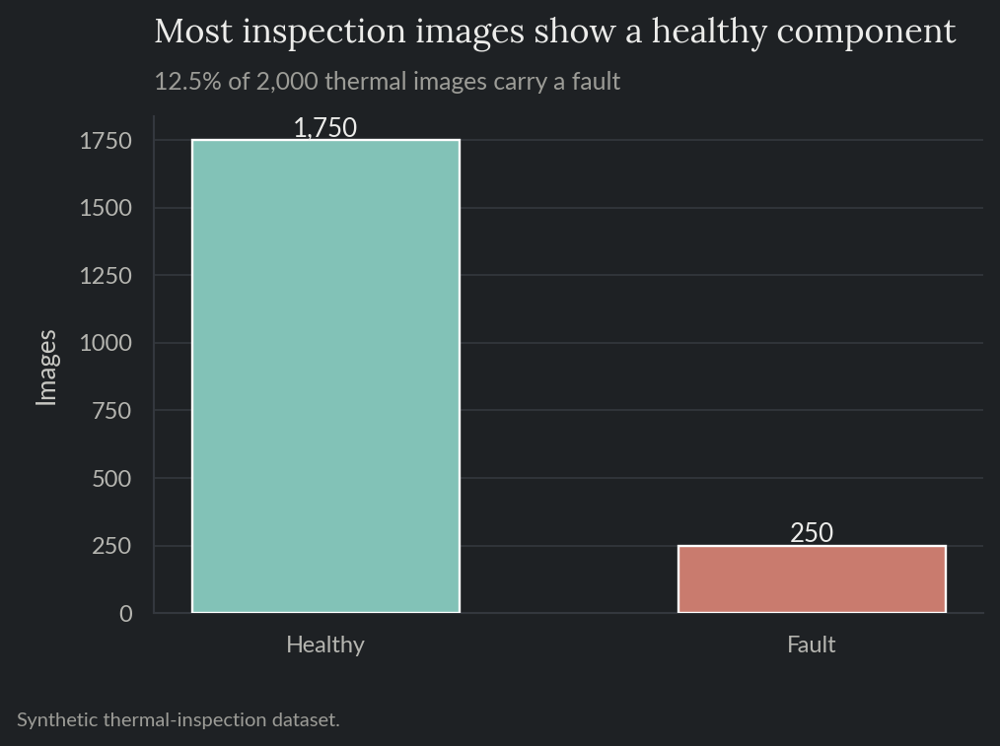
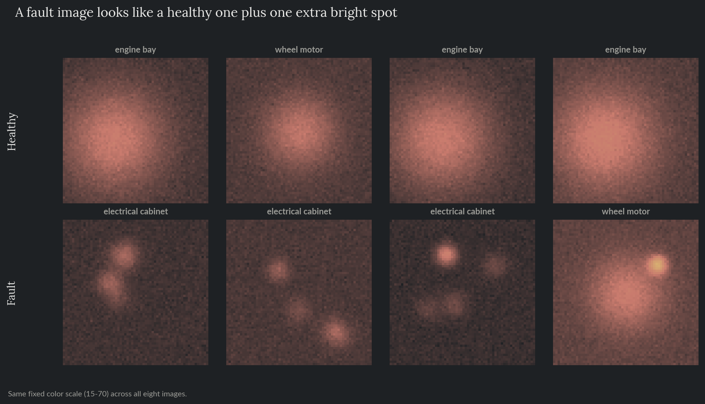
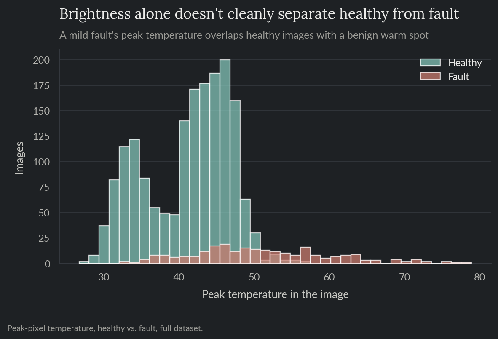
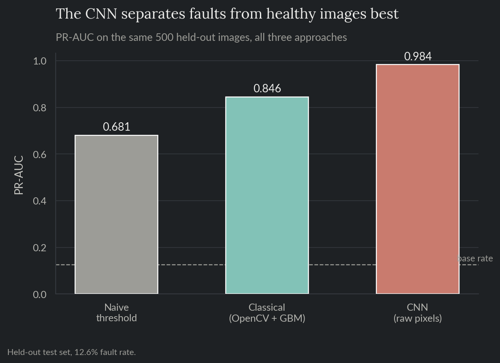
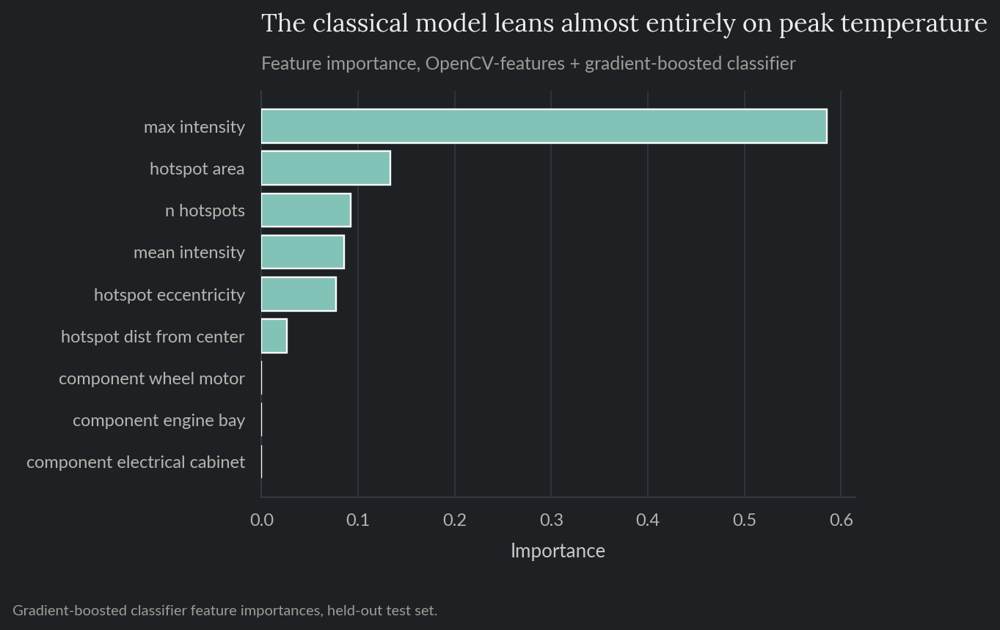
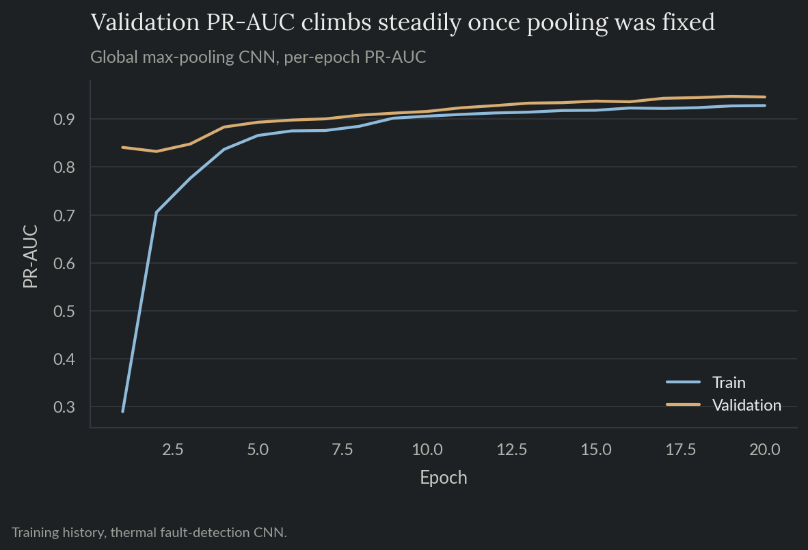
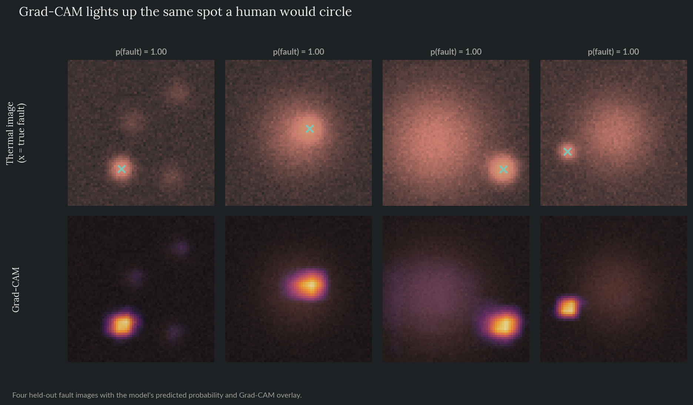

# Thermal Fault Detection

A maintenance inspector walks the yard of a mining haul-truck fleet with a handheld
thermal camera, photographing key components (wheel motor, engine bay, electrical
cabinet) on a routine round. Most images show nothing unusual. Some show a
component quietly running hotter than it should, an early sign of a bearing or
electrical fault, days before it would show up as a breakdown. This project builds
a model that looks at one of those photos and flags which ones need a second look,
and checks, not just claims, that the model is actually looking at the right part
of the image when it does. Same fictional mining company as project 06, a
different data source: a single photo instead of continuous sensor data.

**For the full technical walkthrough (feature pipeline, both models trained and
compared, Grad-CAM interpretability), see the [notebook](notebooks/10_thermal_fault_detection.ipynb).**
This README is the short version.

> All data here is synthetically generated. No proprietary data, models, or results
> from any employer are used or implied.

**Skills and tools featured:**

- Computer vision: OpenCV feature extraction (thresholding, contour/blob detection) and a convolutional neural network (TensorFlow/Keras)
- Grad-CAM interpretability, checked against a known ground-truth location rather than eyeballed
- Classical feature-engineering baseline vs. a CNN trained directly on pixels, compared head to head on the same held-out images
- PR-AUC and ROC-AUC under class imbalance

## The problem

A thermal image of a normal, healthy component is already warm in a characteristic
place: a wheel motor runs warm around its hub, an engine bay runs warm in a
diffuse patch, an electrical cabinet has a few small warm points from its normally
loaded components. A fault looks like that same healthy pattern plus one extra,
localized hot spot. The obvious first thing to try, just flag whichever images are
brightest, doesn't work well: a healthy image can have its own ordinary warm patch
(sun glare, an exhaust vent) that is just as bright as a mild fault. Brightness
alone can't tell those two apart.

## What this does

Two different approaches are trained on the same 2,000 synthetic thermal images (a
64x64 grid of temperature-like values per image, 12.5% showing a fault) and scored
on the same 500 held-out images, so they can be compared directly:

1. **Classical:** threshold each image, find the brightest contour with OpenCV (a
   computer-vision library), and describe its shape, area, how tight or spread out
   it is, distance from the image center, plus how many separate warm regions there
   are. Add the component type, since an inspector would already know what they're
   photographing. Feed all of that into a gradient-boosted classifier.
2. **Deep learning:** skip the handcrafted features entirely. Feed the raw pixels
   into a small convolutional neural network (CNN), a model built from stacked
   filters that learn to recognize visual patterns directly from the image, with no
   feature engineering step in between.

## Exploratory analysis

The fault rate is realistic but not extreme: 1 in 8 images shows a fault (Figure
1). A healthy and a faulty image of the same component look almost identical
apart from that one extra bright spot (Figure 2).



*Figure 1. Image count by outcome, healthy vs. fault.*



*Figure 2. Healthy vs. fault examples across all three components, same fixed color scale.*

A naive rule, flag anything above a fixed brightness cutoff chosen to catch 75% of
faults, correctly flags 74.8% of faults but is only right 25.6% of the time it
flags something: 544 healthy images get caught in the net too, mostly the ones
with a benign warm patch (Figure 3). As a continuous ranking score rather than one
fixed cutoff, that same brightness signal reaches a PR-AUC (average precision, how
well a score ranks true faults above non-faults) of 0.681, better than guessing,
but the baseline both trained models below have to beat.



*Figure 3. Peak pixel temperature, healthy vs. fault, full dataset.*

## Results

| | |
|---|---|
| Fault rate, held-out test set | 12.6% |
| Naive brightness threshold (ranking) | 0.681 PR-AUC |
| Classical (OpenCV features + gradient boosting) | 0.846 PR-AUC (6.7x base rate), 0.962 ROC-AUC |
| CNN (raw pixels) | 0.984 PR-AUC (7.8x base rate), 0.997 ROC-AUC |



*Figure 4. PR-AUC on the same 500 held-out images, all three approaches.*

The CNN wins outright. The classical model's feature importances show why it falls
short: it leans almost entirely on peak temperature (58.6% of total importance),
the same brittle signal the naive rule uses, just combined with a handful of
weaker shape features on top (Figure 5). The CNN has no such single point of
failure; it learns directly from the full image.



*Figure 5. Gradient-boosted classifier feature importances, held-out test set.*

## Why the CNN needed one specific fix to work at all

A first version of the CNN, built the standard way, condensed its final feature
map with global *average* pooling, taking the mean activation across the whole
image before making a prediction. It came out barely better than random guessing
(PR-AUC close to the 12.5% base rate). The reason: a fault is one small bright
region against a much larger normal background, and averaging across the whole
image dilutes exactly that kind of sparse, localized signal into near-nothing.
Switching to global *max* pooling, does at least one location in the image
strongly activate, fixed it immediately (Figure 6): the question "is there a hot
spot somewhere in this image" matches max-pooling's nature far better than
average-pooling's.



*Figure 6. Validation PR-AUC per epoch, the max-pooling CNN used in the results above.*

## Does the model actually look at the fault?

A high score doesn't prove a model is looking at the right thing, it could be
keying on some unrelated correlate of the label. Grad-CAM (gradient-weighted class
activation mapping) traces which pixels most pushed a prediction up, producing a
heatmap over the original image. Since every synthetic fault in this dataset has a
known (x, y) location, that heatmap can be checked against ground truth instead of
just eyeballed for plausibility (Figure 7).



*Figure 7. Four held-out fault images, the model's predicted probability, and the Grad-CAM overlay.*

Across all 63 fault images in the held-out set, the brightest point of the
Grad-CAM heatmap lands a median of 1.3 pixels (mean 6.4, pulled up by a few harder
cases) from the true fault location, on a 64x64 image where a random guess would
land 28.5 pixels away on average. The model isn't just scoring faults correctly,
it's doing it by looking at the actual fault.

## Recommendation

Ship the CNN: it wins on every metric above, and Grad-CAM confirms it's winning
for the right reason. Keep the classical OpenCV-features model around as a fast,
fully interpretable fallback, every one of its inputs (peak temperature, hot-spot
shape, which component it is) is something an inspector could sanity-check by eye
without needing a heatmap overlay next to every prediction.

## Repo layout

- `notebooks/10_thermal_fault_detection.ipynb`: full technical walkthrough, executed with all charts and results inline.
- `src/`: the reproducible pipeline (data generation, EDA, OpenCV features, classical model, CNN, Grad-CAM) as standalone scripts.
- `tests/`: pytest suite covering data-generation invariants (every fault image genuinely contains a hot spot at its recorded location), feature extraction, CNN determinism, and the Grad-CAM helper functions.
- `reports/`: generated charts and metrics.

## Reproduce

```bash
pip install -r requirements.txt
python src/generate_data.py
python src/eda.py
python src/train_classical.py
python src/train_cnn.py
python src/interpret.py
```

`data/` and the trained model files under `reports/` are gitignored; regenerate
them by running the scripts above.

## Tests

```bash
pytest tests/ -v
```

Runs in CI on every push (see the badge at the [repo root](../../README.md)).
