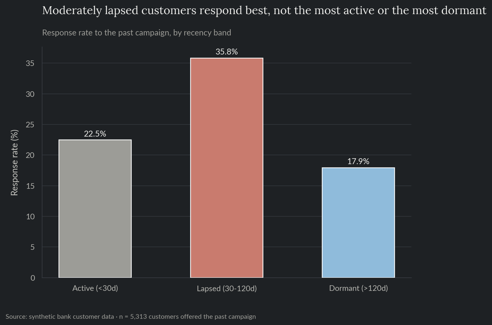
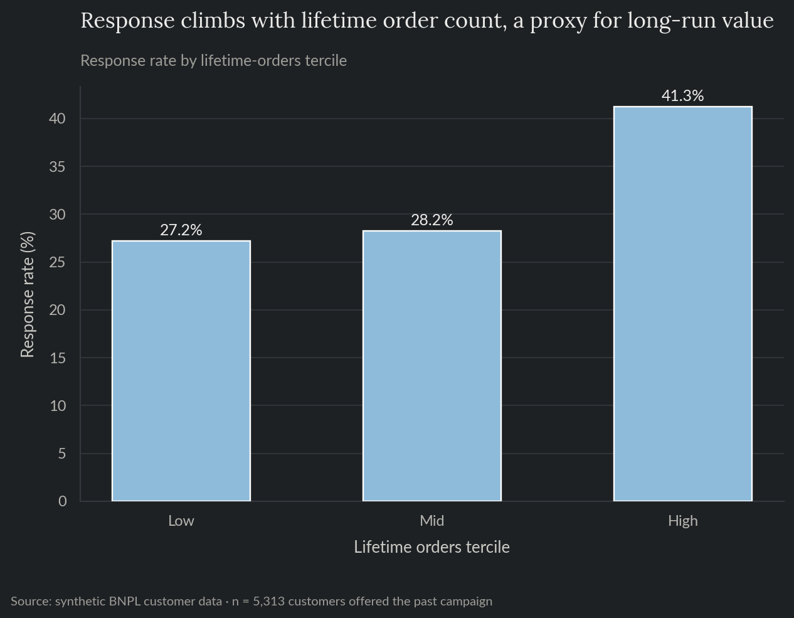
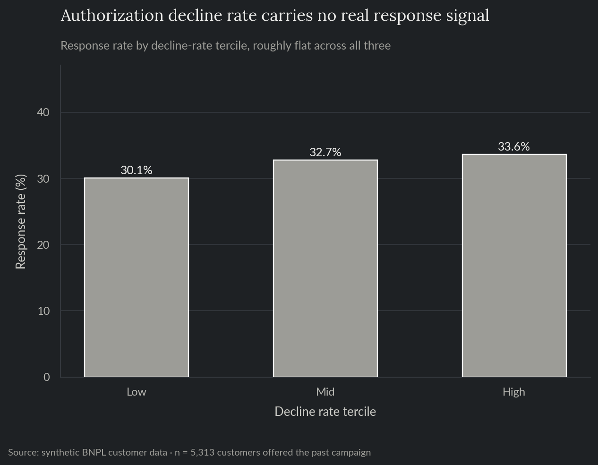
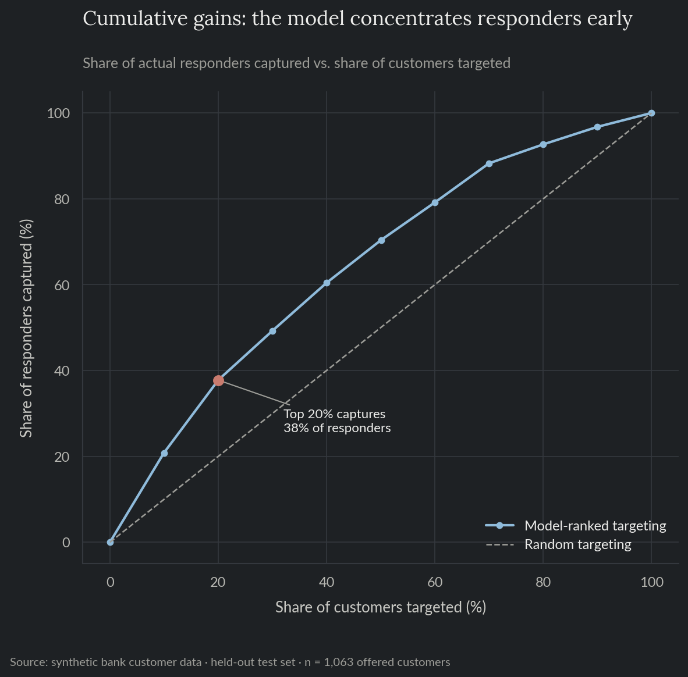
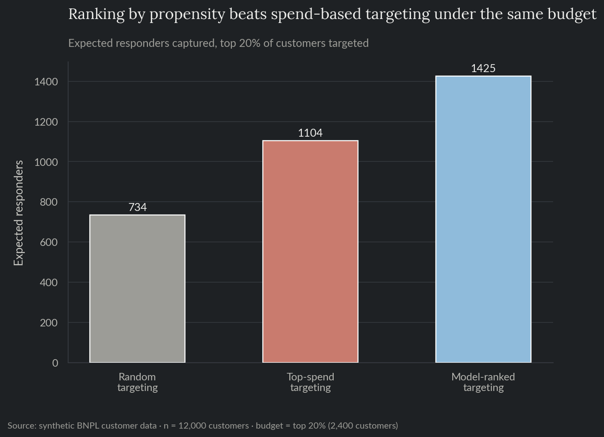
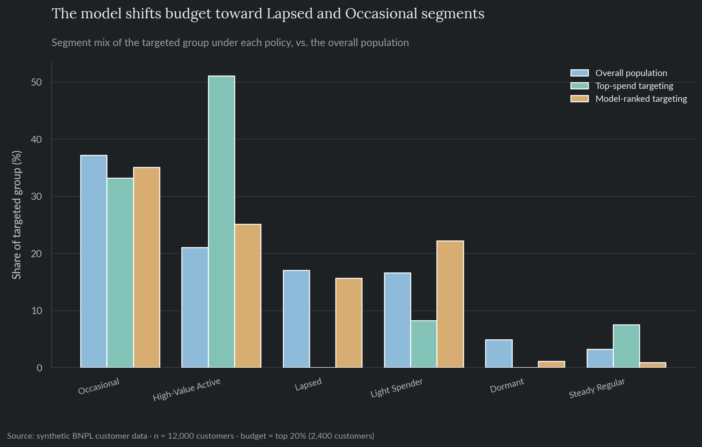

# Cardholder Segmentation & Spend-Growth Propensity

A growth team at a buy now, pay later (BNPL) fintech has a limited monthly budget for a win-back campaign and needs to decide who gets it. Two complementary techniques, a behavioral segmentation and a response-propensity model, are built on the same customer base and then compared head to head on a budget-constrained targeting decision. Synthetic data, the same fictional platform as projects 01-06, viewed from the growth/marketing side.

**For the full technical walkthrough (exploratory analysis, GMM segmentation, propensity modeling, calibration, SHAP, budget-constrained targeting), see the [notebook](notebooks/11_cardholder_segmentation_propensity.ipynb).** This README is the short version.

> All data here is synthetically generated. No proprietary data, models, or results from any employer are used or implied.

**Skills and tools featured:**

- Behavioral segmentation via Gaussian Mixture Model, component count chosen by BIC
- Response-propensity modeling (logistic baseline vs. gradient-boosted trees)
- Probability calibration and a cumulative-gains (decile lift) chart
- SHAP interpretability, including a deliberate decoy feature
- Budget-constrained targeting: propensity-ranked vs. naive spend-based vs. random

## The problem

The growth team's past win-back campaign wasn't randomized: it leaned toward moderately lapsed, established accounts, a standard business targeting rule, not a controlled test. For the next campaign, they can only afford to reach a fraction of the customer base. Segmenting customers by current behavior (recency, frequency, spend) is a natural first step, but current behavior alone can't tell apart a dormant customer who's genuinely gone from one who's simply between orders and worth a nudge. The question this project answers: given a fixed budget, who should actually get the next offer, and how much better does a real ranking do than an intuitive "target the biggest spenders" rule?

## What this does

Clusters customers into behavioral segments from trailing-90-day activity, trains a propensity model on the subset who received the past campaign to predict who responds, scores the entire customer base with it, and compares three targeting policies under the same fixed budget: random, top-spend, and propensity-ranked.

## Exploratory analysis

Response to the past campaign follows an inverted-U by recency: customers moderately lapsed (30-120 days since last order) respond best, more than customers still active (nothing to win back) and more than customers fully dormant (too far gone) (Figure 1).



*Figure 1. Response rate to the past campaign, by recency band.*

Response also climbs with lifetime order count, an observable proxy for a customer's long-run value that current-window behavior alone doesn't carry: customers in the top tercile respond at 41.3%, against 27.2% in the bottom tercile (Figure 2).



*Figure 2. Response rate by lifetime-orders tercile.*

Checkout authorization decline rate, included on purpose as a decoy feature with zero true weight in how the data was generated, stays roughly flat across terciles (33.6% vs. 30.1%, a few points of noise against an 18-point recency spread and a 14-point value spread) (Figure 3), a useful check to run before a feature like this ever reaches a model.



*Figure 3. Response rate by checkout authorization decline-rate tercile.*

## Segmentation

A Gaussian Mixture Model clusters customers on current-window behavior (recency, frequency, monetary value, category diversity, decline rate), log-transformed and standardized first so monetary value doesn't dominate purely by having the largest raw scale. Component count is chosen by BIC (Bayesian Information Criterion), a likelihood-based penalty that stops the model from just picking the largest cluster count tried. BIC never elbows within a reasonable search range here, typical once there's enough data that the complexity penalty barely bites, so candidates are capped at a business-interpretable size (k ≤ 6) and the minimum is taken within that cap.

| Segment | % of customers | % of 90-day spend |
|---|---|---|
| High-Value Active | 21.0% | 37.1% |
| Occasional | 37.2% | 37.8% |
| Light Spender | 16.6% | 14.5% |
| Lapsed | 17.1% | 5.3% |
| Steady Regular | 3.2% | 5.4% |
| Dormant | 4.9% | 0.0% |

High-Value Active is a fifth of customers and over a third of spend; Dormant is 5% of customers and effectively none of current spend, the segment a flat "target everyone dormant" rule would waste the most budget on. Segmentation alone can't say which dormant customers are worth reaching, since it only sees current behavior, not history, which is exactly what the propensity model below adds.

## Propensity model

Trained on the labeled subset (customers who actually received the past campaign), then scored against the full customer base. At a 32.1% response rate, positive and negative cases aren't sharply imbalanced, so ROC-AUC is a reasonable headline metric here alongside PR-AUC.

| | |
|---|---|
| Response rate, offered customers | 32.1% |
| Logistic regression baseline AUC | 0.706 |
| GBM test ROC-AUC | 0.717 |
| GBM test PR-AUC | 0.523 |
| Top 20% by predicted score captures | 37.8% of responders (vs. 20% for random) |

The GBM edges out the logistic baseline (0.717 vs. 0.706 AUC), a modest lift that makes sense given the response formula's one real non-linearity: the recency "sweet spot" is a peak, not a straight line, which a tree model captures far more naturally than a linear one. The gains chart is the more decision-relevant view (Figure 4): targeting the top 20% of customers by predicted score captures about 38% of actual responders, nearly double what random targeting gets for the same budget.



*Figure 4. Cumulative gains: share of responders captured vs. share of customers targeted, model-ranked vs. random.*

Isotonic calibration, fit on a held-out validation split, left the Brier score essentially unchanged (0.1896 raw vs. 0.1904 calibrated): the raw GBM was already reasonably well-calibrated at this base rate, an honest null result rather than a forced improvement. It's still applied before scoring the full population in the targeting step below, since the budget analysis needs probabilities that are trustworthy in an absolute sense, and there's no reason to skip a cheap check that happened to come back neutral.

SHAP recovers the intended drivers: `lifetime_orders` and `tenure_days`, the two observable proxies for a customer's long-run value, dominate, followed by `monetary_90d` and `recency_days` (the sweet-spot signal). The decoy `decline_rate` ranks 6th of 16 features, a real but secondary signal, not a top driver, which is what a well-behaved model should do with a feature that has zero true weight in the data it was trained on.

## Budget-constrained targeting

Given a fixed budget (the top 20% of customers by whatever rule is used), three targeting policies are compared: random, a naive "target the biggest spenders" rule, and ranking by the calibrated propensity score. Expected responders under each policy come from the model's own calibrated score, the only response-rate estimate available for customers who were never actually offered anything.

| Policy | Expected responders (top 20%, n=2,400) |
|---|---|
| Random targeting | 734 |
| Top-spend targeting | 1,104 |
| Model-ranked targeting | 1,425 |

Propensity-ranked targeting captures 94.0% more expected responders than random and 29.1% more than the naive top-spend rule, for the identical budget (Figure 5).



*Figure 5. Expected responders captured under each targeting policy, same fixed budget.*

The mechanism shows up clearly in who each policy actually reaches (Figure 6): top-spend targeting puts 51% of its budget on High-Value Active customers, who'd plausibly keep spending with or without an offer, and 0% on Lapsed customers. The propensity model does the opposite: High-Value Active drops to 25% of the targeted group, and Lapsed rises to 16%, the segment a purely behavioral rule most undersells, since "Lapsed" and "Dormant" look similar on current behavior alone but differ sharply in the historical-value signal the model has access to.



*Figure 6. Segment composition of the targeted group under each policy, vs. the overall population.*

## Recommendation

Use the propensity-ranked targeting policy for the next campaign over a spend-based or behavioral-segment-only rule. It captures meaningfully more expected responders under an identical budget, and it does so by reaching a different set of customers: it concentrates on Lapsed and Occasional customers with a strong historical-value signal, rather than customers who'd likely respond, or spend, regardless of any offer. Keep the segmentation as a reporting and resource-planning tool, since it's useful for understanding the customer base at a glance, but don't use it as a targeting rule on its own: it's built entirely from current behavior, so it can't see the historical-value signal the propensity model relies on most. Re-derive the propensity model whenever the campaign, offer, or eligible population changes meaningfully. The past campaign also wasn't randomized, so this model ranks response likelihood rather than measuring the offer's causal, incremental effect; getting that would need a randomized holdout test, which the growth team didn't run for this campaign.

## Repo layout

- `notebooks/11_cardholder_segmentation_propensity.ipynb`: full technical walkthrough, executed with all charts and results inline.
- `src/`: the reproducible pipeline (data generation, exploratory analysis, segmentation, propensity modeling, interpretability, budget-constrained targeting) as standalone scripts.
- `tests/`: pytest suite covering data-generation invariants (including that the win-back sweet spot and the historical-value proxy actually raise response propensity, and that the decoy decline-rate feature doesn't), the segment-labeling logic, the cumulative-gains computation, and the budget-allocation logic.
- `reports/`: generated charts, metrics, and intermediate CSVs.

## Reproduce

```bash
pip install -r requirements.txt
python src/generate_data.py
python src/eda.py
python src/segmentation.py
python src/propensity_model.py
python src/interpret.py
python src/targeting.py
```

`data/` and `reports/model.pkl` are gitignored; regenerate them by running the scripts above, in order (segmentation must run before propensity_model, which must run before interpret and targeting).

## Tests

```bash
pytest tests/ -v
```

Runs in CI on every push (see the badge at the [repo root](../../README.md)).
